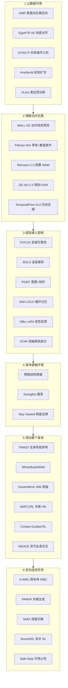

# 人形运动控制：30 篇论文阅读坐标

> **本页定位**：为 [具身智能研究室 · 30 篇盘点](https://mp.weixin.qq.com/s/mpUYlark4cwawDlXJnADmA)（2026-09-18）提供按 **六条问题线** 组织的阅读坐标；方法细节见各 canonical 实体页。
>
> **节点策略：** **30/30 独立详情节点均已存在**（本 ingest **0 新建**、**30 复用**）；Riemann 以 [paper-riemann-1](../entities/paper-riemann-1.md) 为 canonical，勿与策展 stub 混读。

## 一句话观点

**搬一次箱子的完整任务，把「数据怎么表达 → 动作带来什么后果 → 感知怎么修正控制 → 身体怎么借环境支撑 → 全身怎么协调操作 → 连续运行怎么扛切换与停止」串成一条可检查的链路——这 30 篇分别补链路上的一环。**

## 英文缩写速查

| 缩写 | 英文全称 | 简要说明 |
|------|----------|----------|
| WAM | World-Action Model | 联合预测未来与生成动作 |
| VLA | Vision-Language-Action | 视觉–语言–动作策略 |
| WBC | Whole-Body Control | 全身协调控制 |
| MoCap | Motion Capture | 动捕与场景对齐数据 |
| RL | Reinforcement Learning | 强化学习训练/微调 |
| Sim2Real | Simulation to Real | 仿真到真机迁移 |

## 为什么单独做这张地图

- 公众号把跨度极大的 30 篇放进 **同一任务叙事**（搬箱 loco-manip），需要横切面索引而非 30 次重复 ingest。
- 与 [Humanoid Motion Intelligence](../entities/humanoid-motion-intelligence.md) GitHub 知识库同源；本页只做 **站内 canonical 链接**，不镜像方法细节。
- **去重核查（2026-09-18）：** 30 篇各对应唯一 `wiki/entities/paper-*.md`；**0** 重复 arXiv canonical 页。

## 流程总览

## 分组索引

### 1 · 让数据可用

| # | 论文 | 详情 |
|---|------|------|
| 01 | UMR | [paper-umr-unified-motion-retargeting](../entities/paper-umr-unified-motion-retargeting.md) |
| 02 | EgoHTR | [paper-egohtr](../entities/paper-egohtr.md) |
| 03 | UCAG-P | [paper-ucag-p](../entities/paper-ucag-p.md) |
| 04 | AnyWorld | [paper-anyworld](../entities/paper-anyworld.md) |
| 05 | VLAct | [paper-vlact](../entities/paper-vlact.md) |

### 2 · 理解动作后果

| # | 论文 | 详情 |
|---|------|------|
| 06 | WALL-SS | [paper-wall-ss](../entities/paper-wall-ss.md) |
| 07 | Pelican-Sim 1.0 | [paper-pelican-sim](../entities/paper-pelican-sim.md) |
| 08 | Riemann-1.0 | [paper-riemann-1](../entities/paper-riemann-1.md) |
| 09 | GE-Act 2.0 | [paper-ge-act-2](../entities/paper-ge-act-2.md) |
| 10 | TemporalFlow-VLA | [paper-temporalflow-vla](../entities/paper-temporalflow-vla.md) |

### 3 · 感知接入控制

| # | 论文 | 详情 |
|---|------|------|
| 11 | FOCUS | [paper-focus-foot-observation-confidence](../entities/paper-focus-foot-observation-confidence.md) |
| 12 | SOLO | [paper-solo](../entities/paper-solo.md) |
| 13 | PGMT | [paper-pgmt](../entities/paper-pgmt.md) |
| 14 | WM-LOCO | [paper-wm-loco](../entities/paper-wm-loco.md) |
| 15 | ViBe | [paper-vibe](../entities/paper-vibe.md) |
| 16 | STAR | [paper-star-vtla](../entities/paper-star-vtla.md) |

### 4 · 身体接触环境

| # | 论文 | 详情 |
|---|------|------|
| 17 | 稀疏结构穿越 | [paper-agile-perceptive-traversal-sparse-3d](../entities/paper-agile-perceptive-traversal-sparse-3d.md) |
| 18 | SwingBot | [paper-swingbot](../entities/paper-swingbot.md) |
| 19 | Stay Seated | [paper-stay-seated](../entities/paper-stay-seated.md) |

### 5 · 调动整个身体

| # | 论文 | 详情 |
|---|------|------|
| 20 | TANGO | [paper-tango-vla](../entities/paper-tango-vla.md) |
| 21 | WholeBodyWAM | [paper-wholebodywam](../entities/paper-wholebodywam.md) |
| 22 | DreamMimic | [paper-dreammimic](../entities/paper-dreammimic.md) |
| 23 | SMPC2RL | [paper-smpc2rl-loco-manipulation](../entities/paper-smpc2rl-loco-manipulation.md) |
| 24 | Contact-Guided RL | [paper-contact-guided-exploration-locomanipulation](../entities/paper-contact-guided-exploration-locomanipulation.md) |
| 25 | WEAVE | [paper-weave](../entities/paper-weave.md) |

### 6 · 走向连续任务

| # | 论文 | 详情 |
|---|------|------|
| 26 | X-WBC | [paper-x-wbc](../entities/paper-x-wbc.md) |
| 27 | PAMoR | [paper-pamor](../entities/paper-pamor.md) |
| 28 | SkillX | [paper-skillx-humanoid-soccer](../entities/paper-skillx-humanoid-soccer.md) |
| 29 | SmoothRL | [paper-smoothrl](../entities/paper-smoothrl.md) |
| 30 | Safe-Stop | [paper-safe-stop-humanoid](../entities/paper-safe-stop-humanoid.md) |

## 综合观察（策展）

1. **共享动作语义：** UMR 表面对应、UCAG-P 操作锚点、X-WBC 运动表示、WholeBodyWAM 全身命令、VLAct 表征预训练——都在回答「跨本体共享什么、差异由谁接」。
2. **反馈贯穿执行：** FOCUS（足端可靠性）→ TemporalFlow-VLA（进度）→ SOLO（误差累积）→ STAR（触觉变化）→ SkillX / SmoothRL（切换与异步）——评估应覆盖过程而非单帧。
3. **物体结果与停止：** WholeBodyWAM / WEAVE 管协调与接触；Safe-Stop 管中止——任务完成不等于关节跟踪准确。

## 关联页面

- [Humanoid Motion Intelligence](../entities/humanoid-motion-intelligence.md)
- [人形 RL 运动控制身体系统栈](./humanoid-rl-motion-control-body-system-stack.md)
- [Loco-manipulation](../tasks/loco-manipulation.md)
- [Motion retargeting](../concepts/motion-retargeting.md)
- [World Action Models](../concepts/world-action-models.md)

## 参考来源

- [wechat_embodied_ai_lab_30_papers_humanoid_motion_control_2026-09-18.md](../../sources/blogs/wechat_embodied_ai_lab_30_papers_humanoid_motion_control_2026-09-18.md)

## 推荐继续阅读

- [GitHub：Humanoid Motion Intelligence](https://github.com/RealXiaoze/humanoid-motion-intelligence/tree/main)
- [微信公众号原文](https://mp.weixin.qq.com/s/mpUYlark4cwawDlXJnADmA)
