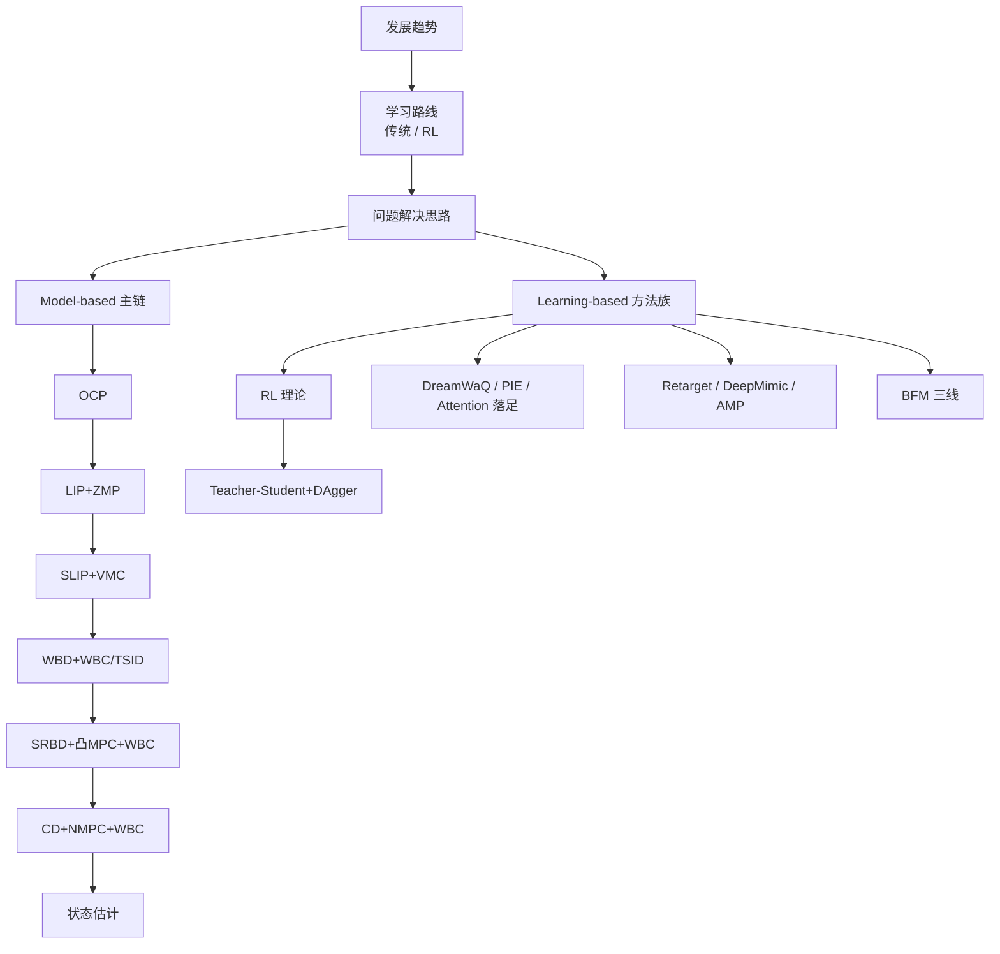

# 人形机器人运动控制 Know-How 技术地图

> **本页定位**：为 [RoboParty 飞书公开文档](https://roboparty.feishu.cn/wiki/GvUxwKVeNiGa7kku6vEcvqfKn87) 提供**全主题节点索引**；每个条目对应图谱中的独立页面（概念 / 方法 / 任务 / 路线 / 实体）。文档组织方式为 **「方法原理 → 基本代码 → 方法局限性」**；本页只做导航与层间关系，不复述逐节伪代码。

## 一句话定义

把 RoboParty Know-How 从「飞书目录树」映射为可检索、可交叉引用的 **wiki 知识图**：宏观趋势与学习路线在上层，**Model-based 七段主链** 与 **Learning-based 九类方法** 在下层，每个主题至少一个独立节点。

## 英文缩写速查

| 缩写 | 英文全称 | 简要说明 |
|------|----------|----------|
| BFM | Behavior Foundation Model | 运控大模型 / 身体基础模型范式 |
| MPC | Model Predictive Control | 滚动时域最优控制，传统栈高频组件 |
| WBC | Whole-Body Control | 全身关节力矩分配的 QP/HQP 基础设施 |
| RL | Reinforcement Learning | 数据驱动运控主范式 |
| OCP | Optimal Control Problem | 最优控制问题，MPC/WBC 理论上游 |
| SLIP | Spring-Loaded Inverted Pendulum | 弹簧负载倒立摆简化模型 |
| VMC | Virtual Model Control | 虚拟模型控制，用虚拟弹簧/阻尼塑造行为 |
| Sim2Real | Simulation to Real | 仿真策略迁移真机 |

## 为什么重要

- **路线先于方法**：文档强调 Model-based 与 Learning-based **两条学习路线**；本图与 [运动控制主路线](../../roadmap/motion-control.md)、[传统控制纵深](../../roadmap/depth-classical-control.md)、[RL 纵深](../../roadmap/depth-rl-locomotion.md) 对齐。
- **问题框架串方法**：「建模+求解」「Sim2Real」「运动学 vs 动力学可行」等横切主题避免把 WBC/MPC/RL 写成孤立词条。
- **与 RoboParty 开源栈互链**：[Roboto Origin](../entities/roboto-origin.md)、[atom01_train](https://github.com/Roboparty/atom01_train) 等提供完整代码；Know-How 侧重伪代码级 Know-How。

## 流程总览

## 全主题节点索引

### 宏观层

| 飞书主题 | Wiki 节点 |
|----------|-----------|
| 人形机器人运动控制发展趋势 | [发展趋势](./humanoid-motion-control-trends.md) |
| 人形机器人运动控制学习路线 | [运动控制主路线](../../roadmap/motion-control.md)、[传统纵深](../../roadmap/depth-classical-control.md)、[RL 纵深](../../roadmap/depth-rl-locomotion.md) |
| 传统运动控制学习路线 | [depth-classical-control](../../roadmap/depth-classical-control.md) |
| 强化学习运动控制学习路线 | [depth-rl-locomotion](../../roadmap/depth-rl-locomotion.md) |
| 人形机器人技术框架路线展望 | [技术框架路线展望](./humanoid-motion-control-framework-outlook.md)、[控制架构对比](../queries/control-architecture-comparison.md) |

### 问题解决思路

| 飞书主题 | Wiki 节点 |
|----------|-----------|
| 建模 + 求解 | [建模与求解](../concepts/modeling-and-solving-for-control.md) |
| Sim2Real 问题 | [Sim2Real](../concepts/sim2real.md) |
| 人形机器人与其他机器人的区别 | [人形 vs 其他机器人](../concepts/humanoid-vs-other-robots.md) |
| 人形机器人和橡皮人 | [橡皮人类比](../concepts/humanoid-rubber-man-analogy.md) |
| 运动学可行和动力学可行 | [运动学 vs 动力学可行](../concepts/kinematic-vs-dynamic-feasibility.md) |

### Model-based 方法栈

| 飞书主题 | Wiki 节点 |
|----------|-----------|
| 传统运动控制方法（总览） | [Model-based 控制栈](./humanoid-model-based-control-stack.md) |
| 最优化控制问题理论基础（OCP） | [Optimal Control](../concepts/optimal-control.md) |
| 线性倒立摆 + 零力矩点（LIP+ZMP） | [LIP / ZMP](../concepts/lip-zmp.md) |
| 弹簧负载倒立摆 + 虚拟模型控制（SLIP+VMC） | [SLIP + VMC](../methods/slip-vmc.md) |
| 全身动力学 + WBC / TSID | [Whole-Body Control](../concepts/whole-body-control.md)、[TSID](../concepts/tsid.md) |
| 单刚体动力学 + 凸 MPC + WBC | [SRBD + 凸 MPC + WBC](../concepts/srbd-convex-mpc-wbc.md) |
| 质心动力学 + NMPC + WBC | [Centroidal NMPC + WBC 栈](../methods/centroidal-nmpc-wbc-stack.md) |
| 人形机器人的状态估计 | [State Estimation](../concepts/state-estimation.md) |

### Learning-based 方法栈

| 飞书主题 | Wiki 节点 |
|----------|-----------|
| 深度强化学习运动控制方法（总览） | [RL 运控方法族](./humanoid-rl-motion-control-methods.md) |
| 深度强化学习理论基础（RL） | [Reinforcement Learning](../methods/reinforcement-learning.md) |
| Teacher-Student 模型和 DAgger 训练算法 | [Teacher-Student + DAgger](../methods/teacher-student-dagger-training.md) |
| DreamWaq 盲走一阶段鲁棒行走 | [DreamWaQ](../methods/dreamwaq.md) |
| PIE 感知一阶段鲁棒行走 | [PIE 感知行走](../methods/pie-perceptive-locomotion.md) |
| Attention 落足点优化算法 | [Attention 落足点](../methods/attention-foot-placement.md) |
| 人-机器人重映射（Retarget） | [Motion Retargeting](../concepts/motion-retargeting.md)、[GMR](../methods/motion-retargeting-gmr.md) |
| DeepMimic 模仿 + RL（跳舞） | [DeepMimic](../methods/deepmimic.md) |
| AMP 模仿 + RL（仿人行走） | [AMP Reward](../methods/amp-reward.md) |
| BFM 行为基础模型（总览） | [Behavior Foundation Model](../concepts/behavior-foundation-model.md)、[BFM 纵深](../../roadmap/depth-bfm.md) |
| 基于 FB 的无监督学习（BFM-Zero） | [BFM-Zero](../entities/paper-bfm-zero.md) |
| 基于 DeepMimic（SONIC） | [SONIC](../methods/sonic-motion-tracking.md) |
| 基于 Teacher-Student 多动作学习 | [Teacher-Student 多技能 BFM](../methods/teacher-student-multi-skill-bfm.md) |

### 学习路线工具与教材

| 飞书主题 | Wiki 节点 |
|----------|-----------|
| Pinocchio | [Pinocchio](../entities/pinocchio.md)、[快速上手](../queries/pinocchio-quick-start.md) |
| 浮动基动力学模型 | [Floating-Base Dynamics](../concepts/floating-base-dynamics.md) |
| 正逆运动学 / 正逆动力学 | [Modern Robotics 教材](../entities/modern-robotics-book.md)、Pinocchio 查询页 |
| 《Robot Dynamics Lecture Notes》 | ETH 课程笔记（外链）；见 [传统纵深 Stage 0](../../roadmap/depth-classical-control.md) |
| 《机器人建模和控制》 | Spong 教材（外链）；见 [传统纵深](../../roadmap/depth-classical-control.md) |

## 局限与风险

- **飞书正文抓取不完整**：公开 Jina 读取仅覆盖开篇与传统路线片段；细节以 [know-how 目录树](../../sources/notes/know-how.md) 与作者开源仓库为准。
- **PIE / DreamWaQ 原文为四足**：飞书条目用于**感知盲走/单阶段估计**教学坐标，人形迁移需自行改观测与奖励。
- **节点不等于论文深读**：单篇论文细节见 `wiki/entities/` 与姊妹仓库 [Humanoid_Robot_Learning_Paper_Notebooks](https://github.com/ImChong/Humanoid_Robot_Learning_Paper_Notebooks)。

## 关联页面

- [Query：Know-How 结构化摘要](../queries/humanoid-motion-control-know-how.md) — 2026-04 对飞书结构的 query 产物
- [八层身体系统栈](./humanoid-rl-motion-control-body-system-stack.md) — 42 篇 RL 论文的系统视角（与本文互补）
- [Roboto Origin](../entities/roboto-origin.md)、[RoboParty](../entities/roboparty.md) — 文档与开源栈出处

## 参考来源

- [humanoid_motion_control_know_how.md](../../sources/papers/humanoid_motion_control_know_how.md) — 飞书文档结构归档
- [feishu 抓取摘录](../../sources/raw/feishu_humanoid_motion_control_know_how_2026-07-14.md) — Agent Reach + Jina Reader（2026-07-14）
- [know-how.md](../../sources/notes/know-how.md) — 完整目录树

## 推荐继续阅读

- [RoboParty 飞书 Know-How 原文](https://roboparty.feishu.cn/wiki/GvUxwKVeNiGa7kku6vEcvqfKn87)
- [RoboParty GitHub](https://github.com/Roboparty)
