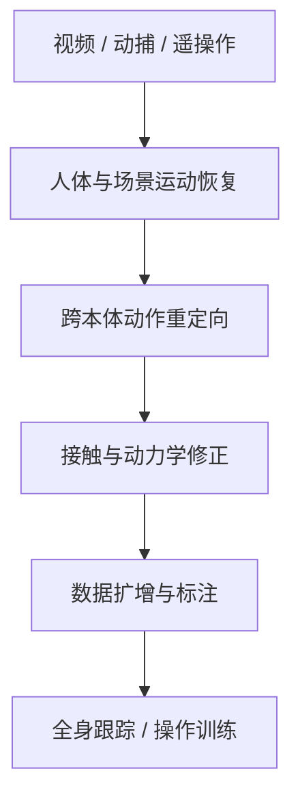

# 具身智能从入门到精通 Day 1：数据与重定向

> **文章节点**：这是 [Yuanxq（具身智能研究室）的原文](https://mp.weixin.qq.com/s/9Gh-3hxglD2Zw30DCva1pQ)的站内导读。原文涉及的 **30 篇论文各有自己的详情页**；本页负责解释它们在数据链中的位置，不把文章当成其中任何一篇论文。

## 一句话观点

从人类视频、动捕或遥操作得到的动作，必须经过时空恢复、跨本体重定向与接触/物理可行性检查，才能成为可靠的机器人训练数据；不同论文解决的是链上不同的误差来源。

## 英文缩写速查

| 缩写 | 英文全称 | 简要说明 |
|------|----------|----------|
| MoCap | Motion Capture | 采集人体或物体运动的参考轨迹 |
| IK | Inverse Kinematics | 约束末端目标并求解机器人关节配置 |
| HOI | Human-Object Interaction | 人与物体的接触及协同运动 |
| WBT | Whole-Body Tracking | 用参考动作训练全身跟踪控制器 |

## 数据链怎样读

| 环节 | 首先核对什么 | 常见失败 |
|------|--------------|----------|
| 运动恢复 | 世界坐标轨迹、相机运动和人体姿态是否一致 | 单目估计漂移使机器人追踪错误位移 |
| 重定向 | 身体比例、关节范围、末端目标和动作相位 | 动作看似相似，但机器人关节超限 |
| 物理修正 | 足底接触、物体接触、平衡与动力学可行性 | 穿模、滑脚或物体抓取点偏移 |
| 数据扩增 | 生成轨迹是否保留动作语义并可验证 | 只增加样本数，却放大不可靠标签 |

## 30 篇论文的独立详情入口

以下按**阅读用途**分组；编号与 [原始来源索引](../../sources/blogs/humanoid_motion_intelligence_day1_data_retargeting_2026_10_02.md)保持一致。每个链接打开一篇论文的规范详情节点。

### 先取得人体、场景与交互数据

| 原序号 | 论文详情 | 读它是为了解决 |
|------:|----------|----------------|
| 1 | [DexMV](../entities/paper-dexmv.md) | 从人手视频提取灵巧操作示范 |
| 2 | [WHAM](../entities/wham-world-human-motion.md) | 恢复世界系人体运动 |
| 3 | [TRAM](../entities/paper-tram-global-human-motion.md) | 联合处理相机与人体全局轨迹 |
| 4 | [GVHMR](../entities/gvhmr.md) | 在重力约束下恢复人体运动 |
| 24 | [HiPHI](../entities/paper-hiphi.md) | 采集和评测人–物交互 |
| 25 | [R2S-EGO](../entities/paper-r2s-ego.md) | 由稀疏采集恢复可用场景 |
| 29 | [EgoExoMoCap](../entities/paper-egoexomocap.md) | 结合第一与第三人称动捕 |
| 30 | [EgoHTR](../entities/paper-egohtr.md) | 获取带地形信息的人体示范 |

### 再把参考动作映射到机器人

| 原序号 | 论文详情 | 读它是为了解决 |
|------:|----------|----------------|
| 6 | [Retargeting Matters](../entities/paper-hrl-stack-01-retargeting_matters.md) | 重定向质量对后续控制的影响 |
| 7 | [OmniRetarget](../entities/paper-hrl-stack-03-omniretarget.md) | 保留人与场景的交互关系 |
| 8 | [DynaRetarget](../entities/paper-notebook-dynaretarget-dynamically-feasible-retargeting-us.md) | 生成动力学可行轨迹 |
| 9 | [Make Tracking Easy](../entities/paper-hrl-stack-02-make_tracking_easy.md) | 神经动作重定向与跟踪衔接 |
| 12 | [OTRetarget](../entities/paper-otretarget.md) | 联合重定向机器人与物体轨迹 |
| 14 | [Dense Temporal Motion Retargeting](../entities/paper-dense-temporal-motion-retargeting.md) | 联合优化时间相位 |
| 15 | [GestAdapt](../entities/paper-gestadapt.md) | 在工作空间约束下适配手势 |
| 16 | [HOI-Retarget](../entities/paper-hoi-retarget.md) | 保留人–物接触 |
| 17 | [BeyondRetarget](../entities/paper-beyondretarget-monocular-humanoid.md) | 从单目输入生成机器人参考 |
| 22 | [Unified Motion Retargeting](../entities/paper-umr-unified-motion-retargeting.md) | 通过表面对应跨本体映射 |

### 最后检查物理一致性并扩充训练数据

| 原序号 | 论文详情 | 读它是为了解决 |
|------:|----------|----------------|
| 5 | [PHC](../entities/phc.md) | 物理人体角色跟踪 |
| 10 | [HumanoidMimicGen](../entities/paper-humanoidmimicgen.md) | 生成全身模仿训练数据 |
| 11 | [ECHO-G](../entities/paper-echo-g-cospeech-humanoid.md) | 语音驱动的全身动作 |
| 13 | [PRISM](../entities/paper-prism-real2sim2real.md) | 反事实视觉数据扩增 |
| 18 | [MATE](../entities/paper-mate-virtual-teleop.md) | 多人协作遥操作数据 |
| 19 | [PhyVisGen](../entities/paper-phyvisgen.md) | 生成物理与视觉一致的操作数据 |
| 20 | [Automatic Labelling](../entities/paper-automatic-labelling-bimanual-mobile.md) | 双臂移动操作自动标注 |
| 21 | [HIGenNTO](../entities/paper-higennto-noise-space-optimization.md) | 场景交互动作生成 |
| 23 | [AnyWorld](../entities/paper-anyworld.md) | 跨本体第一视角世界建模 |
| 26 | [Shooting for Contact](../entities/paper-shooting-for-contact.md) | 接触约束下的动力学修正 |
| 27 | [Emergent Transfer](../entities/paper-emergent-transfer-cross-config.md) | 旧本体数据迁移到新配置 |
| 28 | [Data Pyramid](../entities/paper-data-pyramid-embodied-manipulation.md) | 比较操作数据来源与规模 |

## 如何用于自己的数据流水线

1. **手头只有视频**：先核查 WHAM、TRAM、GVHMR 之类运动恢复工作能否给出稳定的世界系轨迹，再考虑重定向。
2. **已经有 MoCap**：优先比较 Retargeting Matters、OmniRetarget、UMR 与 DynaRetarget 对身体比例、接触和物理约束的处理。
3. **要训练 G1 全身策略**：在进入 WBT 前检查足底接触、动作相位和关节限位；用 PHC、Shooting for Contact 等节点定位可行性问题。
4. **要扩大操作数据**：先确认物体轨迹和抓取接触标注可信，再看 HumanoidMimicGen、PhyVisGen、Automatic Labelling 等扩增或标注路线。

这些是阅读与选型顺序，并非原文逐项实验对比；具体指标、机器人型号与代码可用性应以各论文详情页及其官方来源为准。

## 关联页面

- [动作重定向知识链](./hub-motion-retargeting.md)
- [训练数据知识链](./hub-data-pipeline.md)
- [Motion Retargeting Pipeline](../concepts/motion-retargeting-pipeline.md)

## 参考来源

- [文章来源与 30 篇逐篇索引](../../sources/blogs/humanoid_motion_intelligence_day1_data_retargeting_2026_10_02.md)

## 推荐继续阅读

- [公众号原文](https://mp.weixin.qq.com/s/9Gh-3hxglD2Zw30DCva1pQ)
- [原项目 humanoid-motion-intelligence](https://github.com/RealXiaoze/humanoid-motion-intelligence)
