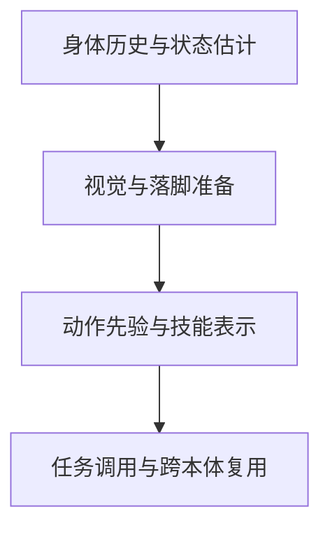

# 具身智能从入门到精通 Day 2：运动控制与运动先验

> **文章节点**：这是 [Yuanxq（具身智能研究室）的原文](https://mp.weixin.qq.com/s?__biz=Mzg5Mjc3MjA5Nw==&mid=2247502913&idx=1&sn=403b2a802ea3ced9af760794d3e2c8df)的站内导读。原文的 **34 篇论文各有自己的详情入口**；本页说明这些工作的关系，不把公众号文章当成其中任何一篇论文。

## 一句话观点

腿式机器人先要从身体反馈中判断状态，再利用视觉为落脚做准备；运动先验与潜在技能则让自然动作成为可调用、可组合的能力。

## 英文缩写速查

| 缩写 | 英文全称 | 简要说明 |
|------|----------|----------|
| RL | Reinforcement Learning | 本页大多数腿式运动控制策略的训练范式 |
| RMA | Rapid Motor Adaptation | 从本体历史在线估计环境外参并适配策略 |
| PIE | Parkour with Implicit-Explicit learning | 隐式—显式联合估计的感知跑酷框架 |
| AMP | Adversarial Motion Priors | 以判别器奖励约束动作风格接近参考动捕 |
| ASE | Adversarial Skill Embeddings | 预训练可复用潜在技能空间，供高层任务调用 |
| BFM | Behavior Foundation Model | 可经提示调用多种行为的人形行为基础模型 |

## 阅读路线

| 路线 | 先问什么 | 代表详情 |
|---|---|---|
| 本体估计 | 打滑、受阻或动力学变化怎样进入策略？ | [RMA](../entities/paper-rma-rapid-motor-adaptation.md)、[DreamWaQ](../entities/paper-dreamwaq.md)、[Digit 真机行走](../entities/paper-digit-humanoid-locomotion-rl.md) |
| 视觉感知 | 前方地形怎样与历史身体状态结合？ | [PIE](../entities/paper-pie-parkour-implicit-explicit.md)、[DreamWaQ++](../entities/dreamwaq-plus.md)、[Hiking in the Wild](../entities/paper-hiking-in-the-wild.md) |
| 运动先验 | 怎样让动作自然且保留任务适应？ | [AMP](../entities/paper-amp-survey-01-amp.md)、[ASE](../methods/ase.md)、[BFM-Zero](../entities/paper-bfm-zero.md) |
| 技能调用 | 怎样提示、串联和跨本体复用行为？ | [UFO](../entities/roboparty-ufo.md)、[CrossBFM](../entities/paper-crossbfm-shared-latent-behavior.md)、[Spectral Skills](../entities/paper-spectral-skills-motion-representation.md) |

## 34 篇论文的独立详情入口

以下按文章脉络分组。每项链接到对应工作**唯一的规范详情节点**；详情页不足的工作已单独补齐，已经存在的不同论文继续分别保留。

### 经典脉络：状态估计与感知行走

| 论文 / 项目 | 独立详情 | 阅读重点 |
|---|---|---|
| Learning Quadrupedal Locomotion over Challenging Terrain | [Learning Quadrupedal Locomotion over Challenging Terrain](../entities/paper-notebook-learning-quadrupedal-locomotion-over-challenging.md) | 复杂地形上的特权教师与本体历史学生。 |
| RMA: Rapid Motor Adaptation for Legged Robots | [RMA: Rapid Motor Adaptation for Legged Robots](../entities/paper-rma-rapid-motor-adaptation.md) | 从状态—动作历史提取环境适应表示。 |
| DreamWaQ: Learning Robust Quadrupedal Locomotion With Implicit Terrain Imagination | [DreamWaQ: Learning Robust Quadrupedal Locomotion With Implicit Terrain Imagination](../entities/paper-dreamwaq.md) | 由本体历史估计运动状态与隐式环境信息。 |
| Robust Perceptive Locomotion for Quadrupedal Robots in the Wild | [Robust Perceptive Locomotion for Quadrupedal Robots in the Wild](../entities/paper-robust-perceptive-locomotion-wild.md) | 融合带噪高程图与身体反馈。 |
| PIE: Parkour with Implicit-Explicit Learning Framework for Legged Robots | [PIE: Parkour with Implicit-Explicit Learning Framework for Legged Robots](../entities/paper-pie-parkour-implicit-explicit.md) | 联合利用深度历史和本体历史进行感知跑酷。 |
| DreamWaQ++: Obstacle-Aware Quadrupedal Locomotion | [DreamWaQ++: Obstacle-Aware Quadrupedal Locomotion](../entities/dreamwaq-plus.md) | 将点云感知接入四足运动策略。 |
| Real-World Humanoid Locomotion with Reinforcement Learning | [Real-World Humanoid Locomotion with Reinforcement Learning](../entities/paper-digit-humanoid-locomotion-rl.md) | 历史观测策略迁移到 Digit 真机。 |

### 运动先验与技能调用

| 论文 / 项目 | 独立详情 | 阅读重点 |
|---|---|---|
| AMP: Adversarial Motion Priors for Stylized Physics-Based Character Control | [AMP: Adversarial Motion Priors for Stylized Physics-Based Character Control](../entities/paper-amp-survey-01-amp.md) | 从示范转移中学习风格奖励。 |
| Adversarial Motion Priors Make Good Substitutes for Complex Reward Functions | [Adversarial Motion Priors Make Good Substitutes for Complex Reward Functions](../entities/paper-amp-locomotion-quadruped-rewards.md) | 将 AMP 运动先验用于 A1 真机行走。 |
| Hiking in the Wild: A Scalable Perceptive Parkour Framework for Humanoids | [Hiking in the Wild: A Scalable Perceptive Parkour Framework for Humanoids](../entities/paper-hiking-in-the-wild.md) | 感知、落脚约束与动作先验共同支持 G1 跑酷。 |
| Deep Whole-body Parkour | [Deep Whole-body Parkour](../entities/paper-deep-whole-body-parkour.md) | 深度感知的人形全身动作跟踪与跑酷。 |
| ASE: Large-scale Reusable Adversarial Skill Embeddings | [ASE: Large-scale Reusable Adversarial Skill Embeddings](../methods/ase.md) | 学习可选择、可复用的潜在动作技能。 |
| BFM-Zero: A Promptable Behavioral Foundation Model for Humanoid Control | [BFM-Zero: A Promptable Behavioral Foundation Model for Humanoid Control](../entities/paper-bfm-zero.md) | 通过目标提示调用预训练行为。 |
| UFO: A General Unsupervised Reinforcement Learning Framework for Humanoid Control | [UFO: A General Unsupervised Reinforcement Learning Framework for Humanoid Control](../entities/roboparty-ufo.md) | 开源行为预训练框架，含 UFO-FB 与 UFO-TeCH 路线。 |

### 拓展阅读：2026 年工作

| 论文 / 项目 | 独立详情 | 阅读重点 |
|---|---|---|
| NEXUS: Perceptive Whole-Body Control for Terrain-Adaptive Teleoperation | [NEXUS: Perceptive Whole-Body Control for Terrain-Adaptive Teleoperation](../entities/paper-nexus-terrain-adaptive-teleoperation.md) | 地形适配的人体动作参考与全身遥操作。 |
| LocoWM: High-Precision Locomotion through World-Model-Guided Residual Adaptation | [LocoWM: High-Precision Locomotion through World-Model-Guided Residual Adaptation](../entities/paper-locowm.md) | 动作条件世界模型预测托盘与身体响应并提前修正。 |
| DODGER: Safety-Guided Reinforcement Learning for Robot Navigation Among Dynamic Obstacles | [DODGER: Safety-Guided Reinforcement Learning for Robot Navigation Among Dynamic Obstacles](../entities/paper-dodger-dynamic-obstacle-navigation.md) | 在人群等动态障碍中生成安全导航命令。 |
| Locomotion-Grounded Humanoid Soccer: Task-Gated Reinforcement Learning of a Multi-Directional Kicking Library | [Locomotion-Grounded Humanoid Soccer: Task-Gated Reinforcement Learning of a Multi-Directional Kicking Library](../entities/paper-locomotion-grounded-humanoid-soccer.md) | 以通用行走为基础学习多方向踢球技能。 |
| CrossBFM: Distilling a Shared Latent Behavior Space Across Humanoid Embodiments | [CrossBFM: Distilling a Shared Latent Behavior Space Across Humanoid Embodiments](../entities/paper-crossbfm-shared-latent-behavior.md) | 蒸馏可跨人形本体复用的行为表示。 |
| Learning Expressive and Compositional Motion Representation via Spectral Skills | [Learning Expressive and Compositional Motion Representation via Spectral Skills](../entities/paper-spectral-skills-motion-representation.md) | 连续技能表示支持运动跟踪、串联和组合。 |
| Generate, Track, Improve | [Generate, Track, Improve](../entities/paper-generate-track-improve.md) | 感知生成参考轨迹，再由固定跟踪器执行。 |
| Humanoid Badminton: Learning Dynamic Racket Skills from Limited Human Motion Data | [Humanoid Badminton: Learning Dynamic Racket Skills from Limited Human Motion Data](../entities/paper-humanoid-badminton-dynamic-racket-skills.md) | 有限的人类动作示范与在线羽毛球技能调用。 |
| Echo in the Steps: Learning Perceptive Humanoid Parkour with Gated Memory | [Echo in the Steps: Learning Perceptive Humanoid Parkour with Gated Memory](../entities/paper-echo-in-the-steps.md) | 门控记忆保留之后落脚所需的地形线索。 |
| DAVIS: A Depth-Only End-to-End Active-Vision Framework for Humanoid Soccer Skills | [DAVIS: A Depth-Only End-to-End Active-Vision Framework for Humanoid Soccer Skills](../entities/paper-davis-humanoid-soccer.md) | 头部主动视觉与人形足球策略共同学习。 |
| Banana Kick: Response-Informed Skill Evolution for Humanoid Soccer | [Banana Kick: Response-Informed Skill Evolution for Humanoid Soccer](../entities/paper-banana-kick-humanoid-soccer.md) | 利用执行反馈迭代足球技能奖励。 |
| Humanoid Locomotion with a Fly-Inspired Recurrent Controller | [Humanoid Locomotion with a Fly-Inspired Recurrent Controller](../entities/paper-humanoid-fly-inspired-rnn.md) | 检验循环状态在果蝇启发行走控制器中的作用。 |
| PredActor: Predictive Action Diffusion for Steerable Onboard Humanoid Control | [PredActor: Predictive Action Diffusion for Steerable Onboard Humanoid Control](../entities/paper-predactor.md) | 联合生成未来状态与动作并在机载闭环执行。 |
| UniPoint: Unified Point-Level Sensor Fusion for Humanoid Locomotion Across Challenging Terrains | [UniPoint: Unified Point-Level Sensor Fusion for Humanoid Locomotion Across Challenging Terrains](../entities/paper-unipoint-sensor-fusion-locomotion.md) | 融合深度相机与激光雷达点级几何信息。 |
| FootQuery: Future-Touchdown-Guided Retrieval from Depth History | [FootQuery: Future-Touchdown-Guided Retrieval from Depth History](../entities/paper-footquery-perceptive-humanoid-locomotion.md) | 按预计触地点从深度历史检索地形。 |
| Moving Through Clutter (MTC): Learning Scene-Aware Humanoid Locomotion through 3D Clutter from Immersive Human Demonstrations | [Moving Through Clutter (MTC): Learning Scene-Aware Humanoid Locomotion through 3D Clutter from Immersive Human Demonstrations](../entities/paper-mtc-scene-aware-humanoid-locomotion.md) | 用完整三维场景约束杂物环境中的全身穿行。 |
| GM-Loco: Terrain-Adaptive Humanoid Locomotion on Granular Media | [GM-Loco: Terrain-Adaptive Humanoid Locomotion on Granular Media](../entities/paper-gm-loco.md) | 面向沙地等颗粒介质建模脚地作用。 |
| SkillX: Unified Multi-Skill Policy Learning for Humanoid Soccer | [SkillX: Unified Multi-Skill Policy Learning for Humanoid Soccer](../entities/paper-skillx-humanoid-soccer.md) | 统一足球策略学习技能及其切换。 |
| World-Model-Augmented Visual Locomotion for Humanoids on Foothold-Constrained Terrain | [World-Model-Augmented Visual Locomotion for Humanoids on Foothold-Constrained Terrain](../entities/paper-wm-loco.md) | 用预测性记忆辅助踏石、楼梯和沟隙行走。 |
| SOLO: Stable Omni-terrain Long-Horizon Perceptive Humanoid Locomotion | [SOLO: Stable Omni-terrain Long-Horizon Perceptive Humanoid Locomotion](../entities/paper-solo.md) | 把关键地形查询与长程误差归因用于感知行走。 |

## 关联页面

- [Day 1：数据与重定向](./humanoid-motion-intelligence-day1-data-retargeting.md)
- [Locomotion 步态知识链](./hub-locomotion.md)
- [全身跟踪知识链](./hub-wbt.md)
- [文章来源与逐篇索引](../../sources/blogs/humanoid_motion_intelligence_day2_locomotion_motion_priors_2026_10_03.md)

原文中转述的数值用于定位研究结论，不构成同一实验条件下的横向排名。阅读时应回到论文核实平台、传感器、成功定义和实机条件。

## 参考来源

- [Day 2 文章来源索引](../../sources/blogs/humanoid_motion_intelligence_day2_locomotion_motion_priors_2026_10_03.md)

## 系列后续

- [Day 3：动作跟踪与全身控制](./humanoid-motion-intelligence-day3-motion-tracking-wbc.md)
- [Day 4：移动操作](./humanoid-motion-intelligence-day4-loco-manipulation.md)
