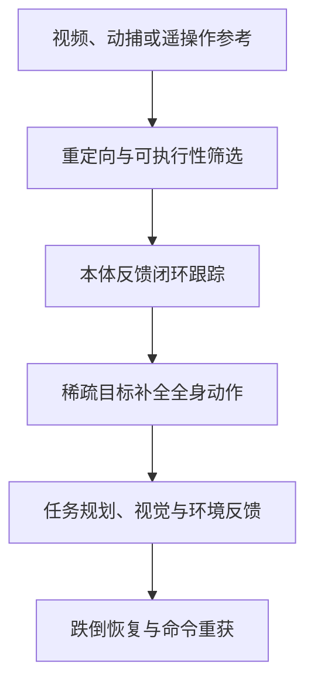

# 具身智能从入门到精通 Day 3：动作跟踪与全身控制

> **文章节点**：Yuanxq（具身智能研究室）[原文](https://mp.weixin.qq.com/s?__biz=Mzg5Mjc3MjA5Nw==&mid=2247503024&idx=1&sn=ddcbec9f9b7f8880a88f38127fd6a44c)的站内导读。论文条目分别链接到独立详情页；本页归纳工作关系，不替代论文。

## 一句话观点

动作跟踪需在参考动作与真实身体状态之间闭环。目标越稀疏，控制器需补全的身体自由度越多；进入导航与操作后，还要接入地形、视觉、接触和任务反馈。

## 英文缩写速查

| 缩写 | 英文全称 | 说明 |
|---|---|---|
| WBC | Whole-Body Control | 协调全身关节、支撑和任务目标 |
| MoCap | Motion Capture | 提供人体或机器人动作参考 |
| PPO | Proximal Policy Optimization | 常用于学习式动作控制 |
| BFM | Behavior Foundation Model | 面向多动作和多控制接口的策略模型 |

## 方法关系

给定动作参考的研究关注姿态、节奏和接触误差；稀疏目标研究让策略补齐未指定身体部位；任务控制研究再引入规划与场景信息。比较时需区分策略的输入、外部定位来源与真机闭环边界。

## 论文与项目独立详情

| 工作 | 独立详情 | 在主线中的作用 |
|---|---|---|
| DeepMimic | [独立详情](../methods/deepmimic.md) | 物理动作模仿与恢复 |
| H2O | [独立详情](../entities/paper-h2o-human-to-humanoid-teleoperation.md) | 视频遥操作和教师—学生全身控制 |
| TWIST | [独立详情](../entities/paper-twist.md) | 遥操作与动作示范采集 |
| TWIST 2 | [独立详情](../entities/paper-twist2.md) | 便携人形动作数据采集 |
| ExBody | [独立详情](../entities/paper-exbody-expressive-humanoid.md) | 上身跟踪与下肢步态补全 |
| OmniH2O | [独立详情](../entities/paper-hrl-stack-08-omnih2o.md) | 头手目标补全全身动作 |
| MaskedMimic | [独立详情](../entities/paper-bfm-17-maskedmimic.md) | 遮罩条件动作补全 |
| HOVER | [独立详情](../entities/paper-bfm-14-hover.md) | 多模态命令统一控制 |
| BeyondMimic | [独立详情](../methods/beyondmimic.md) | 动作跟踪与引导扩散规划 |
| SONIC | [独立详情](../methods/sonic-motion-tracking.md) | 规模化全身动作跟踪 |
| GAE | [独立详情](../entities/paper-gae-general-action-expert.md) | 跨本体实时遥操作 |
| PLAT | [独立详情](../entities/paper-plat-sparse-keyframe-tracking.md) | 稀疏关键帧跟踪 |
| Runway Humanoid | [独立详情](../entities/paper-runway-expressive-locomotion.md) | 从单目视频迁移步态风格 |
| X-WBC | [独立详情](../entities/paper-x-wbc.md) | 跨本体全身控制模型 |
| ViBe | [独立详情](../entities/paper-vibe.md) | 视觉适配全身控制 |
| PGMT | [独立详情](../entities/paper-pgmt.md) | 地形感知动作跟踪 |
| AdaPT | [独立详情](../entities/paper-adapt.md) | 网球风格动作自适应规划 |
| GigaBrain-WBC-0.5 | [独立详情](../entities/paper-gigabrain-wbc-0-5.md) | 交互感知行为世界模型 |
| HumanTracker | [独立详情](../entities/paper-humantracker.md) | 人类对齐跟踪评测 |
| PFM-HR | [独立详情](../entities/paper-pfm-hr.md) | 姿态先验与动作跟踪 |
| StableMimic | [独立详情](../entities/paper-stablemimic.md) | 跟踪策略的跌倒恢复 |
| Teleopit | [独立详情](../entities/paper-teleopit.md) | 全身遥操作和数据采集 |
| Extreme-RGMT | [独立详情](../entities/paper-extreme-rgmt.md) | 高动态技能持续学习 |
| YAHMP | [独立详情](../entities/paper-yahmp.md) | 通用跟踪策略消融 |
| ScaleBFM | [独立详情](../entities/paper-scaling-bfm-humanoid.md) | 行为基础模型规模化 |
| MimicLite | [独立详情](../entities/mimiclite.md) | 高效动作跟踪 |
| HEFT | [独立详情](../entities/paper-heft.md) | 重载遥操作 |
| ReactiveBFM | [独立详情](../entities/paper-reactivebfm.md) | 本体反馈下分块规划 |
| AnyBody | [独立详情](../entities/paper-anybody-keypoint-humanoid-control.md) | 任意关键点全身控制 |
| FADA | [独立详情](../entities/paper-fada-humanoid.md) | 少样本动力学适配 |

## 结论

完整动作跟踪、稀疏命令补全、任务规划和跌倒恢复是相邻但不同的问题。选择方法时应分别检查参考来源、部署观测、未指定部位如何生成、失败后如何恢复，以及仿真与真机证据。

## 参考来源

- [Day 3 原文与索引归档](../../sources/blogs/humanoid_motion_intelligence_day3_motion_tracking_wbc_2026_10_04.md)
- [humanoid-motion-intelligence 项目](https://github.com/RealXiaoze/humanoid-motion-intelligence)
- 下一篇：[Day 4：移动操作](./humanoid-motion-intelligence-day4-loco-manipulation.md)
