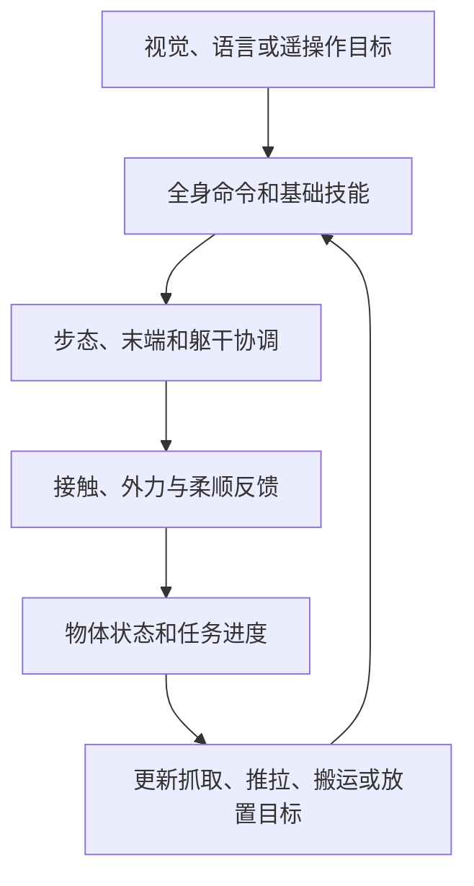

# 具身智能从入门到精通 Day 4：移动操作

> **文章节点**：Yuanxq（具身智能研究室）[原文](https://mp.weixin.qq.com/s/UeBpHKuQDRnXG9lAnoH6AA)的站内导读。各论文/项目有各自的独立详情入口。

## 一句话观点

移动操作既要协调步态和手部目标，也要处理接触外力、末端柔顺与物体状态变化。低层身体控制、接触适应和上层任务阶段需要分层评估。

## 英文缩写速查

| 缩写 | 英文全称 | 说明 |
|---|---|---|
| WBC | Whole-Body Control | 全身协调控制 |
| VLA | Vision-Language-Action | 视觉和语言条件下的动作策略 |
| DAgger | Dataset Aggregation | 用教师纠正学生策略访问的状态 |
| UMI | Universal Manipulation Interface | 跨平台操作数据与接口 |

## 方法关系

## 论文与项目独立详情

| 工作 | 独立详情 | 在主线中的作用 |
|---|---|---|
| Deep Whole-Body Control | [独立详情](../entities/paper-deep-whole-body-control-loco-manip.md) | 统一腿臂策略 |
| ULC | [独立详情](../entities/paper-loco-manip-161-048-ulc.md) | 统一移动和双臂命令 |
| Visual Whole-Body Control | [独立详情](../entities/paper-visual-whole-body-control-vbc.md) | 视觉目标分层控制 |
| FALCON | [独立详情](../entities/paper-loco-manip-161-109-falcon.md) | 外力下全身协调 |
| SoFTA | [独立详情](../entities/paper-gentlehumanoid.md) | 末端稳定与步态分频 |
| CHIP | [独立详情](../entities/paper-hrl-stack-36-chip.md) | 可调接触柔顺 |
| SkillBlender | [独立详情](../entities/paper-loco-manip-161-077-skillblender.md) | 技能连续混合 |
| HDMI | [独立详情](../entities/paper-hrl-stack-06-hdmi.md) | 跟踪人体、物体与接触 |
| VIRAL | [独立详情](../entities/paper-viral-humanoid-visual-sim2real.md) | 视觉仿真到现实移动操作 |
| DoorMan | [独立详情](../entities/paper-doorman-opening-sim2real-door.md) | 视觉开门策略 |
| CEER2 | [独立详情](../entities/paper-ceer2-directional-compliance.md) | 方向可调末端和根部柔顺 |
| EgoHumanoid-V2 | [独立详情](../entities/paper-loco-manip-161-060-egohumanoid.md) | 人体全身技能迁移 |
| Uni-VLaT | [独立详情](../entities/paper-uni-vlat.md) | 全身触觉适配 VLA |
| DexRoam | [独立详情](../entities/paper-dexroam-mobile-bimanual-manipulation.md) | 移动双手灵巧操作 |
| DexWeave | [独立详情](../entities/paper-dexweave-humanoid-loco-manipulation.md) | 人体交互重定向和全身策略 |
| CompliantWBC | [独立详情](../entities/paper-compliantwbc-heavy-humanoid.md) | 重型人形全身柔顺 |
| Praxis | [独立详情](../entities/paper-praxis-egocentric-interaction-priors.md) | 第一视角交互先验（标题待核） |
| VisForce | [独立详情](../entities/paper-visforce-force-grounding.md) | 视觉对齐当前力和目标力 |
| HOTICE | [独立详情](../entities/paper-hotice.md) | 拥挤环境物体运输 |
| STRIDER | [独立详情](../entities/paper-strider-multi-gait-loco-manip.md) | 多步态移动操作 |
| Whole-Body UMI | [独立详情](../entities/paper-whole-body-umi-realtime-motion.md) | 迁移 UMI 操作技能 |
| KINO | [独立详情](../entities/paper-kino.md) | 关键帧规划和全身执行 |
| ViLoMan | [独立详情](../entities/paper-viloman.md) | 视觉—本体全身移动操作 |
| Weave | [独立详情](../entities/paper-weave.md) | 人体示范灵巧移动操作 |
| ForeTime-VLA | [独立详情](../entities/paper-foretime-vla.md) | 未来 token 蒸馏 |
| DECOWAM | [独立详情](../entities/paper-decowam.md) | 解耦世界动作模型 |
| MobileWAM | [独立详情](../entities/paper-rcl-2608-04657-mobilewam-bridging-world-action-models-to-mobile.md) | 移动操作世界动作模型 |
| TF-ART | [独立详情](../entities/paper-tf-art-tactile-force-survey.md) | 力觉和触觉学习综述 |
| FARO | [独立详情](../entities/paper-faro-feasibility-aware-robot-motion-optimization.md) | 可行性约束的运动优化 |
| SteadyTray | [独立详情](../entities/paper-notebook-steadytray.md) | 托盘物体平衡 |

## 评读边界

分别检查任务目标由谁生成、控制器使用何种接触观测、物体状态如何进入闭环，以及论文结果来自仿真还是特定真机配置。固定任务成功率不能单独说明失败恢复或开放场景泛化能力。

## 结论

将方法按“身体控制—接触适应—物体任务反馈”拆开，可判断进步来自哪一层。现实部署还受传感器、标定、手部结构、物体估计与任务切换影响。

## 参考来源

- [Day 4 原文与索引归档](../../sources/blogs/humanoid_motion_intelligence_day4_loco_manipulation_2026_10_05.md)
- [humanoid-motion-intelligence 项目](https://github.com/RealXiaoze/humanoid-motion-intelligence)
- 前篇：[Day 3：动作跟踪与全身控制](./humanoid-motion-intelligence-day3-motion-tracking-wbc.md)
