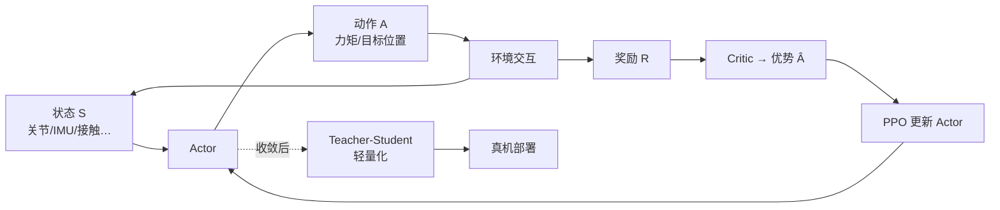

# 人形 RL 策略训练五模块：从 MDP 到蒸馏部署

## 一句话定义

**人形 RL 策略训练五模块** 把数据驱动运动控制拆成固定耦合的闭环：RL/MDP 交互框架 → Actor-Critic 决策–评估 → PPO 稳定更新 → 多维奖励塑形 → Teacher-Student 轻量化部署；工程落地常与底层 WBC/MPC 组成混合架构。

## 英文缩写速查

| 缩写 | 英文全称 | 简要说明 |
|------|----------|----------|
| MDP | Markov Decision Process | 状态–动作–转移–奖励–折扣的五元组建模 |
| AC | Actor-Critic | Actor 出动作、Critic 估价值的标准深度 RL 结构 |
| PPO | Proximal Policy Optimization | 用 clip 限制策略更新幅度的主流 on-policy 算法 |
| TS | Teacher-Student Distillation | 大 teacher 策略蒸馏为可机载部署的 student |
| WBC | Whole-Body Control | 传统全身控制；常作混合架构底层安全层 |

## 为什么重要

- **补齐「训练模块栈」**：相对 [身体系统栈](./humanoid-rl-motion-control-body-system-stack.md)（按能力层读论文），本页按 **训练流水线组件** 读 RL 运控，适合入门与选型对齐。
- **解释为何模块不能拆着卖**：Actor-Critic / PPO / 奖励都嵌在 MDP 循环里；蒸馏是收敛后的后置步骤，不是另一条独立训练主线。
- **对接工程 checklist**：与 [Humanoid RL Cookbook](../queries/humanoid-rl-cookbook.md)、[奖励设计指南](../queries/locomotion-reward-design-guide.md)、[Privileged Training](../concepts/privileged-training.md) 同一叙事轴。

## 五模块与数据流

| 模块 | 在闭环中的位置 | 核心机制（文内读法） | 详页 |
|------|----------------|----------------------|------|
| **1. RL/MDP 框架** | 顶层交互逻辑 | $(S,A,P,R,\gamma)$；最大化 $\mathbb{E}[\sum_t \gamma^t r_t]$ | [MDP](../formalizations/mdp.md)、[最小闭环](../concepts/embodied-rl-minimal-closed-loop.md) |
| **2. Actor-Critic** | 网络载体 | Actor 决策；Critic 估 $V/Q$；优势 $A=Q-V$ 强化/抑制动作 | [RL](../methods/reinforcement-learning.md) |
| **3. PPO** | 优化规则 | clip 新旧策略比，小步更新，防策略突变 | [PPO](../methods/ppo.md) |
| **4. 奖励函数** | 评价标准 | 任务 + 平衡 + 平滑 − 危险惩罚；权重无通用模板 | [奖励设计](../queries/locomotion-reward-design-guide.md) |
| **5. Teacher-Student** | 后置部署 | 大模型策略 → 小模型拟合输出；降延迟/算力 | [Privileged Training](../concepts/privileged-training.md) |

## 核心原理（模块耦合）

1. **框架先于算法**：没有状态–动作–奖励循环，PPO 与 Critic 无处可跑；这是 [具身 RL 最小闭环](../concepts/embodied-rl-minimal-closed-loop.md) 的同一前提。
2. **前端三件套共训**：Actor-Critic 提供参数化策略与价值；奖励决定 Critic 拟合目标；PPO 只更新 Actor（依赖 Critic 的优势）。
3. **蒸馏不参与前期探索**：对象是已收敛的成熟策略；损失最小化师生动作分布差，并可叠加任务奖励，避免「只抄均值、丢任务指标」。
4. **AMP 等模仿学习**：文内旁注其底层常沿用 Actor-Critic / PPO；本页不展开运动先验线，见 [身体系统栈](./humanoid-rl-motion-control-body-system-stack.md) 与 AMP 相关实体。

## 工程实践

- **状态空间常见项**：关节角/速、IMU 姿态与角速度、足部接触、质心位置与速度等可观测量。
- **动作接口**：关节力矩或目标关节位置（经底层 PD）；实时性要求 Actor 直接对接执行器指令链路。
- **奖励调试**：先保证前进/平衡主项有效，再加压平滑与惩罚；权偏会直接出现抖动、畸形步态或原地「赚钱」行为。
- **PPO 经验阈值**：文内常规 clip $\varepsilon \approx 0.2$；人形高维下「更新过猛」比「学得慢」更致命。
- **部署路径**：仿真大 teacher → 蒸馏 student → 真机；特权信息/机载观测差见 [Privileged Training](../concepts/privileged-training.md) 与 [Sim2Real](../concepts/sim2real.md)。
- **与传统控制混合（文内收束）**：底层 WBC/MPC 保安全与基础稳定，上层 RL 生成自适应运动指令——对照 [WBC vs RL](../comparisons/wbc-vs-rl.md)。

## 局限与风险

- **奖励敏感**：无通用模板；换机型/任务几乎必重调。
- **蒸馏不是免费午餐**：teacher 未收敛或观测接口不对齐时，student 只会稳定地学错。
- **不要把五模块当成论文榜单**：本页是 **训练体系读法**；按能力层选型仍看 [身体系统栈](./humanoid-rl-motion-control-body-system-stack.md)。
- **解析控制并未被否定**：传统路径在结构化轨迹跟踪上仍有稳定性优势；RL 解的是「难写闭式、需自适应」的那一段。

## 关联页面

- [具身 RL 最小闭环](../concepts/embodied-rl-minimal-closed-loop.md) — MDP 仿真循环入门
- [Humanoid RL Cookbook](../queries/humanoid-rl-cookbook.md) — 从零训真机行走 checklist
- [Reinforcement Learning](../methods/reinforcement-learning.md) / [PPO](../methods/ppo.md)
- [Privileged Training](../concepts/privileged-training.md) — 师生/特权蒸馏
- [人形 RL 身体系统栈](./humanoid-rl-motion-control-body-system-stack.md) — 正交的能力层视角
- [机器人学习五大范式](../comparisons/robot-learning-five-paradigms-taxonomy.md) — 学习信号选型超集

## 参考来源

- [人形机器人运动控制：强化学习与策略训练体系详解](../../sources/blogs/wechat_shenlan_humanoid_rl_policy_training_system.md) — 深蓝具身智能（<https://mp.weixin.qq.com/s/mxesB0pGI_NLSkSf-cZYug>）

## 推荐继续阅读

- 原文：<https://mp.weixin.qq.com/s/mxesB0pGI_NLSkSf-cZYug>
- [具身 RL 最小闭环源文](../../sources/blogs/wechat_shenlan_rl_embodied_minimal_closed_loop.md)
- [Humanoid RL Cookbook](../queries/humanoid-rl-cookbook.md)

<!-- sync 2026-08-08T04:42:45Z -->
