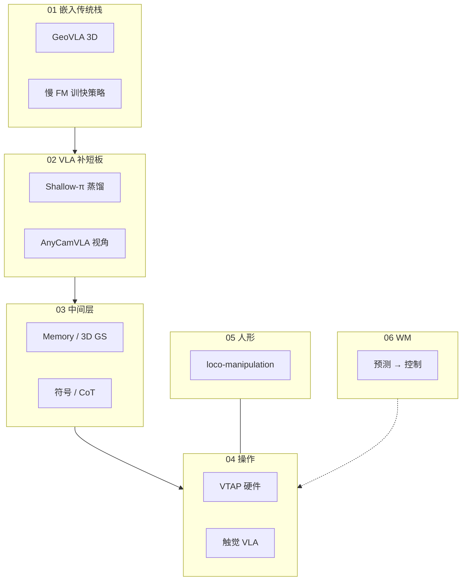

# IROS 2026：1933 篇论文的六条变化

> **本页定位**：[AI科技评论 · 六变化解读](https://mp.weixin.qq.com/s/XvdbbidbJKBszMQwVzvD0A)（2026-09-25）的阅读坐标；**非** IROS 全量论文库，而是文内 **多标签统计 + 代表论文** 的横切面。

## 一句话观点

**大模型没有「吃掉」机器人学——学习、感知、规划、控制与操作以更高密度交织；VLA 从 scaling 转向效率/几何/记忆/系统壳，World Model 仍少（~1%）但更贴近控制环。**

## 英文缩写速查

| 缩写 | 英文全称 | 简要说明 |
|------|----------|----------|
| IROS | IEEE/RSJ International Conference on Intelligent Robots and Systems | 智能机器人与系统顶会 |
| VLA | Vision-Language-Action | 视觉–语言–动作策略 |
| WM | World Model | 环境动态预测模型 |
| TAMP | Task and Motion Planning | 任务与运动规划 |
| FM | Foundation Model | 大基础模型 |

## 六节结构 → 代表节点

| # | 主题 | 文内判断 | 本库入口（代表） |
|---|------|----------|------------------|
| 01 | AI 嵌入传统栈 | LLM 不取代 Planner；几何/慢训快控/触觉 FM 回归 | [GeoVLA](../entities/paper-geovla.md)、catalog |
| 02 | VLA 补短板 | 蒸馏、3D、视角、记忆、RoboBRIDGE 系统 | [Shallow-π](../entities/paper-shallow-pi.md)、[AnyCamVLA](../entities/paper-anycam-vla.md) |
| 03 | 中间层复兴 | Memory/Reasoning/3D/符号约束 | [catalog](../../sources/papers/iros_2026_ai_tech_review_six_trends_cited_papers_catalog.md) §03 |
| 04 | Manipulation | 触觉×学习×硬件 | [VTAP](../entities/paper-vtap-gripper.md)、HapticVLA 索引 |
| 05 | Humanoid loco-manip | 从会走到边走边干 | [ULTRA](../entities/paper-notebook-ultra-unified-multimodal-control-for-autonomous.md)、[DreamMimic](../entities/paper-dreammimic.md) |
| 06 | World Model | 19 篇、向控制参与 | catalog §06 |

**本 ingest：2 新建实体**（GeoVLA、Shallow-π）；**7+ 复用**既有节点；其余见 [catalog](../../sources/papers/iros_2026_ai_tech_review_six_trends_cited_papers_catalog.md)。

## 流程总览

## 统计读法（来自公众号，多标签不可加总）

- Robot Learning ~809；Navigation ~564；Perception ~556；Control ~546；Manipulation ~520；Humanoid ~213。
- VLA/LLM 相关 ~162（8.4%）；Reasoning/Memory ~119（6.2%）；World Model **仅 19（~1%）**。

## 关联页面

- [IROS 六趋势 Query 沉淀](../queries/iros-2026-six-trends-from-1933-papers.md)
- [VLA](../methods/vla.md)
- [loco-manipulation](../tasks/loco-manipulation.md)

## 参考来源

- [wechat_ai_tech_review_iros_2026_six_trends_2026-09-25.md](../../sources/blogs/wechat_ai_tech_review_iros_2026_six_trends_2026-09-25.md)
- [iros_2026_ai_tech_review_six_trends_cited_papers_catalog.md](../../sources/papers/iros_2026_ai_tech_review_six_trends_cited_papers_catalog.md)

## 推荐继续阅读

- [IROS 2026 官网](https://ieee-iros.org/)
- [GeoVLA](./../entities/paper-geovla.md) · [Shallow-π](./../entities/paper-shallow-pi.md)
