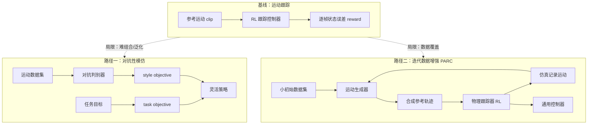

# Jason Peng：更灵活的运动技能学习

> **本页定位**：为 Jason Peng 关于「合成运动数据 → 通用人形控制」的分享提供 **按问题—方法—部署组织的阅读坐标**。**一手讲者视频**见 [NUS 研讨会录像](../../sources/courses/jason_peng_synthetic_motion_humanoid_youtube.md)；[human five 微信编译](https://mp.weixin.qq.com/s/b-5UIRB1mkEDcIJlAT2jwg) 额外覆盖对抗性模仿路径。方法学细节见 [Xue Bin Peng](../entities/xue-bin-peng.md) 与 `wiki/methods/` 各页，本页不复述每篇论文公式。

## 一句话观点

人形运动控制的下一关不是「把更多 clip 跟踪得更像」，而是让控制器在 **数据稀缺** 下仍能 **组合行为、适应新目标与物体**——对抗性分布匹配与生成式迭代数据增强是 Peng 组给出的两条互补主线，真机部署仍受 **sim2real 与执行器建模** 牵制。

## 英文缩写速查

| 缩写 | 英文全称 | 简要说明 |
|------|----------|----------|
| RL | Reinforcement Learning | 通过与环境交互学习策略的范式 |
| IL | Imitation Learning | 从参考运动或演示学习控制策略 |
| GAIL | Generative Adversarial Imitation Learning | 用判别器替代手工模仿奖励的 IL 范式 |
| AMP | Adversarial Motion Prior | 对抗式运动先验，匹配状态转移分布 |
| Sim2Real | Simulation to Real | 仿真策略迁移到真机的工程鸿沟 |

## 问题：运动跟踪的「发条玩具」

[DeepMimic](../methods/deepmimic.md) 式 **RL + 逐帧运动跟踪** 已能复现多种技能，但 Peng 指出三条结构性局限：

1. **灵活性不足**：策略近似「播放固定参考」，难执行未在数据中出现的任务变体（目标微移即需新 clip）。
2. **数据稀缺**：实用任务往往只有稀疏示例，却需要覆盖连续变体的通用控制器。
3. **自然度与任务解耦**：纯跟踪 reward 把「像参考」与「完成任务」绑死，阻碍组合与重排技能。

## 流程总览：两条超越运动跟踪的主线

## 路径一：对抗性模仿 — 任务与风格分解

| 组件 | 作用 | 与仓库页面 |
|------|------|------------|
| **Distribution matching** | 匹配行为分布而非逐帧 pose | [AMP](../methods/amp-reward.md)、[模仿学习](../methods/imitation-learning.md) |
| **Task objective** | 走到目标、击打、运球等高层任务 | 与跟踪 reward 的任务项对照 |
| **Style objective** | 判别器约束「像数据集里的自然运动」 | GAIL / AMP 族 |
| **涌现组合** | 无「走向并击打」示例仍可击打不同目标 | 超越固定 clip 的关键 |

**文内案例**：击打/运球、跌倒起身自动切换、坐不同家具、拾放不同质量物体——均强调 **小数据集 + 对抗目标** 带来的组合泛化。

## 路径二：生成模型与 PARC 迭代增强

| 阶段 | 机制 | 要点 |
|------|------|------|
| **合成参考** | VAE / GAN / diffusion 生成新 clip | text-to-motion 可按「慢跑/推/踢」批量扩数据 |
| **跟踪执行** | 传统 RL 跟踪器模仿生成参考 | 生成器充当 **运动规划器** |
| **物理反馈** | 仿真记录策略运动回灌生成器 | 修正运动学不合理的漂浮/穿透 |
| **迭代扩量** | 14 min → 900+ min（文内 PARC 数字） | 涌现攀爬、跳抓边缘等新策略 |

完整论文索引见 [PARC 实体页](../entities/paper-notebook-parc-physics-based-augmentation-with-reinforceme.md)（待深读）；工程实现脉络见 [MimicKit](../entities/mimickit.md)。

**过滤与质量**：仿真记录需过滤抖动/穿透；多轮迭代可能 **降低运动质量**——Peng 在 Q&A 中明确这是开放问题。

## Sim2Real 与数据生态（Q&A 收束）

| 主题 | Peng 判断 | 仓库挂接 |
|------|-----------|----------|
| **真机部署** | G1 上跟踪器已展示灵活行为，但常摔倒 | [Sim2Real](../concepts/sim2real.md)、[身体系统栈](./humanoid-rl-motion-control-body-system-stack.md) |
| **鸿沟缩小** | 主要靠 domain randomization + 启发式，无严格保证 | 系统辨识与执行器建模仍关键 |
| **运动数据** | 常用 **AMASS**；按项目精选子集或全库 | [AMASS 相关 ingest](../entities/mimickit.md) |
| **视频→运动** | 有前景但质量/全局轨迹/环境重建仍是瓶颈 | Video Mimic 等视觉重建线 |
| **端到端 vs 分层** | 倾向减少「规划器 + 跟踪器」硬分层 | 潜空间接口、对抗 IL 均为候选 |
| **形态迁移** | morphology randomization 可行，是训练扩展问题 | 与 sim2real 随机化同族 |

## 与现有 wiki 的位置

- **讲者与代码栈**：[Xue Bin Peng](../entities/xue-bin-peng.md)、[MimicKit](../entities/mimickit.md)
- **方法演进链**：[DeepMimic](../methods/deepmimic.md)（显式跟踪）→ [AMP](../methods/amp-reward.md)（对抗先验）→ [ASE](../methods/ase.md)（技能潜空间）
- **系统语境**：[人形 RL 身体系统栈](./humanoid-rl-motion-control-body-system-stack.md) 第 2 层「参考/跟踪控制」；[Character Animation vs Robotics](../concepts/character-animation-vs-robotics.md) 解释图形学方法如何进入机器人栈
- **姊妹 human five 系列**：[Hardware 101](./humanoid-hardware-101-technology-map.md)、[Actuator 102](./humanoid-actuator-102-technology-map.md) 补硬件侧；本页补 **运动模仿方法学** 侧

## 关联页面

- [Xue Bin Peng（彭学斌）](../entities/xue-bin-peng.md)
- [DeepMimic](../methods/deepmimic.md)
- [AMP](../methods/amp-reward.md)
- [人形 RL 运动控制身体系统栈](./humanoid-rl-motion-control-body-system-stack.md)
- [MimicKit](../entities/mimickit.md)

## 参考来源

- [jason_peng_synthetic_motion_humanoid_youtube.md](../../sources/courses/jason_peng_synthetic_motion_humanoid_youtube.md) — **一手讲者视频**（NUS Human-Centered Robotic Lab；<https://www.youtube.com/watch?v=2looxieN53o>）
- [wechat_human_five_jason_peng_flexible_motion_skills.md](../../sources/blogs/wechat_human_five_jason_peng_flexible_motion_skills.md) — 微信公众号编译（<https://mp.weixin.qq.com/s/b-5UIRB1mkEDcIJlAT2jwg>；含对抗 IL 路径）
- [wechat_jason_peng_flexible_motion_2026-07-03.md](../../sources/raw/wechat_jason_peng_flexible_motion_2026-07-03.md) — Agent Reach 正文落盘

## 推荐继续阅读

- [DeepMimic 项目页](https://xbpeng.github.io/projects/DeepMimic/index.html)
- [AMP 项目页](https://xbpeng.github.io/projects/AMP/index.html)
- [Synthetic Motion Data for Versatile Humanoid Control（YouTube，~28 min）](https://www.youtube.com/watch?v=2looxieN53o) — 讲者原声与 Q&A
- [PARC 项目页](https://michaelx.io/parc/index.html)
