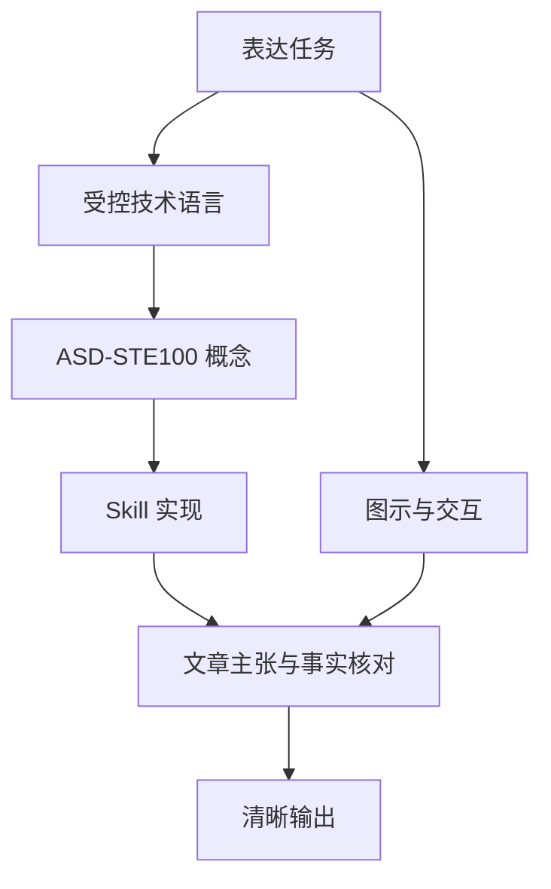

# Karpathy：用 ASD-STE100 与定制化产物提升 LLM 输出可理解性

> **文章节点**：本页是[机器之心文章](../../sources/blogs/karpathy-asd-ste100-clear-llm-outputs-2026-10-03.md)的独立导读，不是 ASD-STE100 标准或 Skill 项目本身的详情页。

## 一句话观点

让模型“说得更清楚”有两层：用一致、短而明确的语言降低歧义；再根据内容选择图、交互页面、排版报告或讲解视频，而不是默认把所有知识塞进长文本。

## 英文缩写速查

| 缩写 | 英文全称 | 简要说明 |
|------|----------|----------|
| ASD | Aerospace, Security and Defence Industries Association of Europe | ASD-STE100 标准的发布组织 |
| STE | Simplified Technical English | 面向技术文档的受控英语规范 |
| LLM | Large Language Model | 本文讨论的文本与内容生成模型 |
| HTML | HyperText Markup Language | 可承载布局、动画与交互的网页格式 |

## 文章要点

### 1. 用受控语言压低歧义

ASD-STE100 源自航空维修技术文档需求。文章提到其规则包含短句、一句一项指令、主动语态和术语一致等原则。规则不必机械照搬：日常说明可以采用“约 80%”的写法，保留清晰结构，同时避免专业标准令语气过于僵硬。规范本身见[概念页](../concepts/asd-ste100.md)。

### 2. 让输出形式匹配理解任务

| 读者要理解什么 | 可让模型生成什么 | 为什么可能更合适 |
|---|---|---|
| 一个流程或结构 | 图示 | 空间关系和步骤一眼可见 |
| 参数如何影响结果 | 交互式 HTML | 读者可改变参数并观察变化 |
| 数学或技术细节 | TeX/PDF 报告 | 公式、代码和图表更适合排版 |
| 抽象概念随时间如何变化 | 程序化讲解视频 | 动画可逐步展示因果和几何关系 |

这不是说网页或视频总比文字好。交互或视觉产物适合需要比较、变化和空间直觉的任务；简单事实仍可直接用文字回答。

### 3. 机器人研究与教学中的用法

机器人学习常有难以靠静态文字讲清的内容，例如学习率如何改变优化轨迹、关节目标怎样形成运动、动作块如何随时间滚动。可以先用简洁文字给结论，再按需要生成一个可调参数的小页面或动画。已有的 [Manim 页面](../entities/manim.md)记录了 3Blue1Brown 风格程序化动画的工具入口。

## 局限与判断

- 文章主要给出实践建议和社区反馈，没有提供控制变量的用户研究或统一量化基准。
- 简化语言可以改善表达，却不能补足错误或缺失的事实。
- 交互页面和视频带来制作、运行与维护成本；只有它们能明显改善理解时才值得生成。
- 工具规则检查不能代替语义审阅。尤其是简化技术指令时，必须保留条件、量值和安全约束。

## 结构与流程图

以下按本页已归纳的机制与资料绘制，表示模块或阅读路径关系。

## 关联页面

- [ASD-STE100 概念页](../concepts/asd-ste100.md) — 受控语言标准与适用边界
- [ASD-STE100 Skill](../entities/asd-ste100-skill.md) — 将规则用于代理输出的开源实现
- [Manim](../entities/manim.md) — 程序化讲解动画工具，仓库已有详情节点
- [LLM Wiki（Karpathy 模式）](../references/llm-wiki-karpathy.md) — 本仓库持续归纳来源并建立知识链接的方法

## 参考来源

- [机器之心原文与链接索引](../../sources/blogs/karpathy-asd-ste100-clear-llm-outputs-2026-10-03.md)
- [ASD-STE100 官方站归档](../../sources/sites/asd-ste100.md)
- [ASD-STE100 Skill 仓库归档](../../sources/repos/danyuchn-asd-ste100-skill.md)

## 推荐继续阅读

- [ASD-STE100 官方站](https://www.asd-ste100.org/)
- [Karpathy 的原始讨论](https://x.com/karpathy/status/2105819303471976479)
- [ASD-STE100 Skill](https://github.com/danyuchn/asd-ste100-skill)
