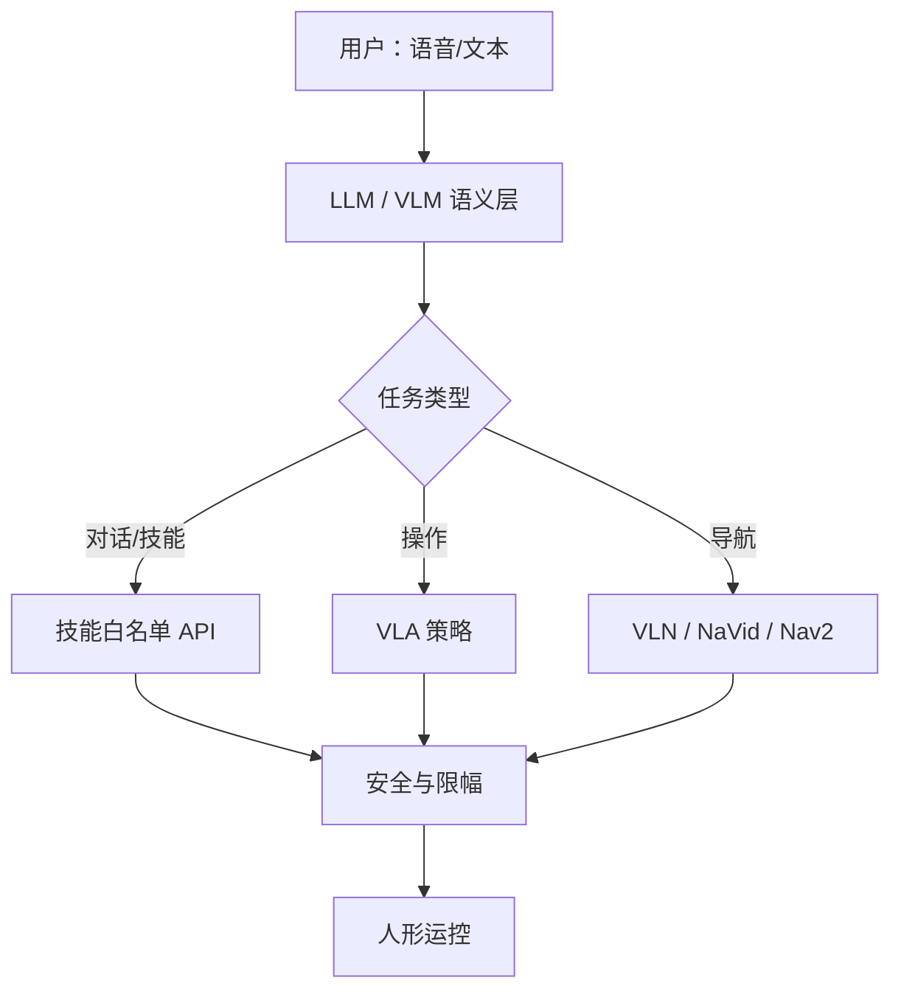

# 大模型赋能人形机器人

## 一句话定义

**大模型赋能人形**泛指用 **LLM / VLM / VLA** 等预训练模型承接语义理解与任务规划（有时含直接动作），再通过技能库、导航栈或端到端策略驱动人形执行——课程第 8.1 节的方法地图。

## 英文缩写速查

| 缩写 | 英文全称 | 简要说明 |
|------|----------|----------|
| LLM | Large Language Model | 语言规划与对话 |
| VLM | Vision-Language Model | 视觉问答/接地 |
| VLA | Vision-Language-Action | 视觉–语言–动作策略 |
| VLN | Vision-Language Navigation | 语言引导导航 |
| NaVid | Video-based VLM Navigation | 视频流 VLM 导航代表 |
| API / Tool | Tool calling | 技能落地接口 |
| ASR/TTS | Speech I/O | 语音交互两端 |

## 为什么重要

- 避免「上大模型」变成空泛口号：必须先选 **交互 / 操作 / 导航** 哪条落地路径。
- 课程 Ch8 实践（语音交互导航）= [语音交互](../methods/humanoid-voice-interaction.md) + [VLN](../tasks/vision-language-navigation.md) / [NaVid](../entities/paper-vln-10-navid.md)。
- 分类细节见 [VLM/VLN/VLA taxonomy](../comparisons/vlm-vln-vla-vlx-world-model-taxonomy.md)。

## 主要技术路线（实现路径）

| 路径 | 输入 | 输出 | 本库入口 | 课程节 |
|------|------|------|----------|--------|
| 语音技能 agent | 语音 | 技能 API / 对话 | [语音交互](../methods/humanoid-voice-interaction.md) | 8.2 |
| VLA 操作 | 图像+语言 | 关节/末端动作 | [VLA](../methods/vla.md) | 8.1 对照 |
| 模块化 VLN | 图像+指令 | 导航动作/路点 | [VLN 任务](../tasks/vision-language-navigation.md) | 8.3 |
| 视频 VLM 导航 | RGB 视频流 | 底层导航动作 | [NaVid](../entities/paper-vln-10-navid.md) | 8.4 |

## 核心原理（选型轴）

| 轴 | 问题 | 偏模块化 | 偏端到端 |
|----|------|----------|----------|
| 可解释性 | 出错能否追责 | 技能表 + 日志 | 难 |
| 数据 | 有无大规模机器人轨迹 | 少数据可跑通 | 需示范/仿真 |
| 安全 | 能否硬约束 | API 限幅、确认 | 需额外盾 |
| 算力 | 机载 vs 云端 | 可拆 | 大模型机载吃紧 |

**课程建议**：先模块化（ASR→LLM→Nav/技能）跑通闭环，再尝试 NaVid 类端到端导航。

## 工程实践

### Ch8 最小交付

1. 语音唤醒 + ASR 得到文本指令。
2. LLM/规则解析为「导航到 X」或「执行技能 Y」。
3. 导航走 VLN 栈或 Nav2 点；技能走 [G1 软件栈](../entities/unitree-g1-software-stack.md)。
4. TTS 反馈结果；全程急停可用。

### 复现与开源

- VLN 四范式见 [开源复现策展](./vln-open-source-repro-paradigms.md)。
- NaVid 实体页含框架与部署线索：[paper-vln-10-navid](../entities/paper-vln-10-navid.md)。

### 常见坑

| 坑 | 对策 |
|----|------|
| 语义成功但撞障 | 保留几何导航/局部避障 |
| 云端延迟 | 本地小模型做 NLU，大模型可选 |
| 幻觉技能 | 白名单 tool-calling |
| 只在仿真说话 | 真机麦噪与回声消除 |

## 局限与风险

- 语义成功 ≠ 运动可行；运控与碰撞安全不可外包给 LLM。
- 数据与权重许可、云端隐私需单独评估。
- **误区**：用聊天演示代替可重复的导航/操作指标。

## 关联页面

- [人形语音交互](../methods/humanoid-voice-interaction.md)
- [VLN](../tasks/vision-language-navigation.md)
- [NaVid](../entities/paper-vln-10-navid.md)
- [VLA](../methods/vla.md)
- [人形算法研究现状](./humanoid-algorithm-research-status.md)
- [人形系统课程策展](../entities/humanoid-system-curriculum.md)

## 参考来源

- [深蓝学院人形系统课程大纲](../../sources/courses/shenlan_humanoid_system_theory_practice.md)

## 推荐继续阅读

- [VLN 开源复现四范式](./vln-open-source-repro-paradigms.md)
- [VLM/VLN/VLA/VLX 分类学](../comparisons/vlm-vln-vla-vlx-world-model-taxonomy.md)
