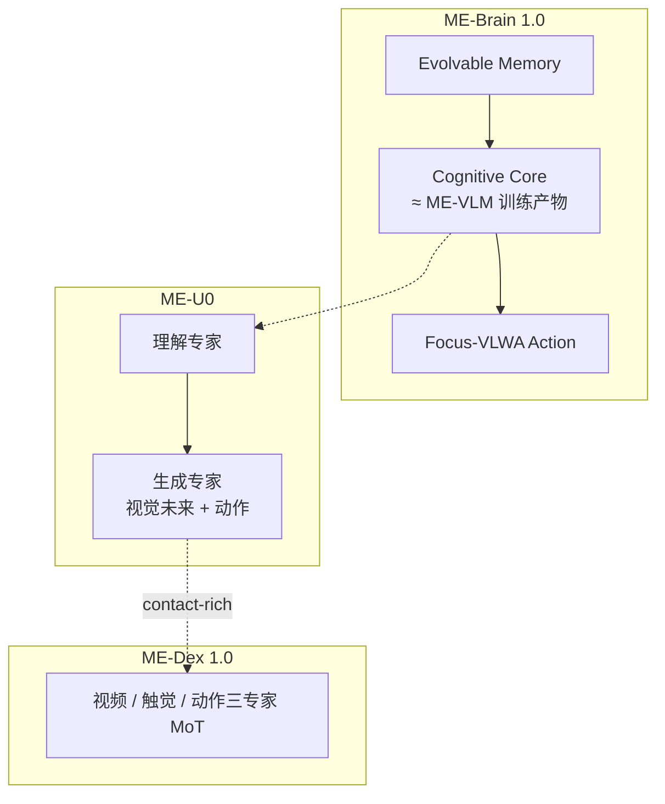

# 理想 MachEmbodied 四篇：记忆、认知、生成与触觉

> **本页定位**：为 [具身智能研究室 · 理想四篇盘点](https://mp.weixin.qq.com/s/UVSRMDa8Aq2oJtqkRUU_EA)（2026-09-25）提供按 **系统分层** 组织的阅读坐标。

## 一句话观点

**车企具身基座不是单模型，而是「记经验 → 定计划 → 生成动作 → 读触觉未来」四层；四篇 arXiv 各守一层，共享 MachEmbodied 品牌与部分代码栈。**

## 英文缩写速查

| 缩写 | 英文全称 | 简要说明 |
|------|----------|----------|
| WAM | World Action Model | 联合预测环境动态与动作 |
| MoT | Mixture-of-Transformers | ME-U0 / ME-Dex 多专家结构 |
| VLM | Vision-Language Model | ME-VLM 认知与 Agent 核 |
| VLWA | Vision-Language-World-Action | Focus-VLWA 动作模型 |

## 节点索引（4/4 独立）

| 层 | 论文 | arXiv | 实体页 |
|----|------|-------|--------|
| 记忆 + 闭环 | ME-Brain-1.0 | [2609.24271](https://arxiv.org/abs/2609.24271) | [paper-me-brain-1-0](../entities/paper-me-brain-1-0.md) |
| 认知 / Agent | ME-VLM | [2609.24526](https://arxiv.org/abs/2609.24526) | [paper-me-vlm](../entities/paper-me-vlm.md) |
| 理解–生成 | MachEmbodied-U0 | [2609.25627](https://arxiv.org/abs/2609.25627) | [paper-me-u0](../entities/paper-me-u0.md) |
| 触觉 WAM | ME-Dex 1.0 | [2609.21449](https://arxiv.org/abs/2609.21449) | [paper-me-dex-1-0](../entities/paper-me-dex-1-0.md) |

**本 ingest：2 新建 / 2 复用；0 重复 arXiv。**

## 流程总览

## 读法提示

- **真机数字**：Brain Piper avg **66.7%**（叠碗 vs 插充电器对比）与 ME-VLM **无大样本真机 SR** 不可混加；U0 / ME-Dex 真机以定性为主。
- **开源梯度**：U0 **已开源**；Brain / ME-Dex **部分**；ME-VLM **待发布** 权重与推理。
- **记忆分工**：Brain 显式长程记忆 vs U0 RoboDojo 记忆维 **~7%** — 选型时先问任务是否需要 **跨 episode 经验库**。

## 关联页面

- [ME-Brain 1.0](../entities/paper-me-brain-1-0.md)
- [ME-VLM](../entities/paper-me-vlm.md)
- [MachEmbodied-U0](../entities/paper-me-u0.md)
- [ME-Dex 1.0](../entities/paper-me-dex-1-0.md)
- [World Action Models](../concepts/world-action-models.md)

## 参考来源

- [wechat_li_auto_me_brain_vlm_u0_dex_2026-09-25.md](../../sources/blogs/wechat_li_auto_me_brain_vlm_u0_dex_2026-09-25.md)

## 推荐继续阅读

- [World Action Models](../concepts/world-action-models.md)
- [12 篇协作 WM 地图](./collab-wm-12-papers-technology-map.md)（含 ME-U0 首次索引）
