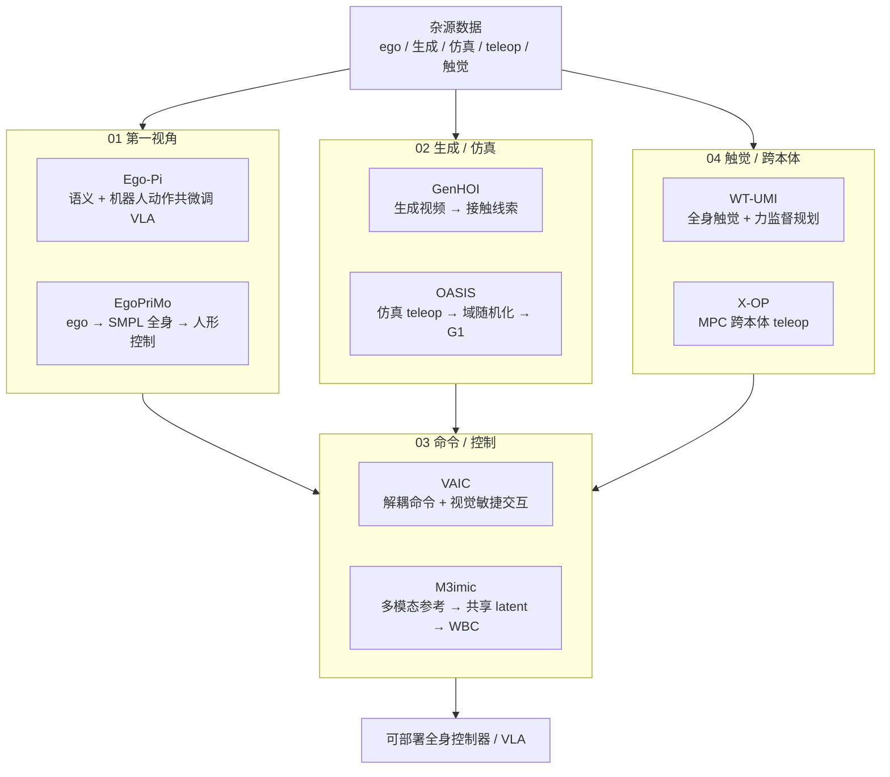

# Loco-Manip 数据入口：8 篇论文技术地图

> **本页定位**：为 [具身智能研究室 · Loco-Manip 8 篇周报](https://mp.weixin.qq.com/s/Ez87ljBYmCyIpLKjMjEyaQ) 提供 **按四组数据入口组织的阅读坐标**；不复述每篇论文细节，只保留 **问题重框、四组论文地图、与 Ego/LEGS/身体系统栈的挂接**。姊妹篇 [Ego 9 篇技术地图](./ego-9-papers-technology-map.md)、[人形 RL 身体系统栈](./humanoid-rl-motion-control-body-system-stack.md)、[Loco-Manipulation 任务页](../tasks/loco-manipulation.md)。

## 一句话观点

人形 loco-manip 的瓶颈正在从「有没有更多真机轨迹」转向 **混合数据能否对齐身体、携带接触信息、进入统一命令空间并在换机后仍复用**——真机遥操作仍重要，但已非唯一入口。

## 英文缩写速查

| 缩写 | 英文全称 | 简要说明 |
|------|----------|----------|
| Loco-Manip | Loco-Manipulation | 行走与操作动力学耦合的全身任务 |
| Ego | Egocentric Vision | 第一人称视角感知与操作记录 |
| VLA | Vision-Language-Action | 视觉-语言-动作多模态策略 |
| WBC | Whole-Body Control | 协调全身关节满足多任务/约束的控制层 |
| HOI | Human-Object Interaction | 人-物交互，含接触与物体运动 |
| MPC | Model Predictive Control | 滚动优化质心/接触与重定向的经典工具 |

## 为什么单独做这张地图

- [Loco-Manipulation](../tasks/loco-manipulation.md) 任务页已覆盖大量 **单篇方法**；本页聚焦 **2026-06 周报** 提出的横切面：**数据从哪来、如何进策略**。
- 与 [Ego 9 篇](./ego-9-papers-technology-map.md) 分工：Ego 地图回答 **第一视角规模化**；本页把 ego **接入 loco-manip 训练链**（Ego-Pi / EgoPriMo）并与仿真、生成视频、触觉、跨本体 teleop **并列**。
- **GenHOI**（arXiv:2606.12995）≠ [SimGenHOI](../entities/paper-notebook-simgenhoi-physically-realistic-whole-body-humano.md)（不同论文，勿合并节点）。

## 流程总览：四组数据入口 → 可部署控制器

## 四组分类节点（图谱 hub）

| 组 | 分类节点 | 篇数 | 核心问题 |
|----|----------|------|----------|
| 01 | [第一视角数据](./loco-manip-category-01-egocentric-data.md) | 2 | 人类 ego 如何先补 **任务语义** 再补 **全身动作**？ |
| 02 | [生成与仿真数据](./loco-manip-category-02-synthetic-data.md) | 2 | 生成视频 / 仿真能否承担更重的 **可执行数据生产**？ |
| 03 | [命令空间与控制器](./loco-manip-category-03-command-controller.md) | 2 | 多源数据如何落到 **解耦命令** 与 **统一 WBC**？ |
| 04 | [触觉与跨本体遥操作](./loco-manip-category-04-contact-teleop.md) | 2 | 接触/力与 **跨机器人** teleop 如何提高复用？ |

## 8 篇论文速查

| # | 工作 | 分组 | Wiki |
|---|------|------|------|
| 01 | Ego-Pi | 01 | [paper-loco-manip-01-ego-pi](../entities/paper-loco-manip-01-ego-pi.md) |
| 02 | EgoPriMo | 01 | [paper-loco-manip-02-egoprimo](../entities/paper-loco-manip-02-egoprimo.md) |
| 03 | GenHOI | 02 | [paper-loco-manip-03-genhoi](../entities/paper-loco-manip-03-genhoi.md) |
| 04 | OASIS | 02 | [paper-loco-manip-04-oasis](../entities/paper-loco-manip-04-oasis.md) |
| 05 | VAIC | 03 | [paper-loco-manip-05-vaic](../entities/paper-loco-manip-05-vaic.md) |
| 06 | M3imic | 03 | [paper-loco-manip-06-m3imic](../entities/paper-loco-manip-06-m3imic.md) |
| 07 | WT-UMI | 04 | [paper-loco-manip-07-wt-umi](../entities/paper-loco-manip-07-wt-umi.md) |
| 08 | X-OP | 04 | [paper-loco-manip-08-x-op](../entities/paper-loco-manip-08-x-op.md) |

## 文内收束判断（策展）

| 判断 | 含义 |
|------|------|
| 混合链 > 单点采集 | 真机 teleop 仍重要，但须与 ego、生成、仿真、触觉、跨本体入口并联 |
| 对齐 > 规模 | 人类视频多不等于机器人可执行；须语义/动力学/接触分层对齐 |
| 命令接口是闸门 | VAIC / M3imic 提醒：数据进来后 **命令空间** 决定能否进控制器 |
| 覆盖可补真实性 | OASIS 叙事：充分域随机化的仿真覆盖可超过有限真实 teleop（任务依赖） |

## 按目标选入口

| 你的目标 | 从哪开始 |
|----------|----------|
| VLA 如何用人类 ego 补任务逻辑 | [01 Ego-Pi](../entities/paper-loco-manip-01-ego-pi.md) → [VLA](../methods/vla.md) |
| ego 如何生成全身动作先验 | [02 EgoPriMo](../entities/paper-loco-manip-02-egoprimo.md) → [Ego 9 篇地图](./ego-9-papers-technology-map.md) |
| 生成视频能否产 HOI 训练信号 | [03 GenHOI](../entities/paper-loco-manip-03-genhoi.md) |
| 仿真 teleop 零样本上 G1 | [04 OASIS](../entities/paper-loco-manip-04-oasis.md) → [LEGS](../entities/paper-legs-embodied-gaussian-splatting-vla.md) 对照 |
| 解耦命令做敏捷物体交互 | [05 VAIC](../entities/paper-loco-manip-05-vaic.md) → [WBC](../concepts/whole-body-control.md) |
| 多模态参考统一进一个 WBC | [06 M3imic](../entities/paper-loco-manip-06-m3imic.md) → [BFM 地图](./bfm-41-papers-technology-map.md) |
| 触觉/力补接触状态 | [07 WT-UMI](../entities/paper-loco-manip-07-wt-umi.md) |
| teleop 数据跨机器人复用 | [08 X-OP](../entities/paper-loco-manip-08-x-op.md) → [OmniRetarget](../entities/paper-hrl-stack-03-omniretarget.md) |

## 关联页面

- [Loco-Manipulation](../tasks/loco-manipulation.md)、[Teleoperation](../tasks/teleoperation.md)
- [Ego 9 篇技术地图](./ego-9-papers-technology-map.md)
- [LEGS（3DGS VLA 数据工厂）](../entities/paper-legs-embodied-gaussian-splatting-vla.md)
- [Agent Reach](../entities/agent-reach.md) — 本文微信抓取工具链

## 参考来源

- [wechat_embodied_ai_lab_loco_manip_8_papers_survey.md](../../sources/blogs/wechat_embodied_ai_lab_loco_manip_8_papers_survey.md)
- [wechat_loco_manip_8_papers_2026-06-14.md](../../sources/raw/wechat_loco_manip_8_papers_2026-06-14.md)
- [loco_manip_8_papers_catalog.md](../../sources/papers/loco_manip_8_papers_catalog.md)

## 推荐继续阅读

- 原文：<https://mp.weixin.qq.com/s/Ez87ljBYmCyIpLKjMjEyaQ>
- [42 篇 humanoid RL 身体系统栈](./humanoid-rl-motion-control-body-system-stack.md)
