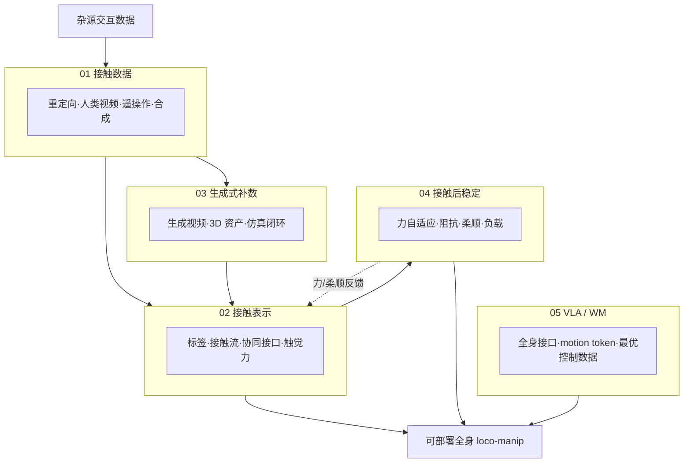

# Loco-Manip 接触横切面：五段链路技术地图

> **本页定位**：为 [具身智能研究室 · Loco-Manip 接触专题](https://mp.weixin.qq.com/s/UjShbwl8p1h9ukymfiRNaw) 提供 **父节点阅读坐标**；不复述逐篇细节，只保留 **问题重框、五段链路、与 161 篇/8 篇/运动小脑姊妹篇的挂接**。姊妹篇 [161 篇十类地图](./humanoid-loco-manip-161-papers-technology-map.md)、[8 篇数据入口](./loco-manip-8-papers-technology-map.md)、[运动小脑 64 篇](./humanoid-motion-cerebellum-technology-map.md)。

## 一句话观点

人形 loco-manip 的接触不只是一只手碰到物体——**脚底支撑、重心、物体受力、负载摆动、触觉与上层调度** 须在同一链路里对齐；策展文把约 36 篇工作按 **数据 → 表示 → 生成补数 → 接触后稳定 → VLA/WM** 五段读，判断瓶颈正从「会不会动」转向 **接触结构能否贯穿全栈**。

## 英文缩写速查

| 缩写 | 英文全称 | 简要说明 |
|------|----------|----------|
| Loco-Manip | Loco-Manipulation | 行走与操作动力学耦合的全身任务 |
| VLA | Vision-Language-Action | 视觉-语言-动作多模态策略 |
| WM | World Model | 预测环境动态以供规划/想象的世界模型 |
| WBC | Whole-Body Control | 协调全身关节满足多任务/约束的控制层 |
| HOI | Human-Object Interaction | 人-物交互，含接触与物体运动 |
| CF | Contact Flow | OmniContact 提出的接触时序接口（稀疏关键体 + 接触信号） |

## 为什么单独做这张地图

- [Loco-Manipulation](../tasks/loco-manipulation.md) 与 [接触丰富操作](../concepts/contact-rich-manipulation.md) 已覆盖概念；[161 篇地图](./humanoid-loco-manip-161-papers-technology-map.md) 按 **能力形成十类** 组织；本页聚焦 **2026-07 接触专题** 的横切面：**接触如何贯穿数据、策略、力控与上层模型**。
- **节点复用、避免重复：** 文中约 30 篇工作 **链接既有** `paper-loco-manip-161-*`、`paper-scenebot`、`paper-omnicontact-humanoid-loco-manipulation`、`paper-hrl-stack-*` 等实体；仅 **6 篇尚无本站实体** 的工作在分类 hub 表中外链项目页/arXiv，**不新建重复论文节点**。

## 流程总览：五段接触链路

## 五组分类节点（图谱 hub）

| 段 | 分类节点 | 篇数 | 核心问题 |
|----|----------|------|----------|
| 01 | [接触数据从哪来](./loco-manip-contact-category-01-contact-data.md) | 8 | 带物体状态、场景约束、接触时序的交互数据如何采集/合成？ |
| 02 | [接触怎么进入策略](./loco-manip-contact-category-02-contact-representation.md) | 8 | 接触被写成标签、接触流、协同接口还是触觉力信号？ |
| 03 | [生成式路线补数据](./loco-manip-contact-category-03-generative-data.md) | 7 | 生成视频/资产能否提供可恢复、可跟踪、可训练的接触轨迹？ |
| 04 | [接触后如何稳住](./loco-manip-contact-category-04-post-contact-stability.md) | 7 | 力变化、柔顺、负载摆动与强接触下身体如何持续？ |
| 05 | [VLA 与世界模型调用](./loco-manip-contact-category-05-vla-world-models.md) | 6 | 上层模型能否调用带接触结构的全身动作接口？ |

## 文内收束判断（策展）

| 判断 | 含义 |
|------|------|
| 接触全栈 | 数据、表示、生成、力控、VLA 须 **同一接触语义** 对齐，否则各层割裂 |
| 数据稀缺性 | 稀缺的是 **带物理约束的接触数据**，而非动作片段数量 |
| 生成须验物理 | 生成路线价值在 **可执行接触时序**，须做摩擦/支撑/重心验证 |
| 力控是真机门槛 | 位置跟踪只说明「到了」；**力与柔顺** 决定接触后能否继续工作 |
| 与姊妹篇 | 161 篇十类、8 篇数据入口、运动小脑 **交叉覆盖、视角不同** |

## 开放问题（文内）

1. **统一接口**：接触标签、接触流、触觉力、根轨迹、motion token 尚未收敛。
2. **生成式验证**：视觉过关 ≠ 力学可执行（GenHOI、Imagine2Real、GRAIL、Humanoid-DART）。
3. **触觉力规模化**：WT-UMI、FALCON、HMC、GentleHumanoid、CHIP 均强调力，但跨硬件复用难。
4. **VLA 接触因果**：上层全身模型若底层无力接口，难上真机。
5. **接口互通**：数据、表示、力反馈、控制、任务模型须互相接上。

## 关联页面

- [Loco-Manipulation 任务页](../tasks/loco-manipulation.md)
- [接触丰富操作](../concepts/contact-rich-manipulation.md)
- [VLA](../methods/vla.md)
- [Agent Reach](../entities/agent-reach.md) — 本文抓取工具链

## 参考来源

- [wechat_embodied_ai_lab_loco_manip_contact_survey.md](../../sources/blogs/wechat_embodied_ai_lab_loco_manip_contact_survey.md)
- [wechat_loco_manip_contact_2026-07-03 抓取正文](../../sources/raw/wechat_loco_manip_contact_2026-07-03/我把最近Loco-Manip工作重新梳理了一遍：人形机器人怎样与物理世界接触，数据、策略、力控和VLA各自解决什么.md)

## 推荐继续阅读

- [161 篇人形 Loco-Manip 技术地图](./humanoid-loco-manip-161-papers-technology-map.md)
- [SceneBot（接触条件化全身跟踪）](../entities/paper-scenebot.md)
- [OmniContact（接触流技能链）](../entities/paper-omnicontact-humanoid-loco-manipulation.md)
