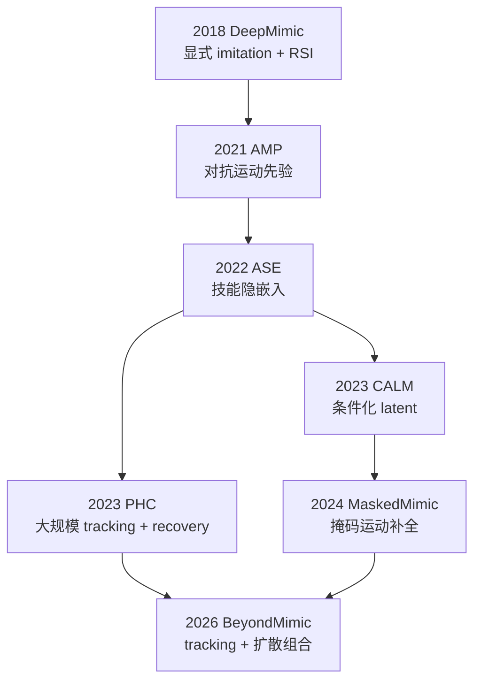

# Mimic 控制演进：DeepMimic → BeyondMimic

> **本页定位**：为 [PinkRobot · Mimic 整体演进](https://mp.weixin.qq.com/s/SEBbND3AJiPU-8hrw2aiBw) 提供 **按问题线索组织的阅读坐标**；与 [AMP 运动先验专题](./humanoid-amp-motion-prior-survey.md)（19 篇横向展开）互补——本篇纵穿 **七代方法主线** 与 **并行分支** 关系。

## 一句话观点

物理角色与人形 mimic 的主线不是「把 PPO 换得更复杂」，而是不断改写 **动作先验如何表达**、**示范如何变成控制信号**、以及 **训练后如何组合技能**——从 DeepMimic 的显式 tracking，到 BeyondMimic 的高保真 tracking 教师 + 测试时扩散引导。

## 英文缩写速查

| 缩写 | 英文全称 | 简要说明 |
|------|----------|----------|
| RSI | Reference State Initialization | 从参考动作随机帧初始化 episode，缓解长时序探索 |
| AMP | Adversarial Motion Prior | 对抗判别约束状态转移接近动捕分布 |
| ASE | Adversarial Skill Embeddings | 大规模可复用技能隐嵌入 |
| CALM | Conditional Adversarial Latent Models | 由具体示范条件化 latent，提升可控性 |
| PHC | Perpetual Humanoid Control | 万级动作 tracking + 跌倒恢复 |
| CVAE | Conditional Variational Autoencoder | MaskedMimic 的运动补全生成骨干 |
| RL | Reinforcement Learning | 与先验/跟踪奖励联合优化的训练范式 |

## 四个长期矛盾

| 矛盾 | 典型症状 | 演进回应 |
|------|----------|----------|
| 精确跟踪 vs 鲁棒性 | 扰动后「追回参考」动作畸形 | 相对/锚点跟踪、恢复策略、部分约束 |
| 动作规模 vs reward 设计成本 | 每加一种技能重写 tracking 项 | AMP 分布先验、隐空间、统一补全接口 |
| 多样性 vs 可控性 | 会动但指定不了「哪一种」 | CALM 条件 latent、BeyondMimic guidance |
| 训练覆盖 vs 未见任务组合 | 训练见过走跑踢仍不会边移边避 | ASE 嵌入、MaskedMimic 补全、扩散组合 |

## 能力演进总览

> **读图注意：** 下图是 **能力演进图**，不是严格软件继承链。PHC（2023）与 CALM（2023）**并行**；MaskedMimic 沿「统一控制接口」；BeyondMimic 把 **高保真 tracking** 与 **生成式轨迹分布** 重新结合。

### 分段检索表

| 年份 | 方法 | 主要问题 | 核心机制 | 本库入口 |
|------|------|----------|----------|----------|
| 2018 | DeepMimic | 高动态参考跟踪 | 显式 reward + PPO + RSI | [deepmimic](../methods/deepmimic.md) |
| 2021 | AMP | 手工模仿项与动作选择 | Adversarial Motion Prior | [amp-reward](../methods/amp-reward.md)、[AMP 综述](./humanoid-amp-motion-prior-survey.md) |
| 2022 | ASE | 大量动作如何复用 | AMP + MI latent | AMP 综述 §ASE |
| 2023 | CALM | latent 难精确指定 | Motion encoder + 条件判别器 | 运动小脑地图 |
| 2023 | PHC | 万动作 + 遗忘 + 恢复 | PMCP + AMP + recovery | [PHC](../entities/phc.md) |
| 2024 | MaskedMimic | 多控制模态统一 | 掩码 inpainting + C-VAE | [paper-bfm-17-maskedmimic](../entities/paper-bfm-17-maskedmimic.md) |
| 2026 | BeyondMimic | 真机 tracking + 未见组合 | RL tracking + 潜扩散 + guidance | [beyondmimic](../methods/beyondmimic.md) |

## 各代机制要点（一页记忆）

### DeepMimic：范式奠基

- 参考动作是 **优化目标**，不是 kinematic playback；底层 **PD 目标接口** 被后人形 RL 继承。
- **RSI** 从参考序列随机帧初始化，解决 backflip 等动作中后段探索不足。
- 局限：动作库变大后「追哪条 reference、各项权重怎么设」成本爆炸 → 推动 AMP。

### AMP：风格从「对齐第几帧」变成「像动捕分布」

- Task reward 管 **what**；motion prior 管 **how**。
- 判别器奖励策略状态转移，而非逐帧 pose 误差。

### ASE → CALM：从「能复用」到「能指定」

- ASE：互信息约束的连续技能隐空间，服务大规模无结构动捕。
- CALM：encoder 把 **具体示范** 映射到 latent，解决 ASE「latent 不好指」的问题。

### PHC（并行）：tracking 规模与恢复

- 沿 **万级动作 tracking + 无重置恢复** 分支发展，不是 CALM 的直接后继。
- 与 CALM/MaskedMimic 的「组合接口」路线形成对照。

### MaskedMimic：统一为「部分约束补全」

- 关节、关键帧、文本、场景约束都可视为 **masked motion inpainting**。

### BeyondMimic：tracking 回归 + 生成式组合

- 阶段 ①：锚点相对跟踪 + 极简 reward + 失败率采样，批量学高动态技能。
- 阶段 ②：蒸馏进潜空间扩散；测试时 **classifier guidance** 做航点、摇杆、关键帧与避障等零样本任务。

## 与其他页面的关系

- **横向展开 AMP 19 篇：** [humanoid-amp-motion-prior-survey](./humanoid-amp-motion-prior-survey.md)
- **身体系统栈八层：** [humanoid-rl-motion-control-body-system-stack](./humanoid-rl-motion-control-body-system-stack.md)
- **运动小脑专题：** [humanoid-motion-cerebellum-technology-map](./humanoid-motion-cerebellum-technology-map.md)
- **BeyondMimic 深读：** [beyondmimic](../methods/beyondmimic.md)

## 推荐继续阅读

- [DeepMimic 原论文](https://arxiv.org/abs/1804.02717)
- [BeyondMimic · Science Robotics 2026](https://arxiv.org/abs/2508.08241)
- [HybridRobotics/whole_body_tracking](https://github.com/HybridRobotics/whole_body_tracking)

## 参考来源

- [PinkRobot · Mimic 整体演进](../../sources/blogs/wechat_pinkrobot_mimic_evolution_deepmimic_beyondmimic_2026-09-15.md)
- [具身智能研究室 · AMP 专题](../../sources/blogs/wechat_embodied_ai_lab_humanoid_amp_motion_prior_survey.md)
