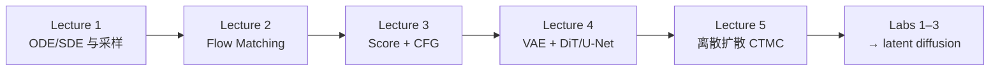

# MIT 6.S184：Flow Matching & Diffusion Models（2026）

> **本页定位**：为 [MIT CSAIL 2026 课程站](https://diffusion.csail.mit.edu/2026/index.html) 提供 **按理论–Lab–机器人应用** 组织的阅读坐标。讲义与 Lab 以官方站点与 [iap-diffusion-labs](https://github.com/eje24/iap-diffusion-labs/tree/2026) 为准；本页不复述全文公式。

## 一句话定义

**一门把随机微分方程、概率路径与神经网络生成组件（VAE、DiT、CTMC）串成完整 latent diffusion 管线的 IAP 课——适合作为本库扩散/flow 形式化与机器人生成式策略的上游系统课。**

## 英文缩写速查

| 缩写 | 英文全称 | 简要说明 |
|------|----------|----------|
| SDE | Stochastic Differential Equation | 含随机项的微分方程；扩散采样核心 |
| ODE | Ordinary Differential Equation | 确定性常微分方程；概率流 / flow 采样 |
| FM | Flow Matching | 直接回归速度场的生成式训练范式 |
| CFG | Classifier-Free Guidance | 无分类器引导的条件生成技巧 |
| DiT | Diffusion Transformer | Transformer 骨干的扩散模型 |
| VAE | Variational Autoencoder | 潜空间编码器–解码器；latent diffusion 前置 |
| CTMC | Continuous-Time Markov Chain | 离散扩散的连续时间马尔可夫链形式 |

## 为什么重要

- **补齐数学底座：** 机器人 wiki 里 [Diffusion Policy](../methods/diffusion-policy.md)、[π₀](../methods/π0-policy.md) 多从应用切入；本课反向提供 **SDE → score → FM → latent DiT** 的完整推导链。
- **可动手复现：** 三份 Lab 在 Colab/GitHub 上 **从零实现** 玩具 FM、score matching 与 latent diffusion，比只看论文 PDF 更利于建立采样/训练直觉。
- **与 Levine Simons 报告对读：** [表达力更强的连续动作策略](./sergey-levine-diffusion-expressive-policies.md) 讲 **控制侧为何需要扩散/flow 动作头**；本课讲 **生成侧数学与实现**。

## 课程主线（2026 站点）

| 模块 | 站点主题 | 本库对接 |
|------|----------|----------|
| 随机分析 | Fokker–Planck、SDE 采样 | [Probability Flow](../formalizations/probability-flow.md) |
| Flow | 条件/边际路径、向量场、FM 损失 | [π₀ flow VLA](../methods/π0-policy.md) |
| Score | Denoising score matching | [Diffusion Policy](../methods/diffusion-policy.md) |
| 潜空间 | VAE + DiT 架构 | [Generative World Models](../methods/generative-world-models.md) |
| 离散 | CTMC 离散扩散 | 文本/离散 token 扩散（概念延伸） |

## Labs 与实践路径

| Lab | 练什么 | 仓库 |
|-----|--------|------|
| **Lab 1** | ODE/SDE 数值与 Langevin 动力学 | [iap-diffusion-labs](https://github.com/eje24/iap-diffusion-labs/tree/2026) |
| **Lab 2** | 同一玩具分布上 **FM vs score matching** | Colab + GitHub solutions |
| **Lab 3** | **VAE + DiT** 组装 **latent diffusion** | 完整生成管线 capstone |

**建议顺序：** 先读 Lecture 1–2 notes → 做 Lab 1–2 → 再读 score/CFG 与 Lecture 4–5 → Lab 3。

## 局限与风险

- **IAP 节奏快：** 需概率论与 PyTorch 基础；不适合零线性代数/深度学习背景硬啃。
- **偏生成式 AI 主域：** 图像/latent 为主，机器人 **动作空间** 与 **闭环控制** 需另读 [Diffusion Policy](../methods/diffusion-policy.md) 等应用页。
- **录像完整性：** 2026 站点部分 lecture recording 仍为空链，以 **Course Notes PDF + Labs** 为主资源。

## 关联页面

- [流匹配与具身策略（概念）](../concepts/flow-matching-embodied-policy.md) — 机器人 VLA / 动作头侧 FM 导读
- [Probability Flow（形式化）](../formalizations/probability-flow.md)
- [Diffusion Model（概念）](../concepts/diffusion-model.md)
- [Diffusion Policy（方法）](../methods/diffusion-policy.md)
- [Sergey Levine：表达力更强的连续动作策略](./sergey-levine-diffusion-expressive-policies.md)

## 参考来源

- [mit_flow_matching_diffusion_2026.md](../../sources/courses/mit_flow_matching_diffusion_2026.md) — 课程 ingest 档案
- [iap_diffusion_labs.md](../../sources/repos/iap_diffusion_labs.md) — Lab 仓库归档
- 课程主页：<https://diffusion.csail.mit.edu/2026/index.html>

## 推荐继续阅读

- Holderrieth & Erives, *Introduction to Flow Matching and Diffusion Models*（[arXiv:2506.02070](https://arxiv.org/abs/2506.02070)）
- Lipman et al., *Flow Matching for Generative Modeling*
- Ho et al., *Denoising Diffusion Probabilistic Models*
