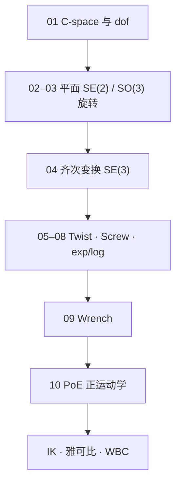

# 《Modern Robotics 原理精读》微信专辑地图

> **本页定位**：为公众号 [**Modern Robotics 原理精读**](https://mp.weixin.qq.com/mp/appmsgalbum?__biz=Mzg2ODgxOTA1Mw==&action=getalbum&album_id=4521219024549937157) **已入库 10/10 篇** 提供阅读顺序与 wiki 挂接；不复述全书，只保留 **专栏顺序、子节点分工、与教材/深蓝专栏关系**。清单见 [`sources/raw/wechat_modern_robotics_album_4521219024549937157.json`](../../sources/raw/wechat_modern_robotics_album_4521219024549937157.json)。

## 一句话观点

运动规划与控制的共同语言是 **位形空间上的几何**：先在 C-space 里理解 dof 与约束，再用 SE(3) 齐次矩阵描述位姿，用 twist/wrench 描述速度与力，最后用 PoE 把关节角连乘成末端位姿——这条链与 [深蓝《具身智能基础》](shenlan-embodied-ai-fundamentals-series.md) 的 L0 几何链互补，符号更贴近 *Modern Robotics* 原书。

## 英文缩写速查

| 缩写 | 英文全称 | 简要说明 |
|------|----------|----------|
| C-space | Configuration Space | 位形空间；规划的主战场 |
| SE(3) | Special Euclidean Group in 3D | 三维刚体位姿群 |
| PoE | Product of Exponentials | 指数积正运动学 |
| FK | Forward Kinematics | 关节角 → 末端位姿 |
| MR | Modern Robotics | Lynch & Park 教材简称 |

## 流程总览

## 专辑目录与 wiki 挂接

| # | 标题 | blog 归档 | 主 wiki 节点 |
|---|------|-----------|--------------|
| 1 | 从真实空间到 C-space | [wechat_goodman_cspace_robot_motion_planning.md](../../sources/blogs/wechat_goodman_cspace_robot_motion_planning.md) | [configuration-space.md](../concepts/configuration-space.md) |
| 2 | MR 第 3 章（1）平面刚体运动 | [wechat_goodman_modern_robotics_ch3_planar_rigid_motion.md](../../sources/blogs/wechat_goodman_modern_robotics_ch3_planar_rigid_motion.md) | [lie-group-rigid-body-motions.md](../formalizations/lie-group-rigid-body-motions.md) |
| 3 | MR 第 3 章（2）旋转与角速度 | [wechat_goodman_modern_robotics_ch3_rotation_angular_velocity.md](../../sources/blogs/wechat_goodman_modern_robotics_ch3_rotation_angular_velocity.md) | [se3-representation.md](../formalizations/se3-representation.md) |
| 4 | 为什么用齐次变换矩阵 | [wechat_goodman_homogeneous_transform_why.md](../../sources/blogs/wechat_goodman_homogeneous_transform_why.md) | [homogeneous-coordinates-transform.md](../formalizations/homogeneous-coordinates-transform.md) |
| 5 | 为什么用运动旋量 | [wechat_goodman_spatial_twist_why.md](../../sources/blogs/wechat_goodman_spatial_twist_why.md) | [spatial-twist-wrench-poe.md](../formalizations/spatial-twist-wrench-poe.md) |
| 6 | Twist 与 6 维速度场 | [wechat_goodman_twist_velocity_field_6d.md](../../sources/blogs/wechat_goodman_twist_velocity_field_6d.md) | 同上 |
| 7 | 螺旋轴 ≠ 关节轴 | [wechat_goodman_screw_axis_not_joint_axis.md](../../sources/blogs/wechat_goodman_screw_axis_not_joint_axis.md) | 同上 |
| 8 | 指数坐标 exp/log | [wechat_goodman_exponential_coordinates_twist.md](../../sources/blogs/wechat_goodman_exponential_coordinates_twist.md) | 同上 |
| 9 | 为什么用力旋量 | [wechat_goodman_spatial_wrench_why.md](../../sources/blogs/wechat_goodman_spatial_wrench_why.md) | 同上 · [contact-wrench-cone.md](../formalizations/contact-wrench-cone.md) |
| 10 | 正运动学算什么 | [wechat_goodman_forward_kinematics_poe.md](../../sources/blogs/wechat_goodman_forward_kinematics_poe.md) | [forward-kinematics.md](../formalizations/forward-kinematics.md) |

## 与姊妹专栏的关系

| 资源 | 分工 |
|------|------|
| [深蓝《具身智能基础》](shenlan-embodied-ai-fundamentals-series.md) | 具身 L0 工程直觉 + RL/运控接口；齐次/李群/ FK–IK–雅可比 |
| **本专辑** | *Modern Robotics* 原书顺序的 twist/PoE/C-space 精读 |
| [Modern Robotics 实体](../entities/modern-robotics-book.md) | 教材 PDF、视频与官方代码入口 |

## 参考来源

- [专辑目录 raw](../../sources/raw/wechat_modern_robotics_album_4521219024549937157.md)
- [抓取 JSON 清单](../../sources/raw/wechat_modern_robotics_album_4521219024549937157.json)

## 推荐继续阅读

- [Modern Robotics 在线 PDF](https://hades.mech.northwestern.edu/images/7/7f/MR.pdf)
- [运动控制路线](../../roadmap/motion-control.md)
