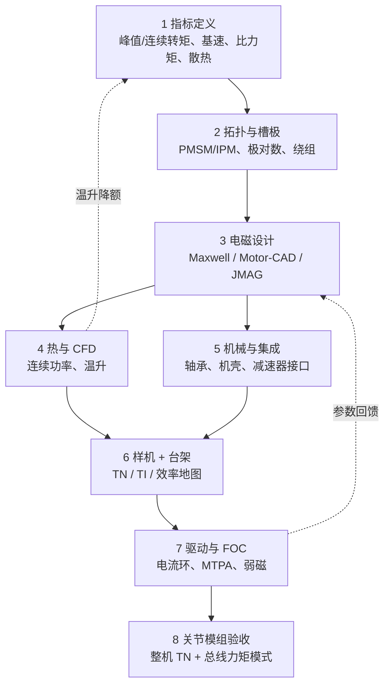

# 电机设计流程（规格 → 仿真 → 样机 → 控制）

> **本页定位**：把 **永磁关节电机** 从需求到可交付模组的主干步骤串成一条可交叉引用的流程；工具细节见 [电磁仿真软件选型](../comparisons/motor-em-simulation-software.md)，读图见 [TN](../concepts/motor-torque-speed-curve.md) / [TI](../concepts/motor-torque-current-curve.md) 曲线页，控制环见 [FOC](../concepts/field-oriented-control.md)。

## 一句话总结

电机设计不是「先画线圈再试转」，而是 **指标驱动、电磁–热–机械耦合迭代**，最终以 **TN/TI 台架曲线 + FOC 电流环** 证明连续与峰值能力都达标。

## 英文缩写速查

| 缩写 | 英文全称 | 简要说明 |
|------|----------|----------|
| TN | Torque-Speed (curve) | 转矩-转速特性曲线 |
| TI | Torque-Current (curve) | 转矩-电流特性曲线 |
| FEA | Finite Element Analysis | 有限元分析（电磁/结构/热） |
| FOC | Field-Oriented Control | 磁场定向控制 |
| MTPA | Maximum Torque Per Ampere | 单位电流最大转矩策略 |
| PMSM | Permanent Magnet Synchronous Motor | 永磁同步电机，关节常见 |
| IPM | Interior Permanent Magnet | 内置式永磁，弱磁区设计常见 |

## 为什么重要

- **人形/腿足关节** 同时需要 **峰值爆发**（起跳、抗冲击）与 **连续行走**（散热）；设计流程必须在早期就把 [峰值:持续](../overview/humanoid-actuator-102-decision-species.md) 与 [热学现实](../overview/humanoid-actuator-102-thermal-and-control.md) 写进指标，而不是样机出来后再补散热。
- **仿真与台架脱节** 是常见失败模式：电磁算出高转矩，但热模型或驱动限流使 [TN 曲线](../concepts/motor-torque-speed-curve.md) 连续区大幅缩水。
- **控制不是后装件**：弱磁、MTPA、电流采样与极对数对齐直接影响能否跑到设计基速；FOC 参数与电机 \(L_d, L_q, K_t\) 必须同源迭代。

## 流程总览

## 分阶段说明

### 1) 指标定义（需求冻结）

从任务反推电机边界，而非从库存电机反推任务：

| 指标 | 人形语境示例 | 关联页 |
|------|--------------|--------|
| 峰值转矩 / 持续时间 | 蹲起、起跳 1–3 s | [TN 曲线](../concepts/motor-torque-speed-curve.md) |
| 连续转矩 | 行走、站立 | [热学与力矩控制](../overview/humanoid-actuator-102-thermal-and-control.md) |
| 基速 / 最高转速 | 摆腿、跑步关节速度 | TN 曲线恒功率区 |
| 比力矩 (Nm/kg) | 腿部 >15 Nm/kg 量级 | [决策与物种](../overview/humanoid-actuator-102-decision-species.md) |
| 峰值:持续比 | 目标 ≥3:1 | 同上 |

输出物：**目标 TN 包络草图** + 母线电压 / 冷却方式假设。

### 2) 拓扑与槽极

- 选择 **表贴式 / 内置式（IPM）**、槽数极数、绕组形式（集中/分布）。
- IPM 利于 **弱磁扩速**；表贴式 \(L_d \approx L_q\) 控制简单，高基速场景需提前算弱磁电流。

### 3) 电磁设计（FEA）

工具选型见 [电机电磁仿真软件选型](../comparisons/motor-em-simulation-software.md)。本阶段核心输出：

| 输出 | 用途 |
|------|------|
| 转矩–转速（TN） | 能力边界 |
| 反电势、Ld/Lq | FOC 与弱磁 |
| 齿槽转矩 | 低速振动、力矩纹波 |
| MTPA 轨迹 | 高效区电流分配 |

机器人关节厂常见：**Maxwell（精细电磁）+ Motor-CAD（快速迭代 TN/效率）**。

### 4) 热与流体

- 将 **连续转矩** 与 **冷却方式**（自然风冷、强迫风冷、液冷、机壳导热）耦合。
- CFD 评估风道与搅风损耗；热分析给出绕组/磁钢温升 → 修正连续功率（往往比电磁峰值更能「卡死」设计）。

### 5) 机械与系统集成

- 轴系、轴承寿命、机壳刚度与 **减速器 / 丝杠** 接口（见 [Hardware 101 · 集成执行器](./humanoid-hardware-101-integrated-actuators.md)）。
- 反射惯量、背隙与 **反向驱动** 在模组级一并评估，而非电机单体验收即可。

### 6) 样机与台架测试

台架应测全族曲线，而非单点：

| 测试 | 验证什么 |
|------|----------|
| [TN 曲线](../concepts/motor-torque-speed-curve.md) | 峰值/连续/基速是否与仿真一致 |
| [TI 曲线](../concepts/motor-torque-current-curve.md) | \(K_t\)、饱和、驱动限流 |
| 效率地图 | 工作点能耗与热 |
| 温升试验 | 连续转矩是否可维持 |

仿真–实测偏差大时，回到步骤 3–4 改磁路或冷却，而不是仅在驱动器上调参。

### 7) 驱动器与 FOC 验证

电机参数冻结后，在逆变器上实现 [磁场定向控制（FOC）](../concepts/field-oriented-control.md)（公式推导见 [FOC 逐步推导](../formalizations/field-oriented-control-derivation.md)）：

| 环节 | 要点 |
|------|------|
| 对齐 | 极对数、电角度零位、相序 |
| 电流环 | 带宽与 PWM 频率（腿足目标常 >20 kHz 电流环量级，见 Actuator 102） |
| MTPA / 弱磁 | 高速区按 \(L_d, L_q\) 分配 \(i_d, i_q\) |
| 力矩模式 | 上层 CAN/EtherCAT 力矩指令 → \(i_q^*\) |

原型阶段可用 [SimpleFOC](../entities/simplefoc.md) 在 MCU 上验证算法；量产关节多用工业伺服栈。

### 8) 关节模组系统验收

- 含减速器、驱动器、传感器的 **整机 TN/TI** 与单电机不同。
- 与 [电机驱动器底软通信协议](../overview/motor-drive-firmware-bus-protocols.md) 联调力矩/阻抗模式，检查延迟与饱和。

## 常见误区

| 误区 | 实际情况 |
|------|----------|
| 电磁达标即算设计完成 | 连续区往往被热限制；见步骤 4 |
| 台架只测峰值转矩 | 行走看连续转矩与温升 |
| FOC 调通即可上车 | 极对数/相序错误会导致振动与失控 |
| 仿真 TN 直接当关节 TN | 减速器效率、热阻与驱动限流会改写包络 |

## 关联页面

- [力矩电机设计纵深路线（Stage 0–6 学习顺序展开版）](../../roadmap/depth-torque-motor-design.md)
- [电机电磁仿真软件选型](../comparisons/motor-em-simulation-software.md)
- [电机转矩-转速曲线（TN 曲线）](../concepts/motor-torque-speed-curve.md)
- [电机转矩-电流曲线（TI 曲线）](../concepts/motor-torque-current-curve.md)
- [磁场定向控制（FOC）](../concepts/field-oriented-control.md)
- [Humanoid 执行器 102 技术地图](./humanoid-actuator-102-technology-map.md)

## 参考来源

- [ansys_motor_cad_electric_machine_design.md](../../sources/sites/ansys_motor_cad_electric_machine_design.md)
- [motor_curves_and_em_simulation_faq.md](../../sources/personal/motor_curves_and_em_simulation_faq.md)
- [simplefoc_documentation.md](../../sources/sites/simplefoc_documentation.md)

## 推荐继续阅读

- [Ansys Motor-CAD 产品页](https://www.ansys.com/products/electronics/ansys-motor-cad)
- [SimpleFOC — FOC theory](https://docs.simplefoc.com/foc_theory)
