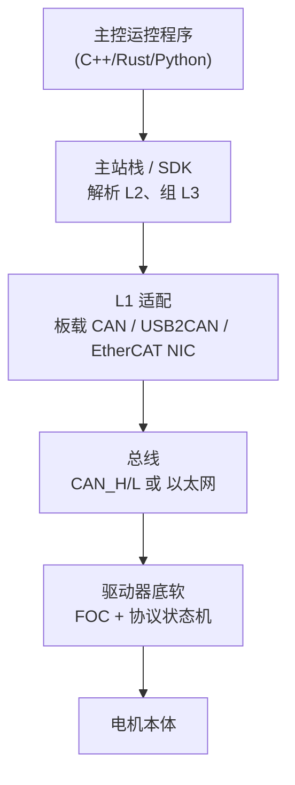
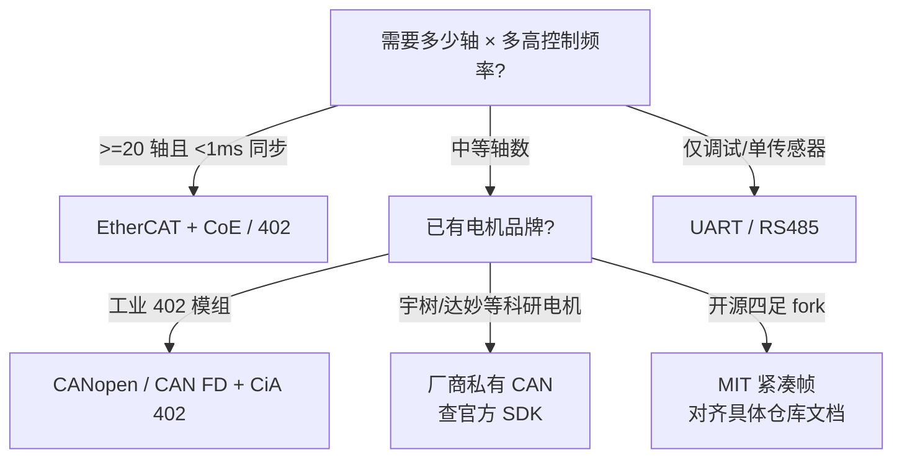

---

type: overview
tags: [hardware, firmware, motor-drive, fieldbus, can-bus, canopen, ethercat, embedded, robotics, mit]
status: complete
updated: 2026-06-24
related:
  - ../concepts/can-bus-protocol.md
  - ../concepts/can-fd.md
  - ../concepts/ethercat-protocol.md
  - ../concepts/uart-serial-communication.md
  - ../concepts/rs-485-serial-bus.md
  - ../concepts/ttl-serial-logic-level.md
  - ../concepts/field-oriented-control.md
  - ../entities/simplefoc.md
  - ../entities/wokwi.md
  - ../comparisons/can-vs-ethercat-joint-bus.md
  - ../formalizations/control-loop-latency-modeling.md
  - ../concepts/processor-in-the-loop-sim2real.md
  - ../queries/real-time-control-middleware-guide.md
  - ./humanoid-motion-control-know-how.md
sources:
  - ../../sources/courses/motor_drive_firmware_bus_protocols.md
  - ../../sources/repos/simplefoc_arduino_foc.md
  - ../../sources/sites/cia_canopen_overview.md
  - ../../sources/sites/cia_can_knowledge_can_classic_and_hs.md
  - ../../sources/sites/cia_can_fd_basic_idea.md
  - ../../sources/sites/cia_dronecan_uavcan.md
summary: "主控与关节驱动器底软之间的通信协议总览：按物理总线 × 应用协议 × 控制语义三层拆解，对比 CANopen/CiA402、CoE、厂商私有 CAN、MIT 紧凑帧、DroneCAN、Modbus 等的优缺点与机器人常见组合。"
---

# 电机驱动器底软通信协议总览

> **本页回答：** 主控（运控机 / 工控机 / 嵌入式板）和**关节电机驱动器底软**之间，有哪些常见协议种类？各自优缺点是什么？和「只学 CAN 物理层」有什么关系？

## 一句话总结

**底软通信 = 物理总线 + 应用层帧格式 + 控制模式语义** 三件套；机器人里最常见的是 **CAN 系（私有或 CANopen）** 与 **EtherCAT+CoE**，调试与外设用 **UART/RS485**；选错层会导致「线能通、但增益/模式/周期对不上」。

## 英文缩写速查

| 缩写 | 英文全称 | 简要说明 |
|------|----------|----------|
| Sim2Real | Simulation to Real | 把仿真中学到的策略迁移落地真机的工程主线 |
| CAN | Controller Area Network | 电机/关节常用的现场总线通信协议 |
| EtherCAT | Ethernet for Control Automation Technology | 高实时性工业以太网总线 |
| PD | Proportional–Derivative | 关节位置/阻抗底层控制，策略输出常为其 setpoint |
| FOC | Field-Oriented Control | 无刷电机的磁场定向控制 |
| PWM | Pulse-Width Modulation | 脉宽调制，驱动电机与功率器件 |
| SDK | Software Development Kit | 软件开发工具包 |
| RL | Reinforcement Learning | 通过与环境交互最大化长期回报来学习策略的范式 |
| WBC | Whole-Body Control | 协调全身关节满足多任务/约束的控制基础设施 |
| ROS 2 | Robot Operating System 2 | 机器人系统集成与通信的常用中间件 |

## 先分清三层（不要混为一谈）

| 层级 | 你在问什么 | 典型例子 |
|------|------------|----------|
| **L1 物理/链路** | 比特怎么在线上传 | 经典 CAN、CAN FD、EtherCAT、RS-485 |
| **L2 应用/传输** | 一帧里字段什么意思、怎么寻址 | CANopen、CoE、厂商私有、DroneCAN、Modbus RTU |
| **L3 控制语义** | 主控想让电机干什么 | 位置/速度/力矩模式（CiA 402）、阻抗/PD 目标、力矩直给 |

集成时三层必须**成套**匹配：例如 L1 用 CAN FD，L2 却按经典 CAN 8 字节私有格式写，驱动器不会认。

**驱动器内部的 FOC：** L3 力矩/速度指令最终由逆变器上的 **磁场定向控制（FOC）** 电流环执行（Clarke/Park + PWM）。协议层只约定「目标力矩/速度」字段，不暴露 dq 电流细节。算法入门与开源 MCU 实现见 [磁场定向控制（FOC）](../concepts/field-oriented-control.md)、[SimpleFOC](../entities/simplefoc.md)。

## 协议种类与优缺点（L2 为主）

下表按**机器人关节驱动**里最常见的应用层/协议族整理；物理层细节见各概念页。

| 种类 | 典型物理层 | 优点 | 缺点 | 常见平台 |
|------|------------|------|------|----------|
| **CANopen + CiA 402** | CAN / CAN FD | 标准对象字典；PDO 周期交换成熟；**CoE** 与 EtherCAT 同源；多厂商互操作 | 栈重；配置复杂；带宽受 CAN 限制 | 工业伺服、部分人形关节模组 |
| **EtherCAT + CoE（CiA 402 对象）** | 以太网 | 极高轴数刷新；**DC 同步**；线缆拓扑灵活 | 主站与从站成本高；需 RT 主站经验 | 高端人形、工业臂 |
| **厂商私有 CAN 帧** | CAN / CAN FD | 帧紧凑、延迟低；SDK 开箱快 | **互不兼容**；文档随版本变；难做处理器在环除非开源 | 四足/人形商用电机（宇树等）、ODM 关节 |
| **MIT / 学术紧凑 CAN 帧** | CAN | 开源生态熟悉；适合 RL 低层 PD/τ 指令 | 非标准；各 fork 字段略异；商用电机不一定支持 | 早期 Cheetah 系、部分开源四足 |
| **DroneCAN（UAVCAN v0 线）** | CAN / CAN FD | 飞控生态成熟；DSDL 可扩展；DNA 分配节点 ID | 面向航空 peripheral，≠ 关节 CiA 402 | 多旋翼 ESC、部分地面 ROS 外设 |
| **Modbus RTU** | RS-485 | 实现简单；工业仪表极多 | 半双工、无硬件仲裁；**不适合** 多轴 kHz 闭环 | 辅助传感器、老伺服、底盘 |
| **UART 自定义 / 文本** | TTL UART | 调试极方便 | 带宽与实时性差 | Bootloader、日志、单轴标定 |
| **以太网私有 TCP/UDP** | 千兆以太网 | 带宽大；可跑复杂 RPC | 抖动大；需自建实时语义 | 部分协作臂、视觉伺服侧车 |

### CiA 402 补充（L3 标准化）

**CiA 402** 是 CANopen 上的**驱动与运动控制 Profile**，规定：

- 状态机（上电 → Ready → Operation enabled）
- **模式字**：Profile Position、Velocity、Torque、Homing 等
- 与 PDO 映射的控制字、目标位置/速度/力矩

因此「我们会 CANopen」在关节场景里通常意味着 **会配 402 对象**，而不只是会发裸 CAN 帧。

### 厂商私有 vs MIT 紧凑帧

二者在 L1 上都是 CAN，但 L2 完全不同：

| 维度 | 厂商私有 | MIT 紧凑帧（学术） |
|------|----------|-------------------|
| 标准化 | 无，随厂商 | 事实标准在开源圈，非 CiA |
| 集成 | 官方 SDK + 文档 | 开源 `legged_control` 等 |
| Sim2Real | 闭源则难做处理器在环 | 开源固件可对齐 |
| 风险 | 版本升级破坏二进制兼容 | 不同 lab fork 字段差异 |

**实践建议：** 采购前向厂商索要 **协议说明 + 周期推荐 + 模式定义**；若只有 DLL 无帧格式，后期 sim2real 成本会显著上升。

## 物理层速查（L1，指向专题页）

| 物理层 | 何时选 | 专题 |
|--------|--------|------|
| 经典 CAN | 轴数中等、已有电机 | [CAN 总线](../concepts/can-bus-protocol.md) |
| CAN FD | 要更大载荷/更高吞吐 | [CAN FD](../concepts/can-fd.md) |
| EtherCAT | 多轴硬实时 + DC | [EtherCAT](../concepts/ethercat-protocol.md) |
| UART/RS485 | 调试、单设备、非关节环 | [UART](../concepts/uart-serial-communication.md)、[RS-485](../concepts/rs-485-serial-bus.md) |
| 横向对比 | 关节总线选型 | [CAN vs EtherCAT](../comparisons/can-vs-ethercat-joint-bus.md) |

## 机器人常见「组合套餐」

1. **科研四足 / 早期人形（成本优先）**  
   L1 CAN → L2 **私有或 MIT 紧凑帧** → L3 PD/力矩指令  
   主控侧：`USB2CAN` + 厂商/开源 SDK。

2. **工业级关节模组**  
   L1 CAN 或 CAN FD → L2 **CANopen + CiA 402** → L3 CST/CSV/CSP  
   主控侧：CANopen 主站（或 PLC）。

3. **高端人形 / 全身 WBC**  
   L1 EtherCAT → L2 **CoE（CANopen 对象）** → L3 同 402 或厂商扩展对象  
   主控侧：IgH / SOEM + PREEMPT_RT。

4. **无人机系外设接到地面机器人**  
   L1 CAN FD → L2 **DroneCAN** → 与关节 CANopen **分总线** 或网关隔离。

5. **Bring-up 阶段**  
   L1 UART → 标定、读版本、产测；**不替代** 关节闭环总线。无硬件时可先用 [Wokwi](../entities/wokwi.md) 等 **MCU 外设仿真** 做 I2C/UART/PWM 冒烟，再焊板联调。

## 选型决策（简图）

## 与延迟、Sim2Real 的关系

- 总线延迟进入 [控制环路延迟建模](../formalizations/control-loop-latency-modeling.md) 的 \(T_{\text{bus}}\) 项。
- **私有协议 + 闭源底软** 会阻碍 [处理器在环 Sim2Real](../concepts/processor-in-the-loop-sim2real.md) 的 CAN 仿真对齐。
- 主控 RT 配置见 [实时运控中间件指南](../queries/real-time-control-middleware-guide.md)（勿在 1 kHz 环里用 ROS 2 承载关节 PDO）。

## 常见误区

| 误区 | 说明 |
|------|------|
| 「会 SocketCAN 就等于会控电机」 | 只会发帧不够，还要对齐 L2/L3 与驱动状态机 |
| 「CANopen 和 CAN 是一回事」 | CANopen 是 L2；物理 CAN 是 L1 |
| 「EtherCAT 和 CANopen 二选一」 | CoE 把 CANopen 对象搬到 EtherCAT 上 |
| 「USB2CAN 与板载 CAN 等效」 | USB 路径抖动更大，不宜单独承担硬实时全关节环 |
| 「Modbus 能控人形 30 关节」 | 带宽与半双工机制不适合 kHz 级多轴同步 |

## 关联页面

- [磁场定向控制（FOC）](../concepts/field-oriented-control.md)
- [SimpleFOC](../entities/simplefoc.md)
- [Wokwi](../entities/wokwi.md) — 浏览器端 MCU/外设仿真，固件 bring-up 与教学
- [CAN 总线（经典）](../concepts/can-bus-protocol.md)
- [CAN FD](../concepts/can-fd.md)
- [EtherCAT 协议基础](../concepts/ethercat-protocol.md)
- [UART 串行通信](../concepts/uart-serial-communication.md)
- [RS-485 串行总线](../concepts/rs-485-serial-bus.md)
- [TTL 串行逻辑电平](../concepts/ttl-serial-logic-level.md)
- [CAN vs EtherCAT 关节总线选型](../comparisons/can-vs-ethercat-joint-bus.md)
- [人形运动控制 Know-How](./humanoid-motion-control-know-how.md)
- [处理器在环 Sim2Real](../concepts/processor-in-the-loop-sim2real.md)

## 参考来源

- [电机底软通信协议课程索引](../../sources/courses/motor_drive_firmware_bus_protocols.md)
- [CiA：CANopen 概览](../../sources/sites/cia_canopen_overview.md)
- [CiA：经典 CAN](../../sources/sites/cia_can_knowledge_can_classic_and_hs.md)
- [CiA：CAN FD](../../sources/sites/cia_can_fd_basic_idea.md)
- [CiA / DroneCAN](../../sources/sites/cia_dronecan_uavcan.md)
- [SimpleFOC / Arduino-FOC](../../sources/repos/simplefoc_arduino_foc.md)

## 推荐继续阅读

- CiA：[CiA 402 – drive and motion control](https://www.can-cia.org/can-knowledge/canopen/cia-402/)
- [CAN vs EtherCAT 对比](../comparisons/can-vs-ethercat-joint-bus.md)
- 具体电机：以**厂商官方 SDK 与协议 PDF** 为准（本页刻意不固化私有字节表）
