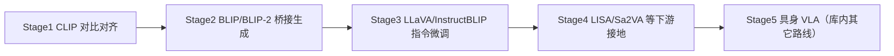

# 多模态 LLM 发展路线

## 一句话定义

一条从 **图文对比对齐** 到 **冻结大语言模型+视觉接口**、再到 **视觉指令微调与下游接地/分割** 的多模态大模型演进路线图，对应课程 5.1.3–6.2。

## 英文缩写速查

| 缩写 | 英文全称 | 简要说明 |
|------|----------|----------|
| MLLM | Multimodal Large Language Model | 多模态大语言模型 |
| CLIP | Contrastive Language-Image Pretraining | 对比对齐阶段代表 |
| Q-Former | Querying Transformer | BLIP-2 桥接模块 |
| SFT | Supervised Fine-Tuning | 指令微调 |
| VLA | Vision-Language-Action | 具身动作延伸 |

## 为什么重要

- 给课程第 5–6 章一个「先学什么」的顺序，避免一上来就微调 7B 却不懂对齐。
- 与本库 [VLA 纵深](../../roadmap/depth-vla.md) Stage 0 衔接：先 VLM，再动作。

## 核心原理（阶段）

| 阶段 | 代表 | 能力 |
|------|------|------|
| 1 | [CLIP](../entities/clip.md) | 零样本分类/检索 |
| 2 | [BLIP](../entities/blip.md)/[BLIP-2](../entities/paper-blip2.md) | Caption/VQA，高效桥接 |
| 3 | [LLaVA](../entities/llava.md)/[MiniGPT-4](../entities/minigpt4.md)/[InstructBLIP](../entities/instructblip.md) | 多轮视觉对话 |
| 4 | [LISA](../entities/lisa.md)/[Sa2VA](../entities/sa2va.md)/[SIDA](../entities/sida.md) | 推理分割/视频具身编辑等 |

## 工程实践

| 项 | 建议 |
|----|------|
| 算力 | 先推理 CLIP/BLIP-2；再 LoRA 微调 LLaVA |
| 数据 | 指令集质量 > 盲目扩参 |
| 机器人 | 明确输出是文本、掩码还是动作 |

## 局限与风险

路线图是教学抽象，工业界并行出现 SigLIP、Flamingo、GPT-4V 等；落地以任务与许可为准。

## 关联页面

- [多模态基础](../concepts/multimodality-basics.md)
- [VLM 分类法](../comparisons/vlm-vln-vla-vlx-world-model-taxonomy.md)
- [Transformer CV 课程策展](../entities/transformer-cv-curriculum.md)

## 参考来源

- [Transformer 视觉应用课程大纲](../../sources/courses/transformer_cv_applications_syllabus.md)

## 推荐继续阅读

- [LLaVA project](https://llava-vl.github.io/)
