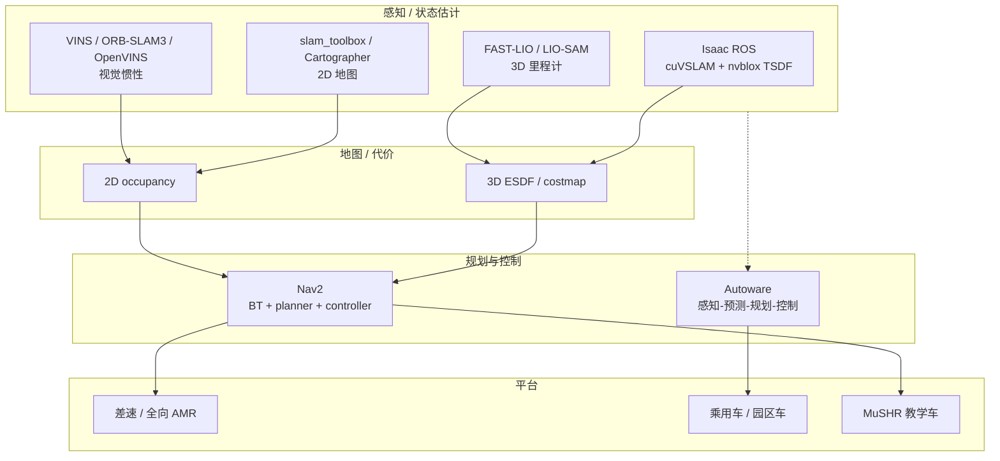

# 导航·SLAM·自动驾驶开源栈总览

> **本页回答：** 做地面移动机器人或低速自动驾驶时，**Nav2、slam_toolbox、Cartographer、FAST-LIO、VINS、Autoware、Isaac ROS** 各在什么层？如何与仓库主线的 **腿式/人形控制**、**VLA 操作** 区分而不混栈？

## 一句话总结

**ROS 2 导航闭环** 以 [Navigation2](../entities/navigation2.md) 为中枢，上游接 **2D SLAM**（[slam_toolbox](https://github.com/SteveMacenski/slam_toolbox)、[Cartographer](https://github.com/cartographer-project/cartographer)）或 **3D 定位**（[FAST-LIO](https://github.com/hku-mars/FAST_LIO)、[LIO-SAM](https://github.com/TixiaoShan/LIO-SAM) 等，见 [LiDAR/VIO 选型](../comparisons/lidar-slam-lio-vio-selection.md)）；**乘用车级全栈** 走 [Autoware](../entities/autoware.md)；**Jetson + GPU 感知建图** 用 [Isaac ROS Visual SLAM](../entities/isaac-ros-visual-slam.md) + [nvblox](../entities/isaac-ros-nvblox.md)。**人形全身 MPC/WBC** 不属于本栈，见 [OpenLoong-Dyn-Control](https://github.com/loongOpen/OpenLoong-Dyn-Control) 与 [OpenLoong](../entities/openloong.md)。

## 为什么重要

- 仓库主线以 **腿式/人形运控与模仿学习** 为主，但 **移动底盘、AMR、低速无人车** 仍依赖成熟的 **定位—建图—规划** 栈；与 [VLN](../tasks/vision-language-navigation.md) 共享「感知—决策—执行」分层思想，**执行层接口不同**（`cmd_vel` / Ackermann vs 关节力矩）。
- 21 仓覆盖从 **教学小车 MuSHR** 到 **Autoware Universe** 的完整谱系；常见错误：用 ORB-SLAM3 直接驱动 Nav2 而无坐标系/频率对齐，或把 FAST-LIO 当全局规划器。
- [LeRobot](../entities/lerobot.md) / [OpenVLA](../entities/openvla.md) 解决 **操作与策略**，不替代 Nav2；二者常在「同一机器人」上 **分层共存**（导航栈 + 机械臂 VLA）。

## 流程总览

## 分层选型表

| 需求 | 优先选型 | 备选 | 避免 |
|------|----------|------|------|
| ROS 2 标准室内 AMR 导航 | Nav2 + slam_toolbox | Cartographer + AMCL | 无地图直接 DWB 调参 |
| 大规模 / lifelong 2D 地图 | slam_toolbox | Cartographer | 把 3D LIO 当地图服务器却不降维 |
| 3D 激光高频里程计 | FAST-LIO | LIO-SAM | 期望内置全局语义地图 |
| 因子图 + GPS 融合室外 | LIO-SAM | hdl_graph_slam | 室内稀疏特征硬上 GPS |
| 地面车辆 3D 激光 SLAM | LeGO-LOAM | FAST-LIO | 无人机空中场景硬用地面假设 |
| 视觉惯性无人机/手持 | VINS-Fusion | ORB-SLAM3 | 忽略 IMU 标定 |
| 研究向 VIO 滤波器 | OpenVINS | VINS-Fusion | 与 Nav2 无 ROS 封装时裸跑 |
| RGB-D 一体建图导航 | RTAB-Map | — | 与高动态场景无 motion compensation |
| 开源 L4 全栈 | Autoware | — | 用 Nav2 插件冒充感知预测 |
| Jetson 视觉 SLAM + 3D 避障 | Isaac ROS VSLAM + nvblox | — | x86 无 GPU 强上 nvblox |
| 导航课 / 非完整小车 | MuSHR | TurtleBot3（既有资料） | 当人形 WBC 教程 |
| 机械臂抓取策略 | LeRobot / OpenVLA | — | 用 Nav2 输出关节力矩 |

## 各层角色摘要

### ROS 2 导航层

- **[Navigation2](../entities/navigation2.md)**：行为树导航器、全局/局部规划器插件（NavFn、Smac、DWB/RPP 等）、代价地图、恢复行为。
- **[MuSHR](../entities/mushr.md)**：低成本阿克曼平台 + 课程式 ROS 导航实验。

### 2D SLAM

- **[SLAM Toolbox](../entities/slam-toolbox.md)**：Karto 后端、序列化大地图、定位/建图模式切换；Nav2 社区常用搭档。
- **[Cartographer](../entities/cartographer.md)**：子图 + scan matching + 位姿图；2D/3D 均可，ROS 封装成熟。

### 3D LiDAR 与图优化

- **[FAST-LIO](../entities/fast-lio.md)**：ikd-Tree + 迭代 ESKF，强调 **速度** 与鲁棒性。
- **[LIO-SAM](../entities/lio-sam.md)**：GTSAM 因子图，易接 **GPS** 与回环。
- **[LeGO-LOAM](../entities/lego-loam.md)**：地面分割与地面优化，适合 **起伏地形**。
- **[hdl_graph_slam](../entities/hdl-graph-slam.md)**：NDT 前端 + g2o，偏 **室外大场景**。
- **[Voxgraph](../entities/voxgraph.md)**：Voxblox TSDF 子图对齐，多会话建图。

### 视觉 / VIO

- **[ORB-SLAM3](../entities/orb-slam3.md)**：多地图、视觉/视觉-惯性；研究基准强，工程需自行对接 ROS 2。
- **[VINS-Fusion](../entities/vins-fusion.md)**：优化式多传感器；支持 GPS 全局融合。
- **[OpenVINS](../entities/open-vins.md)**：MSCKF 系，便于 **算法对比实验**。
- **[OpenVSLAM](../entities/openvslam.md)** → 社区多迁移至 **stella_vslam** 分支维护。
- **[Kimera](../entities/kimera.md)**：Kimera-VIO + RPGO + Semantics 模块化 **语义 SLAM**。
- **[RTAB-Map](../entities/rtabmap.md)**：RGB-D/激光多模态建图与记忆管理。

### 自动驾驶与 NVIDIA 栈

- **[Autoware](../entities/autoware.md)**：Autoware Core/Universe 组件化，面向 **道路场景**。
- **[Isaac ROS Visual SLAM](../entities/isaac-ros-visual-slam.md)** / **[nvblox](../entities/isaac-ros-nvblox.md)**：GPU 加速，与 Nav2 **3D costmap** 衔接。

### 与本仓库其它主线

| 子系统 | 本页栈 | 腿式/人形主线 |
|--------|--------|----------------|
| 状态估计 | 位姿 + 地图 | 浮基 + 接触 + 关节 |
| 规划输出 | `cmd_vel` / 轨迹 | 足端/质心/关节参考 |
| 学习 | VLA/IL 操作 | RL locomotion / tracking |
| 代表仓 | Nav2、FAST-LIO | [OpenLoong-Dyn-Control](../entities/openloong-dyn-control.md)、[legged_gym](https://github.com/leggedrobotics/legged_gym) |

## 常见误区

- **把 SLAM 当规划器**：SLAM 只提供 **位姿与地图**；路径跟踪仍在 Nav2 controller 或 Autoware 控制模块。
- **2D / 3D 混用不投影**：3D LIO 输出需 **投影或切片** 才能喂给经典 2D costmap，或使用 nvblox 等 3D 代价源。
- **OpenVLA 与 Nav2 二选一**：VLA 管 **操作空间**；底盘导航仍常需 Nav2，除非端到端策略直接输出底盘速度且已安全验证。

## 参考来源

- [sources/repos/navigation_slam_autonomy_stack_catalog.md](../../sources/repos/navigation_slam_autonomy_stack_catalog.md)
- 本页所列各 `sources/repos/*.md` 条目

## 关联页面

- [LiDAR / LIO / VIO 选型对比](../comparisons/lidar-slam-lio-vio-selection.md)
- [Navigation2](../entities/navigation2.md)
- [Autoware](../entities/autoware.md)
- [ROS 2 基础](../concepts/ros2-basics.md)
- [VLA 方法](../methods/vla.md)

## 推荐继续阅读

- [Nav2 官方文档](https://docs.nav2.org/)
- [Autoware 文档](https://autowarefoundation.github.io/autoware-documentation/)
- [Isaac ROS](https://nvidia-isaac-ros.github.io/)
