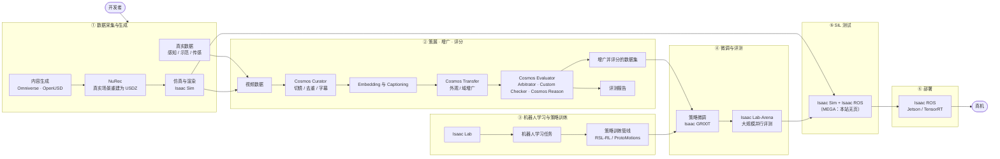

# NVIDIA Physical AI 工具链技术地图（汇总节点）

> **本页定位**：**汇总节点**——把散落在 `wiki/entities/` 的 NVIDIA 工具页，按 NVIDIA 官方端到端 Physical AI 工作流图的分段串成一条链路，供选型与阅读定位。**不复述**各工具安装与 API 细节，细节回各实体页。
>
> **图结构来源**：用户提供的 NVIDIA 端到端机器人开发工作流截图（2026-09-06 入库）。截图本身无公开 URL 存档，本页 **只复用其分段与节点名**，各节点的事实描述以本库已有实体页与其 `sources/` 归档为准。

## 一句话定义

**NVIDIA Physical AI 工具链** 是一条厂商自洽的机器人开发流水线：**真实数据 + 合成数据 → 世界模型策展/增广/评分 → Isaac Lab 训练 → 策略后训练与 Arena 评测 → SIL 回归 → Isaac ROS 部署上机**，每一段都有对应的 NVIDIA 组件承接。

## 英文缩写速查

| 缩写 | 英文全称 | 简要说明 |
|------|----------|----------|
| WFM | World Foundation Model | Cosmos 族世界基础模型，负责生成/策展/评分视频数据 |
| SDG | Synthetic Data Generation | 合成数据生成，本链第①②段的产出 |
| SIL | Software-in-the-Loop | 部署前在仿真里跑真实机器人软件栈的回归验证 |
| USD | Universal Scene Description | OpenUSD 场景/资产格式，Omniverse–Isaac Sim 的公共载体 |
| VLA | Vision-Language-Action | GR00T 等通才策略族，本链第④段的主要被训对象 |
| RL | Reinforcement Learning | Isaac Lab 上的主力训练范式 |
| ROS | Robot Operating System | Isaac ROS 依托的机器人中间件（ROS 2） |

## 为什么重要

- **本库的 NVIDIA 页面已经很多，但彼此是散点**：Isaac Sim / Isaac Lab / Cosmos / NuRec / GR00T / Isaac ROS 各自成页，读者难以判断「我现在缺的是哪一段」。
- **选型问题通常是分段问题**：缺数据、缺增广、缺评测、缺部署是四类完全不同的工程缺口，本页按段给入口，而不是按产品名罗列。
- **厂商图 ≠ 必须全用**：把官方分段画出来，才好看清哪些段可以换成非 NVIDIA 组件（见「局限与风险」）。

## 流程总览：七段工作流

## 子节点索引：截图节点 → 本站页面

| 段 | 截图节点 | 本站已有节点 | 这一段解决什么 |
|----|----------|--------------|----------------|
| **① 真实数据** | Perception / Demonstration / Sensor | [Isaac Teleop](../entities/isaac-teleop.md)、[Physical AI 数据集合](../entities/nvidia-physical-ai-datasets.md)、[GRAIL loco-manipulation 数据](../entities/grail-locomanipulation-dataset.md) | 演示怎么采、公开数据从哪拿 |
| **① 内容生成** | Content Generation | [NVIDIA Omniverse](../entities/nvidia-omniverse.md)、[Learn OpenUSD](../entities/nvidia-learn-openusd.md)、[OmniGraph](../entities/omnigraph.md) | 场景与资产用 USD 怎么组织 |
| **① NuRec** | NuRec | [NVIDIA NuRec](../entities/nvidia-nurec.md)、[Flexion × Niantic × NVIDIA RGB Sim2Real 管线](../entities/flexion-niantic-nvidia-rgb-sim2real-pipeline.md) | 真实现场重建成可仿真体积（real2sim） |
| **① 仿真与渲染** | Simulation & Rendering | [Isaac Sim](../entities/isaac-sim.md)、[Newton Physics](../entities/newton-physics.md)、[NVIDIA Warp](../entities/nvidia-warp.md) | 物理与 RTX 传感器出合成数据 |
| **② 策展** | Cosmos Curator / Embeddings & Captioning | [NVIDIA Cosmos](../entities/nvidia-cosmos.md)、[Cosmos Cookbook](../entities/cosmos-cookbook.md) | 海量视频怎么切、滤、打标 |
| **② 增广** | Cosmos Transfer | [Cosmos Transfer](../entities/cosmos-transfer.md)、[Cosmos-Transfer1 论文](../entities/paper-cosmos-transfer1.md) | 同一轨迹换外观/天气/材质扩数据 |
| **② 评分** | Cosmos Evaluator（Arbitrator / Custom Checker / Cosmos Reason） | [Cosmos 3](../entities/cosmos-3.md)、[Predict2.5 / Transfer2.5 论文](../entities/paper-sa-2511-00062-world-simulation-with-video-foundation-models-fo.md) | 生成数据的拒采与质检 |
| **② 数据集产出** | Augmented & Graded Dataset | [GR00T-Dreams 合成轨迹](../entities/paper-gr00t-dreams-synthetic-trajectories.md)、[MimicGen](../entities/mimicgen.md) | 合成轨迹如何进入训练集 |
| **③ 训练平台** | Isaac Lab | [Isaac Lab](../entities/isaac-lab.md)、[Isaac Lab 默认环境](../entities/isaac-lab-default-environments.md)、[三代产品总览](../entities/isaac-gym-isaac-lab.md) | 任务注册与 GPU 并行环境 |
| **③ 训练管线** | Robot Learning Task / Policy Training Pipeline | [RSL-RL](../entities/rsl-rl.md)、[ProtoMotions](../entities/protomotions.md)、[GR00T-WholeBodyControl](../entities/gr00t-wholebodycontrol.md)、[COMPASS](../entities/compass.md) | PPO / 蒸馏 / 全身控制训练后端 |
| **③ 算力入口** | —（截图未画） | [NVIDIA Brev](../entities/nvidia-brev.md)、[Isaac Launchable](../entities/isaac-launchable.md) | 没有本地 RTX 时怎么起环境 |
| **④ 策略微调** | Fine Tuning Policy | [Isaac GR00T](../entities/isaac-gr00t.md)、[SO-101 Sim2Real 动手课](../entities/nvidia-so101-sim2real-lab-workflow.md) | VLA 后训练与 checkpoint 产出 |
| **④ 评测** | Isaac Arena | [Isaac Lab-Arena](../entities/isaac-lab-arena.md)、[DexBench](../entities/dexbench.md)、[Lightwheel RoboFinals](../entities/lightwheel-robofinals.md) | 通才策略的大规模并行评测 |
| **⑤ SIL 测试** | MEGA / Isaac Sim / Isaac ROS | [Software-in-the-Loop](../concepts/software-in-the-loop.md)、[Hardware-in-the-Loop](../concepts/hardware-in-the-loop.md)、[Isaac Sim](../entities/isaac-sim.md) | 上机前跑真实软件栈回归 |
| **⑥ 部署** | Isaac ROS | [Isaac ROS Nvblox](../entities/isaac-ros-nvblox.md)、[Isaac ROS Visual SLAM](../entities/isaac-ros-visual-slam.md)、[cuRobo](../entities/curobo.md)、[TensorRT](../entities/tensorrt.md)、[NVIDIA Jetson](../entities/nvidia-jetson.md)、[Jetson Orin NX](../entities/jetson-orin-nx.md) | 机载感知/规划/推理落到 ROS 2 |
| **⑥ 端到端案例** | —（截图未画） | [Spot locomotion Sim2Real](../entities/nvidia-isaac-lab-spot-locomotion-sim2real.md)、[UR10e 工业装配 Sim2Real](../entities/nvidia-isaac-lab-ur10e-industrial-assembly-sim2real.md)、[GR00T-VisualSim2Real](../entities/gr00t-visual-sim2real.md) | 官方把全链跑通的公开样例 |

## 工程实践：按缺口选入口

| 你缺的是 | 先读 | 再读 |
|----------|------|------|
| 场景与资产 | [Isaac Sim](../entities/isaac-sim.md) | [NuRec](../entities/nvidia-nurec.md)（真实现场重建） |
| 演示数据 | [Isaac Teleop](../entities/isaac-teleop.md) | [Isaac GR00T](../entities/isaac-gr00t.md) 的 HDF5 → LeRobot 转换 |
| 数据不够多样 | [Cosmos Transfer](../entities/cosmos-transfer.md) | [Cosmos Cookbook](../entities/cosmos-cookbook.md) 的可运行配方 |
| 训练环境 | [Isaac Lab](../entities/isaac-lab.md) | [Isaac Lab 默认环境](../entities/isaac-lab-default-environments.md) |
| 评测口径 | [Isaac Lab-Arena](../entities/isaac-lab-arena.md) | [具身模型测评纵深路线](../../roadmap/depth-embodied-eval.md) |
| 上机部署 | [Isaac ROS Visual SLAM](../entities/isaac-ros-visual-slam.md) | [TensorRT](../entities/tensorrt.md) + [Jetson](../entities/nvidia-jetson.md) |

## 局限与风险

- **这是厂商视角的自洽图，不是唯一路径**：第③段可换 [MuJoCo / mjlab](./robot-training-stack-layers-technology-map.md) 系，第②段的生成增广也不是训练的必要条件；按段替换比整链锁定更稳。
- **截图里的多个节点本站没有独立页**（不为凑图造空壳页）：
  - **Cosmos Curator**、**Arbitrator**、**Custom Checker** — 目前只在 [NVIDIA Cosmos](../entities/nvidia-cosmos.md)、[Cosmos Cookbook](../entities/cosmos-cookbook.md) 内被提及，未单独升格。
  - **MEGA** — 本站无任何页面覆盖；**推测**为 Omniverse 侧的大规模工厂/车队数字孪生蓝图，待查证官方资料后再升格，不要按推测写页。
  - **Isaac ROS 主页** — 本站只有 [Nvblox](../entities/isaac-ros-nvblox.md) 与 [Visual SLAM](../entities/isaac-ros-visual-slam.md) 两个组件页，缺框架总览页。
- **版本漂移**：[Isaac Gym](../entities/isaac-gym.md) 已 deprecated；Cosmos 1.x/2.x 配方（Cookbook）为有限维护，新工作在 Cosmos 3。读本页表格时以各实体页的版本说明为准。
- **生成数据的评分不是物理证明**：Cosmos Reason 之类 critic 只能滤「看起来不合理」，替代不了 SIL 与真机回归。

## 与其他汇总页的分工

- [训练栈分层技术地图](./robot-training-stack-layers-technology-map.md) — 跨厂商的**六层训练栈**（Isaac / MuJoCo / mjlab / UniLab / Newton / Genesis）；本页只沿 **NVIDIA 一条链** 展开。
- [Isaac GR00T](../entities/isaac-gr00t.md) 的「平台五阶段」 — 聚焦 **策略后训练链**（Arena → Teleop → LeRobot → 后训练 → 部署）；本页在其上游补了 **数据生成与 Cosmos 策展/评分**、下游补了 **SIL 与 Isaac ROS 部署**。
- [仿真平台十年技术地图](./sim-platforms-decade-technology-map.md) — 历史脉络视角；本页是当前工具链的横切面。

## 关联页面

- [Isaac Sim](../entities/isaac-sim.md)
- [Isaac Lab](../entities/isaac-lab.md)
- [NVIDIA Cosmos](../entities/nvidia-cosmos.md)
- [Isaac GR00T](../entities/isaac-gr00t.md)
- [Sim2Real](../concepts/sim2real.md)
- [Software-in-the-Loop](../concepts/software-in-the-loop.md)

## 参考来源

- 本页为 **站内归纳**：节点事实全部来自上列各实体页；分段结构来自用户提供的 NVIDIA 端到端工作流截图（2026-09-06）。
- [NVIDIA Isaac GR00T 端到端平台博客归档](../../sources/blogs/nvidia_develop_humanoid_robot_policies_isaac_gr00t.md)
- [Isaac Lab-Arena 通才策略评测博客归档](../../sources/blogs/nvidia_isaac_lab_arena_generalist_policy_eval.md)
- [NVIDIA Cosmos 仓库归档](../../sources/repos/nvidia_cosmos.md)、[Cosmos Cookbook 归档](../../sources/repos/nvidia_cosmos_cookbook.md)
- [Isaac ROS Nvblox 仓库归档](../../sources/repos/isaac_ros_nvblox.md)

## 推荐继续阅读

- [NVIDIA Isaac 平台页](https://developer.nvidia.com/isaac) — 官方产品线入口
- [Isaac Lab 文档](https://isaac-sim.github.io/IsaacLab/) — 训练段官方文档
- [Cosmos Cookbook](https://nvidia-cosmos.github.io/cosmos-cookbook/index.html) — 策展/增广段可运行配方
- [Isaac ROS 文档](https://nvidia-isaac-ros.github.io/) — 部署段官方文档
