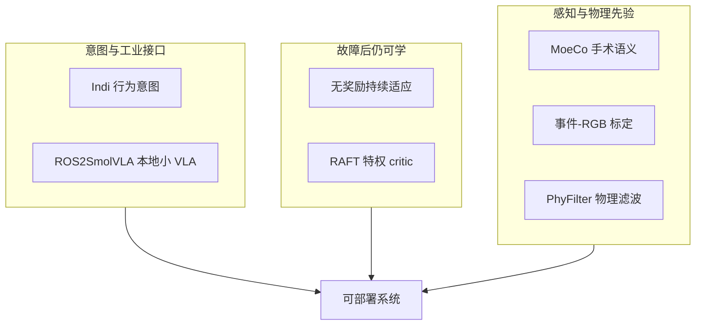

# 开源具身 7 篇：系统结构阅读坐标

> **本页定位**：为 [具身智能小站 · 7 篇开源盘点](https://mp.weixin.qq.com/s/zHxwlUsj22t1oPd9Q2C-dw)（2026-08-26）提供 **按四类问题组织的阅读坐标**；不复述每篇方法细节。姊妹近期盘点见 [开源 8 篇](./open-source-8-papers-technology-map.md)、[VLA 可执行性 9 篇](./vla-robustness-9-papers-technology-map.md)。

## 一句话观点

**这一批工作的重心从「继续放大模型」转向补强系统结构：给解码器意图、给工业栈接口、给故障后的世界模型或特权 critic，再用标定工具和物理反馈降低真机门槛。**

## 英文缩写速查

| 缩写 | 英文全称 | 简要说明 |
|------|----------|----------|
| Indi | Intention Distillation | VLA 解码器意图蒸馏 |
| SRB | Space Robotics Bench | 无奖励适应的仿真宿主 |
| RAFT | Recurrent Asymmetric Fault Tolerant | 特权 critic 推进器容错（非光流） |
| MoeCo | Mixture-of-Experts-guided Co-Optimization | 手术三元组协同优化 |
| PhyFilter | Physics Filter | 物理滤波残差修正 |

## 为什么单独做这张地图

- 公众号把 7 篇放在同一叙事：真实环境不完美时，靠结构而不是只靠更大 VLA。
- **ROS2SmolVLA** 在先前 ingest 已有 complete 页 — 本专辑 **复用、不重复造页**。
- 需要横切面索引，避免 7 个实体成孤岛。

## 流程总览

## 分组索引

### 意图与工业接口

| 论文 | 详情节点 | 读什么 |
|------|----------|--------|
| Indi | [paper-indi](../entities/paper-indi.md) | 教师意图进解码器；项目页未开源训练仓 |
| ROS2SmolVLA | [paper-ros2smolvla](../entities/paper-ros2smolvla.md) | ROS 2 × UR10e 本地 SmolVLA（复用） |

### 故障后仍可学

| 论文 | 详情节点 | 读什么 |
|------|----------|--------|
| Reward-Free Continual Adaptation | [paper-reward-free-continual-adaptation-space](../entities/paper-reward-free-continual-adaptation-space.md) | 冻奖励头、只改 RSSM 动态 |
| RAFT | [paper-raft-thruster-fault](../entities/paper-raft-thruster-fault.md) | critic 看见 \(D_{gt}\)，actor 无传感器 |

### 感知、标定与物理反馈

| 论文 | 详情节点 | 读什么 |
|------|----------|--------|
| MoeCo | [paper-moeco](../entities/paper-moeco.md) | 手术三元组；部分开源 |
| simple-evrgb-cal | [paper-simple-evrgb-cal](../entities/paper-simple-evrgb-cal.md) | 无运动事件—RGB 标定 |
| PhyFilter | [paper-phyfilter](../entities/paper-phyfilter.md) | 物理滤波换泛化 |

## 开源状态速查（入库日 2026-08-26）

| 论文 | 状态 |
|------|------|
| Indi | **未开源** 仅项目页 |
| Reward-Free Continual Adaptation | **已开源** SRB |
| ROS2SmolVLA | **已开源**（既有节点） |
| RAFT | **已开源** 训练/评测 |
| MoeCo | **部分开源** 完整入口待发布 |
| simple-evrgb-cal | **已开源** GUI 工具 |
| PhyFilter | **已开源** 四案例 |

## 关联页面

- [VLA](../methods/vla.md) — Indi / ROS2SmolVLA
- [Privileged Training](../concepts/privileged-training.md) — RAFT
- [DreamerV3](../entities/paper-shenlan-wm-13-dreamerv3.md) — 无奖励适应骨干
- [开源 8 篇地图](./open-source-8-papers-technology-map.md) — 前一日姊妹盘点

## 参考来源

- [wechat_embodied_station_7_papers_vla_intent_space_2026-08-26](../../sources/blogs/wechat_embodied_station_7_papers_vla_intent_space_2026-08-26.md)
- [raw 抓取](../../sources/raw/wechat_embodied_station_7_papers_vla_intent_space_2026-08-26.md)

## 推荐继续阅读

- [具身智能小站原文](https://mp.weixin.qq.com/s/zHxwlUsj22t1oPd9Q2C-dw)
- [开源 8 篇地图](./open-source-8-papers-technology-map.md)
