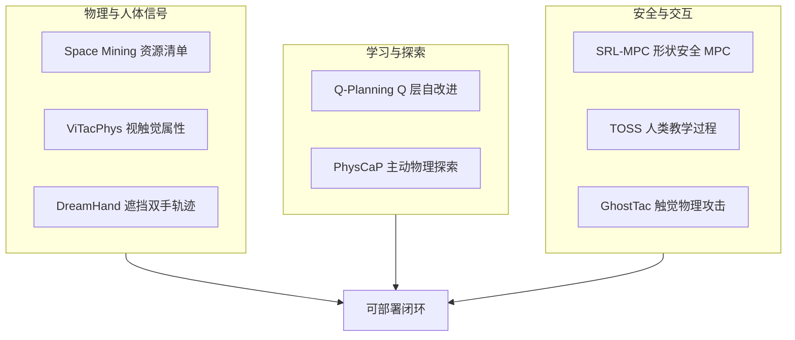

# 开源具身 8 篇：阅读坐标与技术地图

> **本页定位**：为 [具身智能小站 · 8 篇开源盘点](https://mp.weixin.qq.com/s/71jZDzvcWZ3SsoHOEA8sgQ)（2026-08-25）提供 **按五类问题组织的阅读坐标**；不复述每篇方法细节。姊妹近期盘点见 [VLA 可执行性 9 篇](./vla-robustness-9-papers-technology-map.md)、[视频–接触–控制 10 篇](./video-contact-control-10-papers-technology-map.md)。

## 一句话观点

**机器人研究正从「把动作做出来」转向可验证闭环：理解物理属性、从失败中学习、主动试探、嵌入显式安全，并把人类教师与传感器攻击面纳入系统设计。**

## 英文缩写速查

| 缩写 | 英文全称 | 简要说明 |
|------|----------|----------|
| ISRU | In-Situ Resource Utilization | 太空原位资源利用 |
| HOCBF | High-Order Control Barrier Function | SRL-MPC 形状安全约束 |
| CaP | Code-as-Policy | PhysCaP 所扩展的代码策略框架 |
| TOSS | Triggers-Objectives-Signals-Strategies | 人类教学决策四维框架 |
| EMI | Electromagnetic Interference | GhostTac 攻击载体 |

## 为什么单独做这张地图

- 公众号把 8 篇放在「感知物理 → 价值自改进 → 主动探索 → 安全结构 → 系统基础设施」同一叙事里。
- **ViTacPhys / Q-Planning / DreamHand** 在先前 ingest 已有 complete 页 — 本专辑 **复用、不重复造页**。
- 需要横切面索引，避免 8 个实体成孤岛。

## 流程总览

## 分组索引

### 物理感知与数据基础设施

| 论文 | 详情节点 | 读什么 |
|------|----------|--------|
| Space Mining Survey | [paper-space-mining-with-robotics](../entities/paper-space-mining-with-robotics.md) | 六阶段架构 + 开放研究清单 |
| ViTacPhys | [paper-vitacphys](../entities/paper-vitacphys.md) | 人体视触觉 → 物理属性条件抓取 |
| DreamHand | [paper-dreamhand](../entities/paper-dreamhand.md) | VDM 几何先验恢复 egocentric 双手 |

### 策略自改进与主动探索

| 论文 | 详情节点 | 读什么 |
|------|----------|--------|
| Q-Planning | [paper-qplanning](../entities/paper-qplanning.md) | 冻结 BC + 小 Q 吸收失败 rollout |
| PhysCaP | [paper-physcap](../entities/paper-physcap.md) | CaP + 本体感觉探索隐藏属性 |

### 安全、教学与攻击面

| 论文 | 详情节点 | 读什么 |
|------|----------|--------|
| SRL-MPC | [paper-srl-mpc](../entities/paper-srl-mpc.md) | RL 调 MPC + 形状 HOCBF |
| TOSS Framework | [paper-toss-framework](../entities/paper-toss-framework.md) | 人类教学四维过程 + OSF 数据 |
| GhostTac | [paper-ghosttac](../entities/paper-ghosttac.md) | 触觉 EMI 物理层攻击 |

## 开源状态速查（入库日）

| 论文 | 状态 |
|------|------|
| Space Mining | **已开源** 研究清单仓 |
| ViTacPhys | **待发布** |
| Q-Planning | **已开源** |
| SRL-MPC | **待发布** |
| TOSS | **已开源** OSF 数据 |
| PhysCaP | **未开源** |
| GhostTac | **已开源** 演示代码 |
| DreamHand | **待发布** |

## 关联页面

- [VLA](../methods/vla.md) — Q-Planning / PhysCaP 对照语境
- [Model Predictive Control](../methods/model-predictive-control.md) — SRL-MPC 执行层
- [tactile-sensing](../concepts/tactile-sensing.md) — ViTacPhys / GhostTac
- [imitation-learning](../methods/imitation-learning.md) — ViTacPhys / Q-Planning

## 参考来源

- [wechat_embodied_station_8_papers_open_source_2026-08-25](../../sources/blogs/wechat_embodied_station_8_papers_open_source_2026-08-25.md)
- [raw 抓取](../../sources/raw/wechat_embodied_station_8_papers_open_source_2026-08-25.md)

## 推荐继续阅读

- [具身智能小站原文](https://mp.weixin.qq.com/s/71jZDzvcWZ3SsoHOEA8sgQ)
- [VLA 可执行性 9 篇地图](./vla-robustness-9-papers-technology-map.md)
