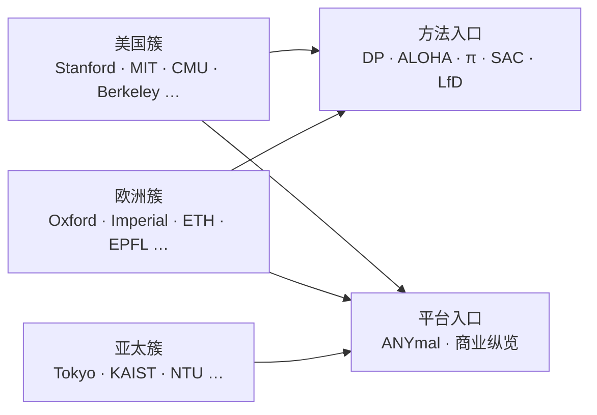

# 海外具身智能实验室地图（2026）

> **本页定位**：为 [深蓝具身智能 · 2026 海外具身智能实验室 43 所](https://mp.weixin.qq.com/s/_zoU9Q-KXHJAUZ041iBuCw) 提供 **国家分区导航**；不复述全部 PI 履历，只保留 **地理簇、代表方法/衍生企业、与本库交叉**。姊妹篇见 [国内具身智能实验室三层地图](./china-embodied-ai-labs-landscape-2026.md)。

## 一句话定义

海外具身智能与机器人实验室呈现 **「顶尖高校研究所 + PI 衍生 AI/机器人公司」** 格局：美国以斯坦福 / MIT / CMU / Berkeley 为方法策源，欧洲以牛津–帝国理工–ETH/EPFL 为感知控制与腿足重镇，亚太（日韩新）在人形硬件与 Physical AI 叙事上形成第二梯队；数据截至 2026-07，**不分排名**。

## 英文缩写速查

| 缩写 | 英文全称 | 简要说明 |
|------|----------|----------|
| VLA | Vision-Language-Action | 视觉–语言–动作多模态策略 |
| BAIR | Berkeley Artificial Intelligence Research | 伯克利人工智能研究实验室集群 |
| CSAIL | Computer Science and Artificial Intelligence Laboratory | MIT 计算机科学与人工智能实验室 |
| ORI | Oxford Robotics Institute | 牛津机器人研究所 |
| LfD | Learning from Demonstration | 示教学习 |
| SLAM | Simultaneous Localization and Mapping | 同步定位与建图 |

## 为什么重要

- **跟方法找源头**：Diffusion Policy、ALOHA、π 系、BridgeData、SAC/HER 等本库高频方法，都能落到具体海外实验室。
- **跟平台找衍生**：ANYbotics、Physical Intelligence、Skild、Covariant、Rainbow Robotics 等商业叙事，往往从研究所旁路长出。
- **与国内篇对照**：海外转化更常表现为 **PI 联合创办公司 / 研究所衍生**；国内篇更强调 **组即公司前身 + 校企联合实验室** 三层结构。

## 流程总览：国家簇 → 方法/平台

## 核心原理：按地区读

### 美国——方法与基础模型策源

| 实验室 | 机构语境 | 文内要点 | 本库延伸 |
|--------|----------|----------|----------|
| SVL | Stanford | 李飞飞；World Labs 大型世界模型 | [世界模型相关地图](./robot-world-models-training-loop-taxonomy.md) |
| REAL Lab | Stanford | 宋舒然；Diffusion Policy、UMI；2026 十四篇脉络见技术地图 | [Diffusion Policy](../methods/diffusion-policy.md)、[REALab 14 篇技术地图](./realab-14-papers-technology-map-2026.md)、[manipulation](../tasks/manipulation.md) |
| IRIS Lab | Stanford | Chelsea Finn；π（Physical Intelligence）；ALOHA / Mobile ALOHA | [ALOHA](../entities/aloha.md)、[π₀](../methods/π0-policy.md)、[π₀.7](../methods/pi07-policy.md)、[VLA 复现谱系](./vla-open-source-repro-landscape-2025.md) |
| CSAIL / Improbable AI | MIT | Daniela Rus；Pulkit Agrawal / DribbleBot | [locomotion](../tasks/locomotion.md) |
| Robotics Institute | CMU | 操作 / 足式 / 学习；Skild AI 等衍生 | [市面平台纵览](./notable-commercial-robot-platforms.md) |
| BAIR / RLL / RAIL | UC Berkeley | Abbeel / Levine；SAC、HER、BridgeData；Covariant | [SAC](../methods/sac.md)、[VLA](../methods/vla.md) |
| RPL | UT Austin | Yuke Zhu；NVIDIA GEAR；robosuite | [VLA](../methods/vla.md)、[仿真平台地图](./sim-platforms-decade-technology-map.md) |
| GRASP | UPenn | Vijay Kumar；Exyn / Ghost Robotics | [市面平台纵览](./notable-commercial-robot-platforms.md) |

### 英国——感知、野外自主与家用视觉

| 实验室 | 要点（文内） | 本库延伸 |
|--------|--------------|----------|
| ORI / A2I（Oxford） | 抓取、足式、野外自主、世界模型；Oxbotica→Oxa | [导航–SLAM 栈](./navigation-slam-autonomy-stack.md) |
| Dyson Robotics Lab（Imperial） | Andrew Davison；视觉 SLAM / 家用感知 | 同上；对照 [OpenVINS](../entities/open-vins.md) |
| BIRL（Cambridge ↔ Tokyo） | Fumiya Iida；仿生 / 自修复软体 | [locomotion](../tasks/locomotion.md) |
| RPL（UCL）/ RAD（Edinburgh） | 感知–学习闭环；不确定性决策 | [Robot Learning Overview](./robot-learning-overview.md) |

### 瑞士——腿足控制与示教学习

| 实验室 | 要点（文内） | 本库延伸 |
|--------|--------------|----------|
| RSL（ETH，Marco Hutter） | ANYmal、全身 MPC、Swiss-Mile；ANYbotics | [ANYmal](../entities/anymal.md)、[MPC](../methods/model-predictive-control.md) |
| LASA（EPFL，Aude Billard） | LfD、柔顺 / 软体、人机协作 | [manipulation](../tasks/manipulation.md) |

### 日韩新等亚太

| 地区 | 代表节点（文内） | 读法 |
|------|-----------------|------|
| 日本 | JSK（Kengoro）、Matsuo Lab（Physical AI / VLA）、早稻田 HRI（WABOT 谱系） | 人形硬件史 + Physical AI 叙事 |
| 韩国 | HUBO Lab → Rainbow Robotics；DRC-HUBO | 竞赛人形 → 上市公司路径 |
| 新加坡 | NTU MARS（与珞石共建）、PINE、NUS NAII | 多模态具身 + 产学联合中心 |
| 加 / 澳 / 荷 / 挪 | Toronto RVL、QUT QCR、TU Delft CoR、NTNU 自主机器人实验室 | 感知学习、野外视觉、软体协作、极端环境 |

完整条目表见 [sources 归档](../../sources/blogs/wechat_shenlan_overseas_embodied_labs_43_2026.md)。

## 工程实践：三条常用路径

1. **学操作策略**：Stanford REAL / IRIS → [Diffusion Policy](../methods/diffusion-policy.md) + [ALOHA](../entities/aloha.md) + [π 系](../methods/π0-policy.md)。
2. **学腿足 / 工业四足**：ETH RSL → [ANYmal](../entities/anymal.md)；对照 [Boston Dynamics](../entities/boston-dynamics.md) 商业谱系。
3. **学开源复现入口**：Berkeley RAIL / π openpi / UT Austin robosuite → [VLA 开源复现谱系](./vla-open-source-repro-landscape-2025.md)。

## 局限与风险

- **非穷尽**：文内覆盖约 43 所，大量优秀实验室未收录；本页亦不做引用量或影响力排名。
- **机构归属靠文内语境**：抓取正文中部分条目以图片标校名，表格归属以公众号叙述为准，若与官网冲突以官网为准。
- **衍生企业 ≠ 实验室开源**：PI 创办公司不意味着训练代码或数据集开放；开源状态须单独核查项目页（见 ingest 步骤 2.5）。
- **时效**：数据截至 **2026-07**；实验室更名、PI 跳槽与公司融资变化快。

## 关联页面

- [REALab 14 篇技术地图（2026）](./realab-14-papers-technology-map-2026.md)
- [国内具身智能实验室三层地图（2026）](./china-embodied-ai-labs-landscape-2026.md)
- [市面知名机器人平台纵览](./notable-commercial-robot-platforms.md)
- [Robot Learning Overview](./robot-learning-overview.md)
- [VLA 开源复现谱系 2025](./vla-open-source-repro-landscape-2025.md)
- [Diffusion Policy](../methods/diffusion-policy.md)
- [ALOHA](../entities/aloha.md)
- [ANYmal](../entities/anymal.md)
- [π₀ Policy](../methods/π0-policy.md)

## 参考来源

- [wechat_shenlan_overseas_embodied_labs_43_2026.md](../../sources/blogs/wechat_shenlan_overseas_embodied_labs_43_2026.md)
- [原始抓取正文](../../sources/raw/wechat_shenlan_overseas_embodied_labs_43_2026-08-01/article.md)

## 推荐继续阅读

- 原文（含全景图领取入口）：[微信公众号文章](https://mp.weixin.qq.com/s/_zoU9Q-KXHJAUZ041iBuCw)
- 姊妹篇原文：[50 所国内具身智能实验室盘点](https://mp.weixin.qq.com/s/58c4CgN9XVmtS_RMKbqeKw)
