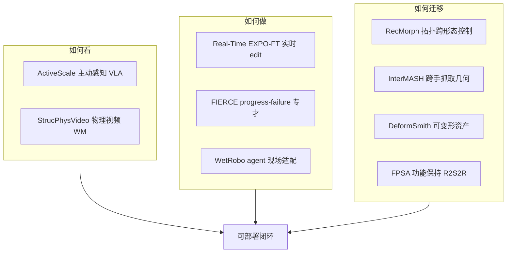

# 感知–动作–迁移：9 篇论文阅读坐标

> **本页定位**：为 [具身智能小站 · 9 篇盘点](https://mp.weixin.qq.com/s/w6w1FzL2FG7vlFa27UYE6w)（2026-09-17）提供按问题组织的阅读坐标；不复述每篇方法细节。

## 一句话观点

**「如何看、如何做、如何迁移」正在同时发生：拓扑递归与统一几何解决跨 body，主动感知与实时 edit 解决观测–执行错位，physics-aware 生成解决 Sim 数据可信度，agent kit 解决实验室落地。**

## 英文缩写速查

| 缩写 | 英文全称 | 简要说明 |
|------|----------|----------|
| VLA | Vision-Language-Action | 视觉–语言–动作策略 |
| GMC | Generalized Morphology Control | 跨形态共享控制 |
| R2S2R | Real-to-Sim-to-Real | 真机–仿真–真机闭环 |
| WM | World Model | 视频/动力学世界模型 |

## 为什么单独做这张地图

- 公众号把 9 篇放在「看 → 做 → 迁」同一叙事；方向跨度大，需要横切面索引。
- **9 篇各有一页**，可逐篇点开核对迁移设定与实验。
- RecMorph / EXPO-FT 已于同日 arXiv 批量入库，本专辑补公众号溯源与交叉阅读线。

## 流程总览

## 分组索引

### 跨形态与几何统一

| # | 论文 | 开源（入库日） | 详情 |
|---|------|----------------|------|
| 01 | RecMorph | **已开源** | [paper-recmorph](../entities/paper-recmorph.md) |
| 06 | InterMASH | **待发布** | [paper-intermash](../entities/paper-intermash.md) |

### 主动感知与实时控制

| # | 论文 | 开源（入库日） | 详情 |
|---|------|----------------|------|
| 02 | ActiveScale | **待发布** | [paper-activescale](../entities/paper-activescale.md) |
| 03 | Real-Time EXPO-FT | **待发布** | [paper-real-time-expo-ft](../entities/paper-real-time-expo-ft.md) |
| 04 | FIERCE | **部分开源** | [paper-fierce](../entities/paper-fierce.md) |

### 物理可信数据与仿真资产

| # | 论文 | 开源（入库日） | 详情 |
|---|------|----------------|------|
| 05 | DeformSmith | **待发布** | [paper-deformsmith](../entities/paper-deformsmith.md) |
| 08 | StrucPhysVideo | **已开源** | [paper-strucphysvideo](../entities/paper-strucphysvideo.md) |
| 09 | FPSA R2S2R | **待发布** | [paper-fpsa-r2s2r](../entities/paper-fpsa-r2s2r.md) |

### 落地与 agent 工程

| # | 论文 | 开源（入库日） | 详情 |
|---|------|----------------|------|
| 07 | WetRobo | **已开源** | [paper-wetrobo](../entities/paper-wetrobo.md) |

## 综合观察（策展）

- **RecMorph + InterMASH** 代表两种跨 embodiment 接口：控制拓扑 vs 抓取几何 token。
- **ActiveScale + EXPO-FT** 分别补「视角–动作协同」与「推理延迟–控制闭环」。
- **DeformSmith + FPSA + StrucPhysVideo** 共用「物理约束写进数据/生成」主题，但对象不同（软体资产 / 刚性接口 / 视频 dynamics）。
- **WetRobo** 提示：非标准实验室场景下，agent 可复现 kit 可能比再训 VLA 更现实。

## 关联页面

- [VLA](../methods/vla.md)
- [cross-embodiment-transfer-strategy](../queries/cross-embodiment-transfer-strategy.md)
- [sim2real](../concepts/sim2real.md)
- [vla-deploy-12-papers-technology-map](./vla-deploy-12-papers-technology-map.md)

## 参考来源

- [wechat_embodied_station_9_papers_perception_action_transfer_2026-09-17.md](../../sources/blogs/wechat_embodied_station_9_papers_perception_action_transfer_2026-09-17.md)

## 推荐继续阅读

- [具身智能小站原文](https://mp.weixin.qq.com/s/w6w1FzL2FG7vlFa27UYE6w)
