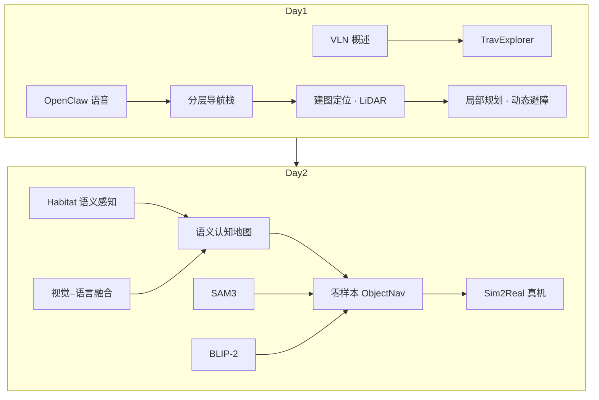

# 四足 × VLN × 具身智能实战营（技术地图）

本页把「2 天线下实战 + 1 月线上答疑」课程日程中的 **技术点与项目** 映射到本知识库的 **独立详情节点**，作为覆盖验收表与学习入口。硬件基线：每组 **四足 + LiDAR + 相机 + Jetson Orin NX**，配对 **RTX 4070** 工作站。

## 一句话定义

**一张课程 → wiki 对照表：日程上出现的导航、感知、框架与项目，都能点进独立页面深读。**

## 英文缩写速查

| 缩写 | 英文全称 | 简要说明 |
|------|----------|----------|
| VLN | Vision-Language Navigation | 视觉–语言导航 |
| ObjectNav | Object-Goal Navigation | 目标物体导航 |
| Habitat | Habitat Embodied AI Platform | 室内具身仿真 |
| SAM 3 | Segment Anything Model 3 | 开放词汇概念分割 |
| BLIP-2 | Bootstrapping Language-Image Pre-training 2 | 图文对齐与生成 VLM |

## 为什么重要

- 避免「课上讲了 TravExplorer / OpenClaw / SAM3，库里却只有散落提及」。
- 用同一张表服务学员复习与知识库 lint：缺页即缺口。

## 覆盖总表（技术点 / 项目 → 详情节点）

| 日程 | 类型 | 课程节点 | 独立详情节点 | 状态 |
|------|------|----------|--------------|------|
| D1 上午 | 技术点 | 四足导航任务与场景 | [四足机器人](../entities/quadruped-robot.md)、[Locomotion](../tasks/locomotion.md) | 已有 |
| D1 上午 | 技术点 | 传统导航 → VLN | [视觉–语言导航](../tasks/vision-language-navigation.md) | 已有 |
| D1 上午 | 技术点 | TravExplorer 框架导航 | [TravExplorer](../entities/paper-travexplorer.md) | **本批新建** |
| D1 上午 | 项目 | OpenClaw 语音控四足 | [OpenClaw](../entities/openclaw.md) | **本批新建** |
| D1 下午 | 技术点 | 建图与定位 | [状态估计](../concepts/state-estimation.md)、[LiDAR 传感](../concepts/lidar-sensing.md)、[LiDAR 里程计融合](../methods/lidar-odometry-fusion.md) | 已有 + **LiDAR 概念新建** |
| D1 下午 | 技术点 | 局部规划与避障 | [DWA](../methods/dwa.md)、[动态障碍过滤](../concepts/dynamic-obstacle-filtering.md) | 已有 |
| D1 下午 | 技术点 | 高层导航 vs 底层控制接口 | [四足分层导航栈](../concepts/hierarchical-quadruped-navigation-stack.md) | 已有 |
| D1 下午 | 实践 | 点到点 + 动态避障 | 同上分层栈 + DWA / 动态障碍页 | 已有 |
| D2 上午 | 技术点 | 像素→实体语义理解 | [具身感知六表征](../concepts/embodied-perception-six-spatial-representations.md)、[2D→3D Gap](../concepts/2d-to-3d-semantic-lifting-gap.md) | 已有 |
| D2 上午 | 技术点 | 视觉–语言特征融合 | [视觉–语言特征融合](../concepts/vision-language-feature-fusion.md) | **本批新建** |
| D2 上午 | 技术点 | 语义认知地图 | [具身语义认知地图](../concepts/embodied-semantic-cognitive-map.md) | **本批新建** |
| D2 上午 | 技术点 | Habitat 仿真器 | [Habitat-Sim](../entities/habitat-sim.md) | 已有 |
| D2 上午 | 项目 | 室内环境语义感知（Habitat） | Habitat + 语义认知地图 + 特征融合 | 组合入口本页 |
| D2 下午 | 技术点 | 语言→动作映射 | [VLN](../tasks/vision-language-navigation.md)、[VLA](../methods/vla.md) | 已有 |
| D2 下午 | 技术点 | SAM3 + BLIP-2 零样本 | [SAM 3](../entities/paper-sam3.md)、[BLIP-2](../entities/paper-blip2.md) | **本批新建** |
| D2 下午 | 技术点 | 仿真→真机工作流 | [Sim2Real](../concepts/sim2real.md) | 已有 |
| D2 下午 | 项目 | 零样本目标导航（仿真+真机） | [零样本目标导航](../tasks/zero-shot-object-navigation.md) | **本批新建** |
| 硬件 | — | Orin NX / LiDAR / 四足 | [Jetson Orin NX](../entities/jetson-orin-nx.md)、[LiDAR 传感](../concepts/lidar-sensing.md)、[四足](../entities/quadruped-robot.md) | **Orin/LiDAR 新建** |

## 流程总览：两日主线

## 推荐学习顺序

1. [四足分层导航栈](../concepts/hierarchical-quadruped-navigation-stack.md) → 真机点到点  
2. [OpenClaw](../entities/openclaw.md) → 语音到导航技能  
3. [Habitat](../entities/habitat-sim.md) + [语义认知地图](../concepts/embodied-semantic-cognitive-map.md)  
4. [SAM 3](../entities/paper-sam3.md) + [BLIP-2](../entities/paper-blip2.md) → [零样本 ObjectNav](../tasks/zero-shot-object-navigation.md)  
5. [TravExplorer](../entities/paper-travexplorer.md) / [ZONDA](../entities/paper-zonda.md) 做跨楼层对照  

## 常见误区

- **把 OpenClaw 当运动控制器** — 它是助手控制平面，不替代 RL loco / PD。  
- **有 VLN 页就等于有 ObjectNav 页** — 任务接口与指标不同，已拆独立任务节点。  
- **SAM3 与 SAM 3D Body 混用** — 后者是人体网格，不是 PCS。  

## 关联页面

- [TravExplorer](../entities/paper-travexplorer.md)
- [零样本目标导航](../tasks/zero-shot-object-navigation.md)
- [视觉–语言导航](../tasks/vision-language-navigation.md)
- [四足控制课程实体](../entities/quadruped-control-curriculum.md)（动力学/RL 主线对照）

## 参考来源

- [四足×VLN 实战营课程大纲](../../sources/courses/quadruped_vln_embodied_workshop_2day.md)

## 推荐继续阅读

- [导航·SLAM·自主栈](./navigation-slam-autonomy-stack.md)
- [VLN 开源复现四范式](./vln-open-source-repro-paradigms.md)
