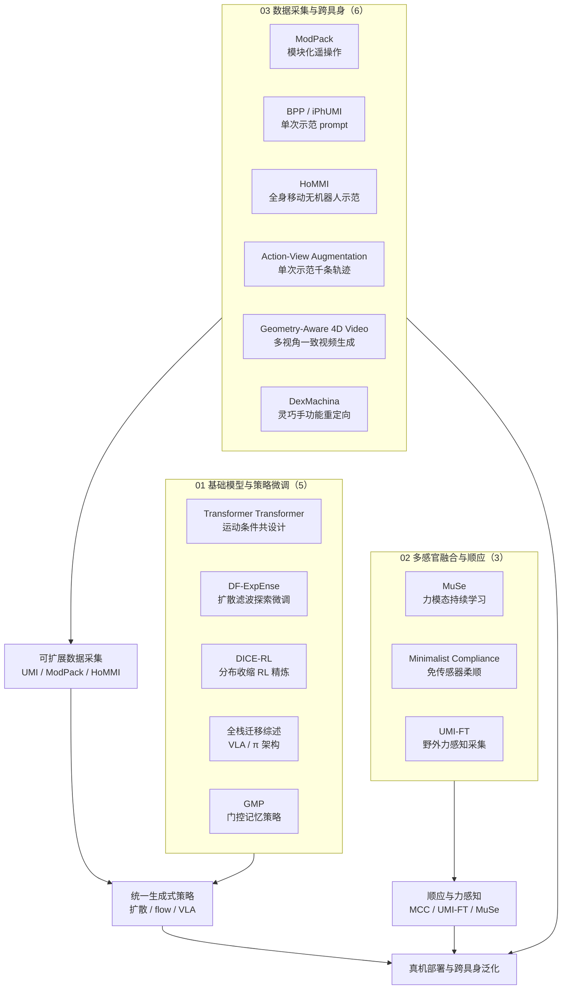

# REALab 技术地图：14 篇工作（2026）

> **本页定位**：为 [深蓝 AI · 斯坦福宋舒然团队 14 篇工作全盘点](https://mp.weixin.qq.com/s/vcewu3wKIcrsidzfGr2-yg) 提供 **按三条脉络组织的阅读坐标**；不复述每篇论文细节，只保留 **问题重框、14 篇索引、开源核查结论、与本库交叉**。实验室地理语境见 [海外具身智能实验室地图](./overseas-embodied-ai-labs-landscape-2026.md) 美国簇 REAL Lab 行。

## 一句话定义

Stanford **Robotics and Embodied AI Lab（REALab，宋舒然）** 在 2026 年的 14 篇代表性工作，共同回答：**当机体形态各异、真实接触极复杂时，如何用统一基础模型、顺应控制与可扩展数据采集，打破硬件与数据壁垒**——从单一 visuomotor 映射走向 **跨具身泛化 + 物理接触式操作**。

## 英文缩写速查

| 缩写 | 英文全称 | 简要说明 |
|------|----------|----------|
| REALab | Robotics and Embodied AI Lab | 斯坦福宋舒然团队实验室 |
| VLA | Vision-Language-Action | 视觉–语言–动作多模态策略 |
| UMI | Universal Manipulation Interface | 便携无机器人手持示教接口 |
| F/T | Force/Torque | 六维力/力矩传感 |
| VOC | Virtual Object Controller | DexMachina 式虚拟物体辅助控制课程 |
| GMP | Gated Memory Policy | 门控记忆 visuomotor 策略 |
| BPP | Behavior Prompting Policy | 单次示范作 in-context prompt 的操作策略 |

## 为什么重要

- **跟方法找源头**：[Diffusion Policy](../methods/diffusion-policy.md) 之后，REALab 把 **扩散/生成式策略在线微调**（DF-ExpEnse、DICE-RL）、**记忆门控**（GMP）、**全栈迁移判断**（综述）串成一条可复现研究线。
- **跟硬件/数据找接口**：UMI 系扩展出 **UMI-FT**（指端力感知）、**HoMMI**（全身移动无机器人示范）、**ModPack**（模块化遥操作背包）、**BPP/iPhUMI**（单次示范 prompt）——覆盖从野外采集到测试时适配。
- **跟接触操作找「小脑」**：**Minimalist Compliance Control** 用电机电流/电压 + 雅可比估计外力，免力传感器即插即用导纳控制；与 **MuSe**（力模态持续学习）、**UMI-FT**（野外力感知采集）形成互补。

## 流程总览：三条脉络

## 核心原理：按脉络读

> **站内详情页**：下表「Wiki 实体」列链接到 `wiki/entities/paper-*` 独立节点（14/14，无重复 arXiv 节点）。

### Wiki 实体索引（14 篇）

| # | 工作 | Wiki 实体 | arXiv |
|---|------|-----------|-------|
| 01 | Transformer Transformer | [paper-transformer-transformer](../entities/paper-transformer-transformer.md) | 2607.25798 |
| 02 | DF-ExpEnse | [paper-df-expense](../entities/paper-df-expense.md) | 2606.19656 |
| 03 | DICE-RL | [paper-dice-rl](../entities/paper-dice-rl.md) | 2603.10263 |
| 04 | 全栈迁移综述 | [paper-foundation-models-full-stack-transfer](../entities/paper-foundation-models-full-stack-transfer.md) | 2602.22001 |
| 05 | GMP | [paper-gated-memory-policy](../entities/paper-gated-memory-policy.md) | 2604.18933 |
| 06 | MuSe | [paper-muse-multisensory-continual-learning](../entities/paper-muse-multisensory-continual-learning.md) | 2606.30988 |
| 07 | Minimalist Compliance | [paper-minimalist-compliance-control](../entities/paper-minimalist-compliance-control.md) | 2603.00913 |
| 08 | UMI-FT | [paper-umi-ft](../entities/paper-umi-ft.md) | 2601.09988 |
| 09 | ModPack | [paper-modpack](../entities/paper-modpack.md) | 2607.19479 |
| 10 | BPP | [paper-behavior-prompting-policy](../entities/paper-behavior-prompting-policy.md) | 2606.30457 |
| 11 | HoMMI | [paper-hommi](../entities/paper-hommi.md) | 2603.03243 |
| 12 | Action-View Augmentation | [paper-action-view-augmentation](../entities/paper-action-view-augmentation.md) | 2606.19586 |
| 13 | Geometry-Aware 4D Video | [paper-geometry-aware-4d-video-generation](../entities/paper-geometry-aware-4d-video-generation.md) | 2507.01099 |
| 14 | DexMachina | [paper-dexmachina](../entities/paper-dexmachina.md) | 2505.24853 |

### 01 — 机器人基础模型与策略微调

| # | 工作 | 文内要点 | 本库延伸 |
|---|------|----------|----------|
| 01 | [Transformer Transformer](../entities/paper-transformer-transformer.md) | RoboTokens + DiT 统一共设计与跨具身控制；ALOHA 跟踪误差约 −70% | [ALOHA](../entities/aloha.md)、[cross-embodiment](../queries/cross-embodiment-transfer-strategy.md) |
| 02 | [DF-ExpEnse](../entities/paper-df-expense.md) | 扩散策略多模态采样 + critic ensemble 平衡质量与探索；机群协同探索 | [Diffusion Policy](../methods/diffusion-policy.md) |
| 03 | [DICE-RL](../entities/paper-dice-rl.md) | RL 作「分布收缩」算子；选择性行为正则 + 价值引导动作选择 | 同上；真机长周期操作 |
| 04 | [全栈迁移综述](../entities/paper-foundation-models-full-stack-transfer.md) | OpenVLA / π₀-FAST / π₀ 三类 VLA 架构；基础模型是关键但非唯一路线 | [VLA](../methods/vla.md)、[VLA 复现谱系](./vla-open-source-repro-landscape-2025.md) |
| 05 | [GMP](../entities/paper-gated-memory-policy.md) | 学习型内存门控 + 历史动作扩散噪声；非马尔可夫任务 SR +30.1% | [diffusion-model](../concepts/diffusion-model.md) |

### 02 — 多模态感官融合与顺应控制

| # | 工作 | 文内要点 | 本库延伸 |
|---|------|----------|----------|
| 06 | [MuSe](../entities/paper-muse-multisensory-continual-learning.md) | 多阶段融合 + 多感官未来预测 + 经验回放；有限 F/T 数据接入预训练视觉策略 | [manipulation](../tasks/manipulation.md) |
| 07 | [Minimalist Compliance](../entities/paper-minimalist-compliance-control.md) | 电机电流/电压 + 雅可比估计外力 → 任务空间导纳；跨 ARX/G1/LEAP | [PRISM](../entities/paper-prism.md)、[CURRENT](../entities/paper-current-as-touch-proprioceptive-contact.md) |
| 08 | [UMI-FT](../entities/paper-umi-ft.md) | 指端 CoinFT 六维力 + RGB/深度；自适应顺应策略 | [UME-Exo](../entities/paper-ume-exo.md) |

### 03 — 数据采集接口与跨具身操作

| # | 工作 | 文内要点 | 本库延伸 |
|---|------|----------|----------|
| 09 | [ModPack](../entities/paper-modpack.md) | 可穿戴背包 + 即插即用感知/主手模块；双臂移动操作 | [teleoperation](../tasks/teleoperation.md) |
| 10 | [BPP](../entities/paper-behavior-prompting-policy.md) | 单次人类示范作 behavior prompt；iPhUMI + DrawAnything/LIBERO-Gen | 测试时 in-context 操作 |
| 11 | [HoMMI](../entities/paper-hommi.md) | UMI + 第一人称感知；具身无关视觉 + 放松头动作 + DiT WBC | [HALOMI](../entities/paper-halomi-humanoid-loco-manipulation.md) |
| 12 | [Action-View Augmentation](../entities/paper-action-view-augmentation.md) | 单次手眼示范 → 鱼眼 3DGS + 轨迹优化 → 千条增广轨迹 | OOD 位姿/避障 |
| 13 | [Geometry-Aware 4D Video](../entities/paper-geometry-aware-4d-video-generation.md) | 跨视角点图对齐；无相机位姿的 4D RGB-D → 位姿追踪训策略 | [robot world models](./robot-world-models-training-loop-taxonomy.md) |
| 14 | [DexMachina](../entities/paper-dexmachina.md) | VOC 课程 + 任务/运动/接触奖励；双手灵巧 benchmark | [CHORD](../entities/paper-chord-contact-wrench-dexterous-manipulation.md) |

## 工程实践：开源状态（项目页核查，2026-08-18）

| 工作 | 开放程度 | 入口 |
|------|----------|------|
| Transformer Transformer | **已开源** | [GitHub](https://github.com/real-stanford/transformer-transformer) + ckpt |
| DF-ExpEnse | **已开源** | [GitHub](https://github.com/real-stanford/dfexpense) |
| DICE-RL | **已开源** | [GitHub](https://github.com/real-stanford/dice-rl) + [HF 数据/ckpt](https://huggingface.co/wintermelontree) |
| 全栈迁移综述 | **无代码** | 综述论文 |
| GMP | **已开源** | [项目页](https://gated-memory-policy.github.io/) |
| MuSe | **部分** | [项目页](https://jadenvc.github.io/multisensory-continual-learning/) |
| Minimalist Compliance | **未列 GitHub** | [项目页](https://minimalist-compliance-control.github.io/)（控制器实现，非学习栈） |
| UMI-FT | **已开源** | [GitHub](https://github.com/real-stanford/UMI-FT) |
| ModPack | **已开源** | [GitHub](https://github.com/real-stanford/modpack)（遥操作；策略训练未含） |
| BPP | **已开源** | [GitHub](https://github.com/real-stanford/behavior_prompting) |
| HoMMI | **已开源** | [GitHub](https://github.com/xxm19/hommi) |
| Action-View Augmentation | **部分** | [1001-demos](https://chuerpan.com/1001-demos.github.io/) |
| Geometry-Aware 4D | **部分** | [robot4dgen](https://robot4dgen.github.io/) |
| DexMachina | **仿真 benchmark** | [project-dexmachina](https://project-dexmachina.github.io/)；真机鲁棒性文内待检验 |

## 局限与风险

- **策展盘点非穷尽**：仅 14 篇「代表性」工作；REALab 另有 Diffusion Policy、UMI 等历史主线未在本篇逐条展开。
- **综述 #04 多机构合著**：全栈迁移文为 DLR + Stanford 联合视角，不宜等同单篇算法贡献。
- **仿真–真机鸿沟**：DexMachina VOC 平滑过渡、MuSe 传感器安装位置敏感等，文内已点明局限。
- **开源≠可复现全链**：ModPack 不含策略训练代码；Minimalist Compliance 偏控制律，需对照硬件电流标定。

## 关联页面

- [海外具身智能实验室地图（2026）](./overseas-embodied-ai-labs-landscape-2026.md)
- [Diffusion Policy](../methods/diffusion-policy.md)
- [Transformer Transformer（实体）](../entities/paper-transformer-transformer.md)
- [manipulation](../tasks/manipulation.md)
- [teleoperation](../tasks/teleoperation.md)
- [bimanual-manipulation](../tasks/bimanual-manipulation.md)
- [cross-embodiment 选型](../queries/cross-embodiment-transfer-strategy.md)

## 参考来源

- [wechat_shenlan_realab_14_papers_2026.md](../../sources/blogs/wechat_shenlan_realab_14_papers_2026.md)
- [原始抓取正文](../../sources/raw/wechat_shenlan_realab_14_papers_2026-08-18/article.md)

## 推荐继续阅读

- 原文：[微信公众号文章](https://mp.weixin.qq.com/s/vcewu3wKIcrsidzfGr2-yg)
- [Diffusion Policy 原论文](https://arxiv.org/abs/2303.04137) — REALab 历史主线
- [UMI (RSS 2024)](https://arxiv.org/abs/2402.10329) — 数据采集范式前序
