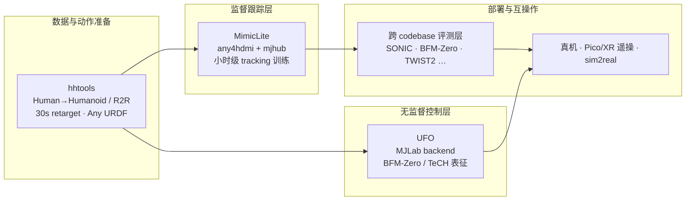

# RoboParty Lab / Party OS 技术地图

> **本页定位**：为 [RoboParty Lab 成立 · 三项工具链开源](https://mp.weixin.qq.com/s/DL-ypgpyLVnypxMwA5d5pw) 提供 **按研发链路组织的阅读坐标**；不复述各仓库安装细节，只保留 **Lab 定位、Party OS 底座分工、三项工具挂接、与 BFM/训练栈的交叉引用**。概念与工程细节见子实体页（均为 **complete**，非 stub）。

## 一句话观点

RoboParty Lab 把「好 idea 输在基建」的问题显式产品化：**Party OS** 作为研发底座，首批开源 **hhtools（动作重定向）→ MimicLite（监督跟踪 infra）→ UFO（无监督 RL 控制）** 三段工具链，并预留跨 codebase 评测与 sim2real 部署层——方向是从 [Roboto Origin](../entities/roboto-origin.md) 的「开源一台人形」演进到「开源人形机器人基础设施」。

## 英文缩写速查

| 缩写 | 英文全称 | 简要说明 |
|------|----------|----------|
| Party OS | Party Operating System | RoboParty Lab 人形研发基础设施聚合层 |
| RL | Reinforcement Learning | 通过与环境交互最大化长期回报来学习策略的范式 |
| Sim2Real | Simulation to Real | 仿真策略迁移真机 |
| BFM | Behavior Foundation Model | 可复用、可 prompt 的身体运控基座 |
| R2R | Robot to Robot | 机器人到机器人动作互转通道 |
| HSI | Human Scene Interaction | 人–场景交互 |
| HOI | Human Object Interaction | 人–物体交互 |

## 为什么单独做这张地图

- [Roboto Origin](../entities/roboto-origin.md) 已覆盖 **单机 DIY 五段流水线**（hardware → description → train → deploy → firmware）；本页补 **2026-07 起 Lab 级 infra 叙事**。
- [BFM 41 篇地图](./bfm-41-papers-technology-map.md) 回答学术 **运控基座** 脉络；MimicLite / UFO 提供 **RoboParty 工程化落点**（跟踪 infra + 无监督 RL 框架）。
- [训练栈分层](./robot-training-stack-layers-technology-map.md) 强调 mjlab 等 **time-to-robot**；UFO 明确以 [mjlab](../entities/mjlab.md) 为 backend。

## 流程总览：Party OS 首批三段工具链

## 父节点与子节点分工

| 层级 | 页面 | 角色 |
|------|------|------|
| **父 overview** | 本页 | 技术地图与链路坐标 |
| **父实体** | [Party OS](../entities/party-os.md) | 研发底座聚合入口 |
| **子实体** | [MimicLite](../entities/mimiclite.md) | 监督运动跟踪训练 + 跨 codebase 部署 infra |
| **子实体** | [UFO（Roboparty）](../entities/roboparty-ufo.md) | 无监督 RL 控制全栈框架 |
| **子实体** | [human-humanoid-tools](../entities/human-humanoid-tools.md) | 动作重定向与数据工作台 |

## 三项工具速查

| # | 工具 | 回答的问题 | Wiki |
|---|------|------------|------|
| 01 | **hhtools** | 人类/机器人动作如何 **快速、通用地** 变成目标 URDF 可执行参考？ | [human-humanoid-tools](../entities/human-humanoid-tools.md) |
| 02 | **MimicLite** | 跟踪策略如何 **小时级迭代**，并作为 **外部策略的统一部署层**？ | [mimiclite](../entities/mimiclite.md) |
| 03 | **UFO** | 无监督 RL 控制如何 **低门槛复现 SOTA** 并 **真机遥操部署**？ | [roboparty-ufo](../entities/roboparty-ufo.md) |

## Party OS 四方向路线图（Lab 规划）

| 方向 | 重点能力 |
|------|----------|
| Humanoid Locomotion | 数据 infra、Sim2Real/Real2Sim、BFM 通用运动模型 |
| Humanoid Perceptive Interaction | 行走/奔跑/跳跃/攀爬；HSI、HOI |
| Humanoid Whole-Body Manipulation | BFM 运控基座 + 可 scale 的 VLA / World Model |
| Agentic Humanoid | Agent + Skills 低成本高智能 |

## 文内收束判断（策展）

| 判断 | 含义 |
|------|------|
| 基建 > 单点 demo | 三项工具覆盖 **数据准备 → 训练 → 部署** 中最耗时的重复建设 |
| MimicLite 双重角色 | 既是 **自有跟踪训练器**，也是 **跨 codebase 统一评测/部署 runtime** |
| UFO 补无监督线 | 与 MimicLite 监督跟踪形成 **互补**；集成 BFM-Zero 与 [TeCH](../entities/paper-tech-humanoid-control.md)（TLDR 时间距离表征） |
| hhtools 降上游摩擦 | Any Motion / Any URDF / R2R 把 retarget 从「每机型定制脚本」推向 **工作台** |
| 演进叙事 | ROBOTO Origin → RoboParty Lab：从单机开源到 **持续生长的开放技术系统** |

## 关联页面

- [Motion Retargeting](../concepts/motion-retargeting.md)
- [SONIC（规模化运动跟踪）](../methods/sonic-motion-tracking.md)
- [mjlab](../entities/mjlab.md)
- [BFM-Zero（论文实体）](../entities/paper-bfm-zero.md)
- [行为基础模型](../concepts/behavior-foundation-model.md)
- [Newton Physics](../entities/newton-physics.md)
- [Teleoperation](../tasks/teleoperation.md)

## 参考来源

- [wechat_roboparty_lab_party_os_3_tools.md](../../sources/blogs/wechat_roboparty_lab_party_os_3_tools.md)
- [roboparty_com.md](../../sources/sites/roboparty_com.md)
- [lab_roboparty_com.md](../../sources/sites/lab_roboparty_com.md)
- [party_os.md](../../sources/repos/party_os.md)
- [mimiclite.md](../../sources/repos/mimiclite.md)
- [roboparty_ufo.md](../../sources/repos/roboparty_ufo.md)
- [roboparty_lab_tech_humanoid_control.md](../../sources/sites/roboparty_lab_tech_humanoid_control.md)
- [human_humanoid_tools.md](../../sources/repos/human_humanoid_tools.md)

## 推荐继续阅读

- [RoboParty Lab 官网](https://lab.roboparty.com)
- [TeCH 成果页（RoboParty Lab）](https://lab.roboparty.com/outputs/tech)
- [Party OS GitHub](https://github.com/Roboparty/Party_OS)
- [Roboto Origin 实体页](../entities/roboto-origin.md)
- [RoboParty 公司实体页](../entities/roboparty.md)
