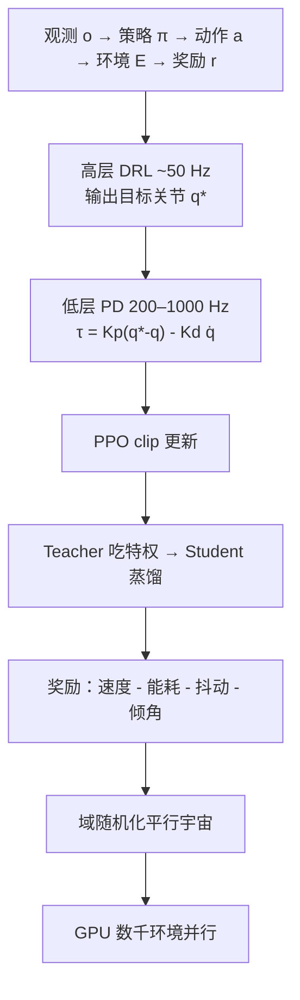

# 机器人 RL 运动控制完整管线

**一句话：** [最小闭环](../concepts/embodied-rl-minimal-closed-loop.md) 只证明 S–A–R–P 能转；真机管线还要分层执行、稳定更新、特权蒸馏、奖励塑形、域随机和大规模并行——缺一块，策略就会在非线性、延迟或硬件公差上倒下。

## 英文缩写速查

| 缩写 | 英文全称 | 简要说明 |
|------|----------|----------|
| PPO | Proximal Policy Optimization | 管线默认策略优化器，靠 clip 限制更新 |
| PD | Proportional–Derivative | 低层把目标关节角变成力矩 |
| DR | Domain Randomization | 每 episode 随机化质量/摩擦/延迟等 |
| TS | Teacher–Student | 特权教师蒸馏到真机可观测学生 |
| GPU | Graphics Processing Unit | Isaac Gym 级并行把墙钟从周压到小时 |

## 为什么重要

「会写 `env.step`」和「能在碎石上跑」之间隔着一整条工程链。专栏 06 用四足把这条链摊开，避免把 PPO、PD 增益、蒸馏和 DR 当成互不相干的技巧。

## 核心原理：七块积木

| 模块 | 本库落点 | 专栏要点 |
|------|----------|----------|
| 最小闭环 | [embodied-rl-minimal-closed-loop](../concepts/embodied-rl-minimal-closed-loop.md) | $o,a,E,r$；POMDP 局部观测 |
| 分层 PD | [Kp/Kd query](../queries/legged-humanoid-rl-pd-gain-setting.md) | 网络不定力矩；PD 吸冲击、抹硬件差 |
| PPO | [ppo](../methods/ppo.md) | $\varepsilon\approx0.2$；采集→GAE→clip→价值 MSE |
| 蒸馏 | [privileged-training](../concepts/privileged-training.md) | 地形/摩擦/质心只给教师 |
| 奖励 | [locomotion 奖励](../queries/locomotion-reward-design-guide.md) | 不强制模仿，Trot 可涌现 |
| DR | [domain-randomization](../concepts/domain-randomization.md) | 质量 ±20%、冰面↔砂纸、延迟噪声 |
| 并行仿真 | [Isaac Gym / Lab](../entities/isaac-gym-isaac-lab.md) | 单卡数千机器人、~1e5 帧/秒量级 |

人形侧把同一套积木收成五模块叙事，见 [humanoid-rl-policy-training-five-modules](./humanoid-rl-policy-training-five-modules.md)（AC / PPO / 奖励 / 蒸馏），与本页互补：本页偏**腿式工程管线顺序**，那页偏**人形训练模块分工**。

## 工程实践

1. **先闭环后算法** — 没有稳定 `step` 就上 PPO，是在空转梯度。
2. **动作接口优先位置** — 直接出力矩的策略对执行器模型极敏感；PD 是默认减维。
3. **DR 锚定公差** — 随机范围应来自称重、摩擦测量和延迟实测，而不是「越大越鲁棒」。
4. **蒸馏不是免费泛化** — 学生没见过的特权维度，部署时也猜不准。

## 局限与风险

- **任务专用** — 新技能 ≈ 新奖励 + 新环境；开放世界持续学习仍未解决。
- **涌现 ≠ 可解释安全** — Trot 自己长出来，不代表接触力有界。
- **把本页当超参手册** — 增益、clip、DR 范围以对应概念页与机型实测为准。

## 关联页面

- [具身 RL 最小闭环](../concepts/embodied-rl-minimal-closed-loop.md) — 专栏 04，本管线的 L0
- [RL Runner（训练循环编排）](../concepts/rl-runner.md) — 管线里 PPO 采集–更新与蒸馏、评测分别是哪类循环
- [人形 RL 策略训练五模块](./humanoid-rl-policy-training-five-modules.md)
- [PPO](../methods/ppo.md) / [Privileged Training](../concepts/privileged-training.md) / [Domain Randomization](../concepts/domain-randomization.md)
- [《具身智能基础》专栏](./shenlan-embodied-ai-fundamentals-series.md) — 本篇为专栏 06

## 参考来源

- [深蓝具身智能：运动控制完整 pipeline](../../sources/blogs/wechat_shenlan_rl_motion_control_pipeline.md)
- [抓取落盘](../../sources/raw/wechat_shenlan_rl_motion_control_pipeline_2026-06-25.md)
- [RL 最小闭环①](../../sources/blogs/wechat_shenlan_rl_embodied_minimal_closed_loop.md)

## 推荐继续阅读

- [运动控制路线 L5](../../roadmap/motion-control.md)
- Rudin et al. 大规模并行 PPO 四足（Isaac Gym）— 见 [locomotion](../tasks/locomotion.md)
