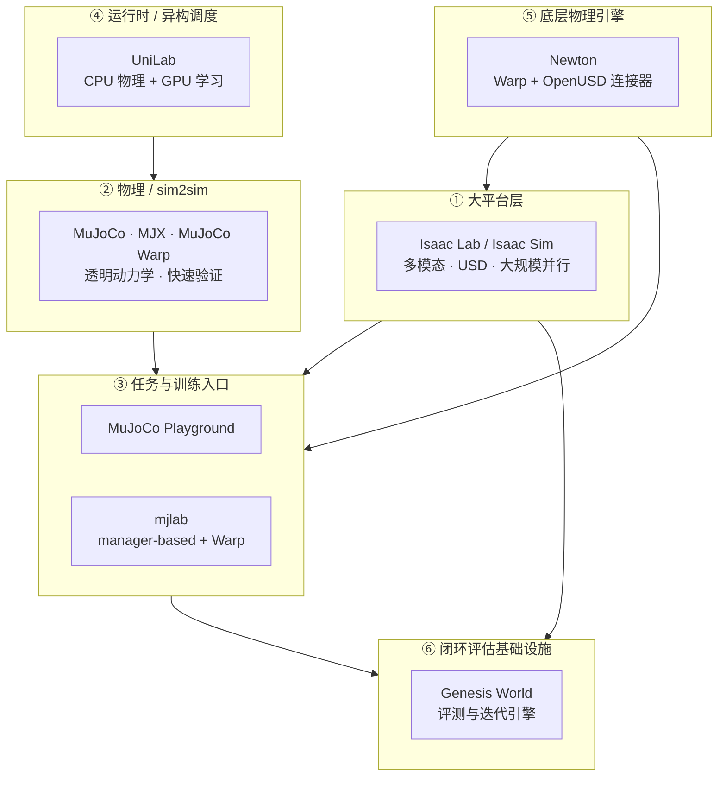

# 机器人训练栈分层技术地图

> **本页定位**：为微信公众号 [**具身智能研究室**](https://mp.weixin.qq.com/s/Z9pgVa48wQKLYVRD3psnhw) 2026-06 长文提供 **训练栈分层阅读坐标**；不复述各项目安装细节，只保留 **层级分工、成本重心转移、按目标选入口** 与和本库实体页的挂接。

## 一句话观点

仿真框架**没有突然洗牌**，但机器人学习工具链正在**变厚**：竞争焦点从「谁每秒仿真步数更高」转向「整条训练–评估–真机闭环的返工成本谁更低」——大平台、物理验证、任务入口、异构运行时、底层连接器与闭环评估基础设施**分层共存**。

## 英文缩写速查

| 缩写 | 英文全称 | 简要说明 |
|------|----------|----------|
| RL | Reinforcement Learning | 本图多数框架服务的策略学习范式 |
| Sim2Real | Simulation to Real | 仿真策略落地真机的工程主线 |
| MJX | MuJoCo JAX | MuJoCo 的 JAX 批量后端 |
| GPU | Graphics Processing Unit | 并行仿真与策略学习算力 |
| VLA | Vision-Language-Action | 多模态策略，依赖厚训练栈的传感与评估 |
| USD | Universal Scene Description | OpenUSD 场景与资产表达（Isaac / Newton 线） |

## 流程总览：六层栈

## 子节点索引

| 层 | 代表项目 | Wiki 节点 | 核心问题 |
|----|----------|-----------|----------|
| **① 大平台** | Isaac Lab / Isaac Sim | [isaac-lab](../entities/isaac-lab.md)、[isaac-sim](../entities/isaac-sim.md) | 复杂场景、多传感、资产与训练接口能否在同一工作台统一？ |
| **② 物理 / sim2sim** | MuJoCo、MJX、Warp | [mujoco](../entities/mujoco.md)、[mujoco-mjx](../entities/mujoco-mjx.md) | 接触动力学是否透明、可调试、便于 sim2sim？ |
| **③ 任务入口** | MuJoCo Playground、mjlab | [mujoco-playground](../entities/mujoco-playground.md)、[mjlab](../entities/mjlab.md) | **time-to-robot**：从行为/奖励想法到真机验证要多久？ |
| **④ 异构运行时** | UniLab | [unilab](../entities/unilab.md) | 瓶颈在物理 step 还是采集–学习–同步整条回路？ |
| **⑤ 底层连接器** | Newton | [newton-physics](../entities/newton-physics.md) | 能否在 OpenUSD / Warp / MuJoCo Warp / Lab 之间可插拔？ |
| **⑥ 闭环评估** | Genesis World、DeepInsight | [genesis-world-10](../entities/genesis-world-10.md)、[deepinsight](../entities/deepinsight.md)、[仿真评测基础设施](../concepts/simulation-evaluation-infrastructure.md) | 仿真能否作为基础模型的**评估引擎**？全栈能否在**统一 trace** 上诊断跨层回归？ |

## 原始资料

| 资料 | Source | 链接 |
|------|--------|------|
| 具身智能研究室长文 | [wechat_embodied_ai_lab_robot_training_stack_layers_2026.md](../../sources/blogs/wechat_embodied_ai_lab_robot_training_stack_layers_2026.md) | `Z9pgVa48wQKLYVRD3psnhw` |

## 按目标选入口

| 你的目标 | 从哪开始 |
|----------|----------|
| 多相机 / 复杂场景 / 大规模 GPU 并行 | [Isaac Lab](../entities/isaac-lab.md) → [mujoco-vs-isaac-lab](../comparisons/mujoco-vs-isaac-lab.md) |
| 快速验证奖励、sim2sim、上真机检查点 | [MuJoCo Playground](../entities/mujoco-playground.md) → [MuJoCo](../entities/mujoco.md) |
| 长期维护多任务 env（obs/reward/curriculum 模块化） | [mjlab](../entities/mjlab.md) |
| 无 CUDA 或要 CPU 物理 + GPU 学习重叠 | [UniLab](../entities/unilab.md) |
| 关注底层物理可微与多框架对接 | [Newton Physics](../entities/newton-physics.md) |
| 基础模型闭环评测、real-to-sim 相关性 | [Genesis World 1.0](../entities/genesis-world-10.md) |
| FM→策略→WBC 全栈评测 orchestration、跨层 trace 诊断 | [DeepInsight](../entities/deepinsight.md) |
| 算法/身体能力分层（非工具链） | [人形 RL 身体系统栈](./humanoid-rl-motion-control-body-system-stack.md) |
| 世界模型在训练环中的位置 | [世界模型训练闭环 taxonomy](./robot-world-models-training-loop-taxonomy.md) |

## 研究判断（策展归纳）

1. **返工成本 > 峰值 FPS：** 环境搭建、奖励迭代、部署接口、失败回放与跨本体迁移，往往比单次仿真吞吐更拖慢进展。
2. **环境定义即基础设施：** manager-based 模块化（mjlab 线）说明「环境容器」正升级为可长期维护的研究资产。
3. **系统瓶颈在缝里：** UniLab 强调采样器–学习器时序与 CPU/GPU 数据搬运——仅比较物理峰值会误导。
4. **评估层正在长高：** Genesis 线把仿真推向 **可信闭环评测**；与 [仿真评测基础设施](../concepts/simulation-evaluation-infrastructure.md) 概念对齐。
5. **与人形/VLA 的关系：** 身体系统栈成熟后，VLA/世界模型才稳定调用底层能力——训练栈厚度决定「能否持续返工、验证、接近真实任务」。

## 常见误区

1. **「新框架取代 Isaac / MuJoCo」** — 更准确是 **同一牌桌上的分层补厚**。
2. **「Playground 与 Isaac Lab 二选一」** — 可先 Playground 原型，再迁移重平台；亦常并存（sim2sim 用 MuJoCo）。
3. **「GPU 仿真总是端到端最优」** — 见 UniLab 对整条 RL 回路的反驳。
4. **把本文当性能榜单** — 策展解读，数值以各项目官方材料为准。

## 关联页面

- [仿真器选型指南（locomotion）](../queries/simulator-selection-guide.md)
- [MuJoCo vs Isaac Lab](../comparisons/mujoco-vs-isaac-lab.md)
- [Sim2Real](../concepts/sim2real.md)
- [Agent Reach](../entities/agent-reach.md) — 本文抓取工具链

## 参考来源

- [具身智能研究室：训练栈分层长文](../../sources/blogs/wechat_embodied_ai_lab_robot_training_stack_layers_2026.md)

## 推荐继续阅读

- [Isaac Lab 文档](https://isaac-sim.github.io/IsaacLab/) — 大平台官方入口
- [MuJoCo Playground](https://playground.mujoco.org/) — 任务入口官方页
- [Genesis World 1.0 博客](https://genesis.ai/blog/genesis-world-1-0) — 评估基础设施叙事（以官网为准）
