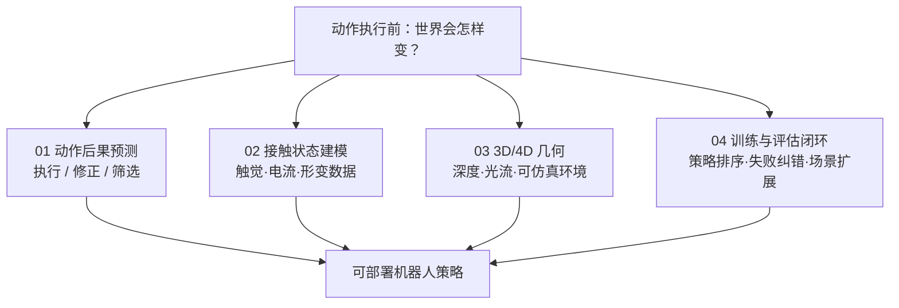

# 机器人世界模型：动作后果预测技术地图

> **本页定位**：为 [具身智能研究室 · 世界模型动作后果专题](https://mp.weixin.qq.com/s/a5ZDDv70CLDfY98mfviWuA) 提供 **父节点阅读坐标**；不复述逐篇细节，只保留 **问题重框、四线分工、与训练闭环 taxonomy 的挂接**。

## 一句话观点

世界模型近期工作的共同转向是：**动作发出去之前，模型能否提前知道世界会怎么变**——从看懂当前帧，走向预测倾倒、形变、接触与推偏等 **物理后果**，并进入执行、修正、筛选或后训练闭环。

## 英文缩写速查

| 缩写 | 英文全称 | 简要说明 |
|------|----------|----------|
| WAM | World Action Model | 联合观测、动作与未来演化的具身策略 |
| VLA | Vision-Language-Action | 常被 WAM/世界模型修正或筛选的基础策略 |
| WM | World Model | 预测未来观测/状态；可与策略解耦或耦合 |
| MoE | Mixture of Experts | Worldscape-MoE 等异构动作接口扩展架构 |
| RGB-DF | RGB, Depth, Flow | RynnWorld-4D 同步预测的外观-几何-运动表征 |

## 为什么单独做这张地图

- [机器人世界模型训练闭环 taxonomy](./robot-world-models-training-loop-taxonomy.md) 按综述 **策略内预测 / 学习型模拟器 / 可控视频** 三线组织；本页聚焦 **2026-07 策展文** 的横切面：**动作后果如何在 WAM、接触、几何与评估四条线落地**。
- **节点独立、避免重复：** 文中 **12 篇** 工作均在 `wiki/entities/paper-*` 有 **独立节点**；与既有 WAM 页（MotionWAM、ABot-M0.5 等）**不重复建页**，仅在关联节互链。

## 流程总览：四线分工

## 四组分类节点（图谱 hub）

| 段 | 分类节点 | 篇数 | 核心问题 |
|----|----------|------|----------|
| 01 | [WAM 动作后果预测](./wm-action-consequence-category-01-wam-action-prediction.md) | 4 | 世界模型直接执行、修正 VLA 还是在部署端筛选？ |
| 02 | [接触状态建模](./wm-action-consequence-category-02-contact-modeling.md) | 4 | 视觉之外的状态转移信号从哪来？ |
| 03 | [3D/4D 几何与环境层](./wm-action-consequence-category-03-geometry-4d.md) | 3 | 像素层之外如何补空间量与可执行环境？ |
| 04 | [训练与评估闭环](./wm-action-consequence-category-04-eval-posttrain.md) | 1+交叉 | 世界模型能否降低真机评测与后训练成本？ |

## 文内收束判断（策展）

| 判断 | 含义 |
|------|------|
| 训练≠部署逐帧视频 | 许多 WAM **训练时** 视频协同监督，**推理时** 直接出动作块 |
| WAM 三类职责 | **直接执行**（DSWAM）、**在线修正**（DynaWM）、**部署筛选**（DreamSteer） |
| 接触是多模态状态 | 视觉全局 + 触觉局部 + 电机电流 + 关节本体 |
| 三层信息 | **像素层** → **几何层** → **环境层**（碰撞、物理、任务语义） |
| 先进入研发链路 | 筛选、纠错、评估、环境扩展——不必立刻接管全部控制 |

## 开放问题（文内）

动作忠实度、长时序误差、不确定性表达、跨本体动作接口；世界模型最终是 **独立模块** 还是 **被吸收进统一策略** 尚无定论。

## 关联页面

- [World Action Models](../concepts/world-action-models.md)
- [WAM 纵深路线](../../roadmap/depth-wam.md)
- [Generative World Models](../methods/generative-world-models.md)
- [VLA](../methods/vla.md)
- [训练闭环 taxonomy](./robot-world-models-training-loop-taxonomy.md)

## 参考来源

- [wechat_embodied_ai_lab_robot_world_models_action_consequence_2026.md](../../sources/blogs/wechat_embodied_ai_lab_robot_world_models_action_consequence_2026.md)

## 推荐继续阅读

- [MotionWAM](../entities/paper-motionwam-humanoid-loco-manipulation-wam.md) — 实时人形 WAM 对照
- [GigaWorld-1](../entities/paper-gigaworld-1-policy-evaluation.md) — 策略评估专用世界模型
