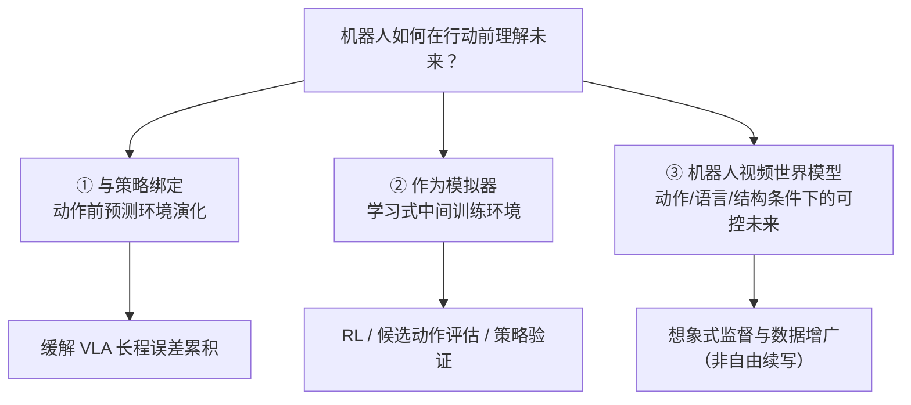

# 机器人世界模型：训练闭环与三线 taxonomy

> **本页定位**：为 [World Model for Robot Learning: A Comprehensive Survey](https://arxiv.org/abs/2605.00080)（NTUMARS 等，2026）提供 **机器人学习语境下的阅读坐标**；不复述 43 页文献清单，只保留 **问题重框、三线分工、评价口径** 与和本库已有页面的挂接。

## 一句话观点

机器人世界模型的下一步，不是继续证明「会生成未来视频」，而是证明 **预测出的未来能进入策略学习、任务评估与闭环决策**——开环像不像真，不足以说明机器人有没有变强。

## 为什么需要单独 taxonomy

「世界模型」同时被用于：开放域视频生成、传统物理仿真、VLA 后训练、自动驾驶场景预测等。名称相同，**优化目标与评测对象** 往往不同。该综述的价值是把讨论 **锚回机器人学习**：

- 关键问题不是「模型能不能生成一段未来画面」。
- 而是：**这个未来能否帮助机器人更好地学习、评估、规划与执行？**

与本库 [Generative World Models](../methods/generative-world-models.md) 的衔接：该页侧重 **扩散/视频生成式** 仿真与反事实推演；本页侧重 **综述给出的三条能力接口** 与 **训练闭环评价**。与 [World Action Models（WAM）](../concepts/world-action-models.md) 的衔接：WAM 综述（arXiv:2605.12090）讨论 **未来与动作在同一策略内联合建模**；本页综述覆盖更广的 **世界模型家族**（含纯模拟器与视频生成支路）。

## 三线 taxonomy（综述主线）

| 线路 | 典型问题 | 与本库页面的关系 |
|------|----------|------------------|
| **① 策略内世界模型** | 执行 \(a\) 前，内部推演 \(o'\) 是否合理？ | [VLA](../methods/vla.md)、[WAM](../concepts/world-action-models.md)、[Being-H0.7](../methods/being-h07.md)（潜空间先验）、[mimic-video](../methods/mimic-video.md) |
| **② 学习型模拟器** | 真机数据贵、传统仿真不够真，能否学可用「中间环境」？ | [Model-Based RL](../methods/model-based-rl.md)、[Video-as-Simulation](../concepts/video-as-simulation.md)、[Robotic World Model（ETH RSL）](../entities/robotic-world-model-eth-rsl.md)（状态动力学口径） |
| **③ 机器人视频世界模型** | 生成的未来是否 **受动作控制** 且 **物理/几何可信**？ | [Generative World Models](../methods/generative-world-models.md)、[Latent Imagination](../concepts/latent-imagination.md)、[WEM](../entities/paper-wem-world-ego-modeling.md)（world/ego 解耦 + 混合长程基准 HTEWorld） |

## 路线演化：从「想象未来」到「训练闭环」

- **早期范式**：先生成未来观察，再由其他模块反推动作 → 画面可能合理，但 **动作–结果对齐弱**。
- **近期趋势**：单一骨干、MoE、统一 VLA、潜空间世界建模等，共同方向是 **缩小世界预测与动作决策的距离**，并参与 **后训练、评估与强化学习**。
- **行业评价划线**（综述与策展文一致）：除视觉保真外，应显式考察 **控制一致性、物理一致性、下游任务增益**。

## 机器人世界的三道门槛

面向操纵与 loco-manipulation，可把「够不够格当机器人世界模型」收成三道递进的门槛：

1. **物理一致**：接触、遮挡、受力、几何关系尽量可信，而非仅画面好看。
2. **动作可控**：不同 \(a\) 必须产生可区分的未来；否则对策略几乎无信息。
3. **训练有用**：生成或预测的未来，能提升 **策略学习、成功率或评估质量**。

这与 [人形 RL 运动控制身体系统栈](./humanoid-rl-motion-control-body-system-stack.md) 第 8 层判断一致：**世界模型价值在 action-conditioned rollout（预测接触后果、失败概率），不在生成好看视频**。

## 视频世界模型的四层约束（能力拆分）

当工作落在「机器人视频世界模型」支路时，综述建议用四层约束理解「生成过程是否被任务拴住」：

| 层次 | 作用 | 失败模式 |
|------|------|----------|
| **想象式监督** | 补真实交互数据 | 未来不可靠 → 监督信号污染策略 |
| **动作条件** | 建立 \(a \rightarrow o'\) 因果 | 自由续写 → 无法服务控制 |
| **语言条件** | 在指令下预测任务相关未来 | 与任务目标脱节 |
| **结构条件** | 深度/三维/物理先验补接触与几何 | 仅靠像素难以表达可执行性 |

**提醒**：通用文生视频越强，**不自动**意味着更适合机器人；机器人需要的是 **可进入训练闭环的未来**。

## 与 VLA 后训练：「任务无关世界模型」方向

策展文将综述与「任务无关世界模型强化 VLA」对照：若每个新任务都重采轨迹并重训专用世界模型，**数据成本过高**；方向性做法是先从 **更宽行为数据** 学物理先验，再由奖励或语义头接新任务——世界模型更接近 VLA 后训练的 **通用环境基础**（参见 [Model-Based RL](../methods/model-based-rl.md) 与 [VLA](../methods/vla.md) 中的后训练讨论）。该路线 **尚未** 被综述宣称已解决，但解释了近期论文密度上升的原因。

## 评估：最该警惕的错觉

综述与策展文共同强调：**开环视频指标**（清晰度、预测长度、场景复杂度）无法替代 **闭环策略是否变强**。更可靠的问题包括：

- 生成数据是否 **提升策略学习**？
- 预测未来是否 **帮助少犯错**？
- 是否在 **闭环任务** 中提高成功率？

若三者答不好，世界模型容易退化为 Demo。本库 [EWMBench](../entities/ewmbench.md) 讨论 **操纵场景守恒** 类指标；[WEM / HTEWorld](../entities/paper-wem-world-ego-modeling.md) 进一步覆盖 **导航–操作交错、多轮长程** rollout，可与上述口径对照阅读。

## 关联页面

- [Generative World Models](../methods/generative-world-models.md) — 像素/Token 视频 rollout 与工程折中（DWM、Being-H0.7、mimic-video 等）
- [World Action Models（WAM）](../concepts/world-action-models.md) — 未来与动作联合建模的平行综述（arXiv:2605.12090）
- [VLA](../methods/vla.md) — 反应式策略与长程物理推演的张力
- [人形 RL 运动控制：身体系统栈](./humanoid-rl-motion-control-body-system-stack.md) — 第 8 层「世界模型 = 上线前试运行」

## 参考来源

- [World Model for Robot Learning 综述（arXiv:2605.00080）](../../sources/papers/wm_robot_survey_arxiv_2605_00080.md)
- [NTUMARS 综述项目站](../../sources/sites/wm-robot-survey-ntumars.md)
- [具身智能研究室 · 训练闭环解读（微信公众号）](../../sources/blogs/wechat_embodied_ai_lab_robot_world_model_training_loop.md)

## 推荐继续阅读

- [综述 PDF](https://arxiv.org/pdf/2605.00080.pdf) — 完整 taxonomy、文献表与图示
- [Awesome-World-Model-for-Robotics-Policy](https://github.com/NTUMARS/Awesome-World-Model-for-Robotics-Policy) — 维护中的论文列表
