# ROBOTIS Humanoid Skills × NVIDIA 栈：双 pipeline 技术地图

> **本页定位**：为 [human five · Humanoid Skills](https://mp.weixin.qq.com/s/JcaBxH1xBmRdEFjesOTC7A) 提供 **按「全身 vs 操作」分叉组织的阅读坐标**；不复述全文图表，只保留 **瓶颈判断、关键数字、失效模式与 wiki 挂接**。硬件 BOM 见 [Hardware 101](./humanoid-hardware-101-technology-map.md)；NVIDIA 全栈索引见 [Physical AI 工具链地图](./nvidia-physical-ai-toolchain-technology-map.md)。

## 一句话观点

人形要同时学会 **whole-body motion** 与 **manipulation**，但规模化路径不同：**全身技能靠 Isaac Lab 里成千上万随机化仿真试错**；**操作技能靠少量高保真遥操作 + GR00T 微调，并用 Cosmos Transfer 扩视觉分布而不重采轨迹**——高接触操作的下一条瓶颈是 **动作如何改变世界**（World-Action Models），而不只是换外观。

## 英文缩写速查

| 缩写 | 英文全称 | 简要说明 |
|------|----------|----------|
| RL | Reinforcement Learning | 全身跟踪策略在 Isaac Lab 中 PPO 训练 |
| QDD | Quasi-Direct Drive | DYNAMIXEL-Q 低减速比准直驱，利于可预测扭矩 |
| Sim2Real | Simulation to Reality | 仿真策略部署真机；需仿真与硬件双向对齐 |
| GR00T | Generalist Robot 00 Technology | NVIDIA 机器人基础模型；Worker 上微调 1.7 |
| WAM | World-Action Model | 学习「动作→世界演化」的潜在规模化方向 |
| SOMA | （NVIDIA 人体运动统一表征） | 77 关节旋转 + 根轨迹，接 SOMA Retargeter |
| IMU | Inertial Measurement Unit | K1 部署栈姿态估计（文内 8 Hz 更新） |

## 为何单独做这张地图

- 文章是 **ROBOTIS 在自家 K1 / AI Worker 上的 NVIDIA 组件选型复盘**，不是单篇论文 ingest。
- 站内已有 [ROBOTIS hub](../entities/robotis.md)、[BeyondMimic](../methods/beyondmimic.md)、[Cosmos Transfer](../entities/cosmos-transfer.md)，缺 **「同一厂商两条产品线如何拼 NVIDIA 栈」** 的端到端坐标。
- 与 [human five · Actuator 102](./humanoid-actuator-102-technology-map.md) 呼应：文内把 **QDD + 阻抗** 写成 Sim2Real 的硬件半解。

## 流程总览：两条 pipeline

```mermaid
flowchart TB
  subgraph WB["AI Sapiens · 全身运动"]
    M1["Kimodo / GEM-X / 数据集"] --> SOMA["SOMA 统一骨骼"]
    SOMA --> RET["SOMA Retargeter → K1 参考"]
    RET --> LAB["Isaac Lab · BeyondMimic<br/>4096 并行 · DR"]
    LAB --> DEP["policy.onnx + sim2real.yaml"]
    DEP --> HW1["Jetson Orin NX · 50 Hz<br/>DYNAMIXEL-Q 阻抗"]
  end
  subgraph MAN["AI Worker · 操作"]
    TEL["遥操作演示"] --> DS["268 episodes"]
    DS --> CT["Cosmos Transfer 2.5<br/>+300 视觉增广"]
    CT --> FT["GR00T 1.7 微调"]
    FT --> HW2["Jetson AGX Orin 推理"]
  end
```

## 第一部分：AI Sapiens（K1）全身运动

### 平台与目标

| 项 | 数值 / 说明 |
|----|-------------|
| 本体 | 23 DoF 双足 K1；高 1355 mm；质量 35 kg |
| 执行器 | DYNAMIXEL-Q QDD；臂 5 DoF ×2，腿 6 DoF ×2，腰 1 DoF |
| 计算 | 板载 NVIDIA Jetson Orin NX |
| 控制频率 | 仿真物理 200 Hz；策略 50 Hz（与真机一致） |
| 训练规模 | 4096 并行 K1；域随机化：摩擦、关节偏置、质心、速度扰动 |
| 墙钟训练 | 约 4 h（示例动作「Red Red Dance」） |
| 产物 | `policy.onnx`、`sim2real.yaml`、`reference_motion.csv`/`.npz` |

### 运动前端（解耦设计）

1. **多源输入**：视频（GEM-X）、文本（Kimodo）、SMPL/AMASS、MHR/SAM 3D、BONES-SEED 等。
2. **SOMA**：异构人体模型 → **77 关节旋转 + 3D 根轨迹**。
3. **SOMA Retargeter**：约束优化映射到 23 DoF K1，输出机器人参考运动文件。
4. **下游不变**：新运动源只要进统一参考格式，RL pipeline 无需重搭。

### BeyondMimic 跟踪目标（文内归纳）

- **锚点与位姿**：跟踪参考构型，保留调整接触以保平衡的自由度。
- **平滑性**：惩罚过大扭矩 / 加速度 / 顶关节限位。
- **接触安全**：抑制非预期接触与仿真投机。

### Sim2Real：仿真与硬件双向改进

| 方向 | 做法 | 文内观察 |
|------|------|----------|
| 仿真后端 | Isaac Lab 默认 **PhysX** → 换 **Newton** | 同策略在真机 **平衡与接触响应** 明显改善 |
| 域随机化 | 仍需要 | 与「基准模型更准」解决不同问题 |
| 硬件栈 | Jetson Orin NX + **PREEMPT-RT** + 1 kHz 控制环 | 降低调度抖动 |
| 执行器 | QDD：低减速比、小间隙、电流控扭矩 | 指令扭矩更可预测 → 更易建模 |

**工程结论（原文）**：缩小 Sim2Real = **更保真的仿真** + **行为可预测、可建模的硬件**（见 [Actuator 102](./humanoid-actuator-102-technology-map.md) 中 QDD 叙事）。

## 第二部分：AI Worker 操作

### 数据瓶颈与采集

- 半人形：**双 7 DoF 臂 + swerve 底盘 + RGBD**；Jetson AGX Orin。
- 遥操作：外骨骼 / 小型主从臂 / VR；均受 **硬件·人力·场地·时间** 约束。
- 数据金字塔（文内）：互联网人类视频（大/低保真）→ 仿真合成（中）→ **真机遥操作（小/最高保真）**。

### GR00T 1.7 基线

| 项 | 数值 |
|----|------|
| 演示数据 | 268 episodes（约 3 h） |
| 训练 | RTX PRO 6000，约 4 h |
| 推理 | 板载 Jetson AGX Orin 32 GB |

**典型失效**：夹爪阴影被误判为目标（训练光照/场景覆盖不足）。

### Cosmos Transfer 2.5 增广

| 数据集 | 数量 |
|--------|------|
| 原始真机 | 268 |
| Cosmos 增广 | 300 |
| 合并 | **568** |

- **保留轨迹，改视觉**：同一动作在不同外观/光照下复用标签。
- **观测改善（文内）**：更少追阴影；抓取失败后更常重新趋近物体（恢复行为为实证现象，非受控实验结论）。

## 规模化判断与开放问题

| 技能类 | 规模化载体 | 下一瓶颈 |
|--------|------------|----------|
| 全身运动 | Isaac Lab 大规模并行 RL | 接触动力学 + 执行器建模 |
| 操作（当前栈） | 真机演示 + GR00T + Cosmos **视觉**增广 | **物理交互结果**（滑移、位姿变化、恢复策略） |
| 潜在方向 | [World-Action Models](../concepts/world-action-models.md) | 学习「动作 → 世界演化」，而非只扩观测 |

ROBOTIS 路线（文内）：**全身移动（locomotion + 摔倒恢复）** 与 **ROBOTIS Hand 灵巧操作** 向同一本体整合。

## 关联页面

- [ROBOTIS](../entities/robotis.md) · [AI Sapiens K1](../entities/robotis-ai-sapiens.md) · [AI Worker](../entities/robotis-ai-worker.md)
- [cyclo_lab](../entities/cyclo-lab.md) · [Cyclo Intelligence](../entities/cyclo-intelligence.md)
- [BeyondMimic](../methods/beyondmimic.md) · [Kimodo](../entities/kimodo.md) · [SOMA Retargeter](../entities/soma-retargeter.md)
- [Cosmos Transfer](../entities/cosmos-transfer.md) · [Newton Physics](../entities/newton-physics.md)
- [Sim2Real](../concepts/sim2real.md)

## 参考来源

- [Humanoid Skills（human five 微信编译）](../../sources/blogs/wechat_human_five_robotis_humanoid_skills_nvidia_stack_2026-09-28.md)
- [原始抓取](../../sources/raw/wechat_human_five_robotis_humanoid_skills_2026-09-28.md)

## 推荐继续阅读

- [ROBOTIS Physical AI 文档](https://ai.robotis.com/)
- [NVIDIA Isaac Lab 文档](https://isaac-sim.github.io/IsaacLab/)
- [human five · Humanoid Actuator 102](https://mp.weixin.qq.com/s/zinp6ulTorzfqmCR_HaI5A) — QDD 与 Sim2Real 硬件侧
