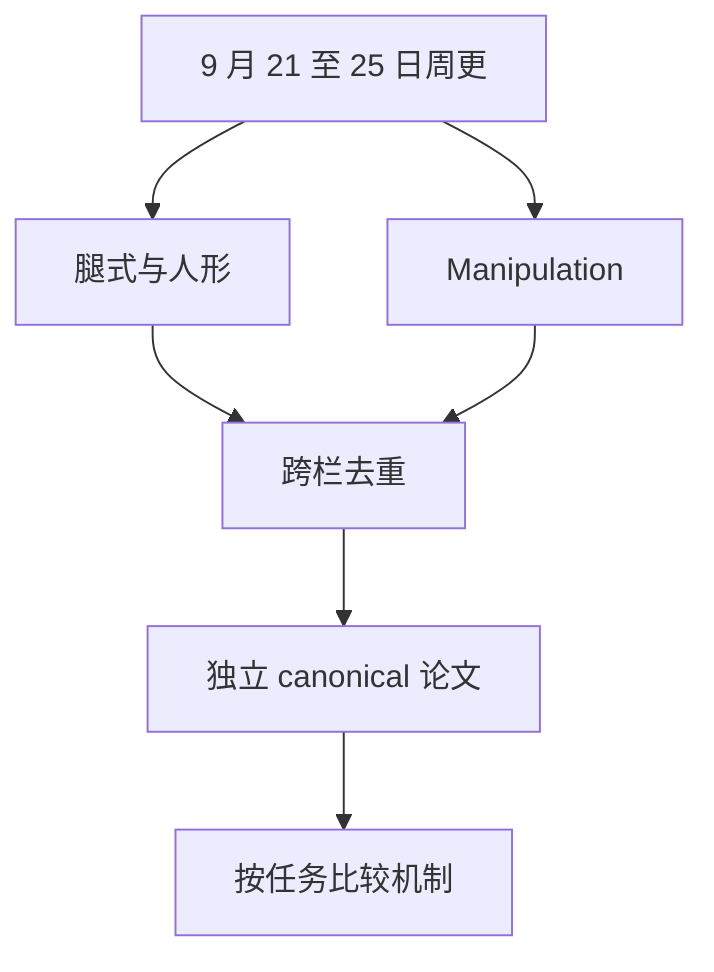

# senlanke 周更论文索引（2026-09-21–25）

> **本页定位**：为双周更提供 **48 个唯一 arXiv 详情节点**索引（35+15 行映射，Opt2VLA/Brace 不重复造页）。

## 一句话观点

本周覆盖 **感知落脚/Teacher–Student、WAM 频率解耦与 TraceDelta、VLA 安全回滚与力感知人形、双臂扩散与常开记忆** 等主线；读法：**按 arXiv 进唯一 `paper-*` 节点**。

## 英文缩写速查

| 缩写 | 英文全称 | 简要说明 |
|------|----------|----------|
| VLA | Vision-Language-Action | 视觉–语言–动作 |
| WAM | World Action Model | 世界–动作联合建模 |
| WBC | Whole-Body Control | 全身控制 |
| RL | Reinforcement Learning | 强化学习 |
| TS | Teacher–Student | 特权–观测蒸馏 |

## 腿式 / 人形 / 四足（35）

| 简称 | 节点 |
|------|------|
| FootQuery ★ | [../entities/paper-footquery-perceptive-humanoid-locomotion](../entities/paper-footquery-perceptive-humanoid-locomotion.md) |
| REDACT ★ | [../entities/paper-redact-robust-perceptive-locomotion](../entities/paper-redact-robust-perceptive-locomotion.md) |
| Echo in the Steps ★ | [../entities/paper-echo-in-the-steps](../entities/paper-echo-in-the-steps.md) |
| STRIDER ★ | [../entities/paper-strider-multi-gait-loco-manip](../entities/paper-strider-multi-gait-loco-manip.md) |
| PLAT ★ | [../entities/paper-plat-sparse-keyframe-tracking](../entities/paper-plat-sparse-keyframe-tracking.md) |
| UniPoint ★ | [../entities/paper-unipoint-sensor-fusion-locomotion](../entities/paper-unipoint-sensor-fusion-locomotion.md) |
| HOTICE | [../entities/paper-hotice](../entities/paper-hotice.md) |
| HIGenNTO | [../entities/paper-higennto-noise-space-optimization](../entities/paper-higennto-noise-space-optimization.md) |
| 距离条件运输 | [../entities/paper-dcrr-distance-conditioned-humanoid-transport](../entities/paper-dcrr-distance-conditioned-humanoid-transport.md) |
| LIMBO | [../entities/paper-limbo-barrier-objectives-wbc](../entities/paper-limbo-barrier-objectives-wbc.md) |
| Whole-Body UMI | [../entities/paper-whole-body-umi-realtime-motion](../entities/paper-whole-body-umi-realtime-motion.md) |
| Opt2VLA | [../entities/paper-opt2vla-force-aware-humanoid](../entities/paper-opt2vla-force-aware-humanoid.md) |
| DeCap 平滑 | [../entities/paper-smoothness-constraint-locomotion](../entities/paper-smoothness-constraint-locomotion.md) |
| PredActor | [../entities/paper-predactor](../entities/paper-predactor.md) |
| Brace Yourself | [../entities/paper-brace-yourself-environmental-bracing](../entities/paper-brace-yourself-environmental-bracing.md) |
| FRAMES | [../entities/paper-frames-failure-recovery-loco-manip](../entities/paper-frames-failure-recovery-loco-manip.md) |
| PRIMO | [../entities/paper-primo-human-motion-odometry](../entities/paper-primo-human-motion-odometry.md) |
| MATE | [../entities/paper-mate-virtual-teleop](../entities/paper-mate-virtual-teleop.md) |
| Sample Simulate Select | [../entities/paper-sample-simulate-select](../entities/paper-sample-simulate-select.md) |
| Banana Kick | [../entities/paper-banana-kick-humanoid-soccer](../entities/paper-banana-kick-humanoid-soccer.md) |
| DAVIS | [../entities/paper-davis-humanoid-soccer](../entities/paper-davis-humanoid-soccer.md) |
| ForgetMimic | [../entities/paper-forgetmimic](../entities/paper-forgetmimic.md) |
| 果蝇 RNN | [../entities/paper-humanoid-fly-inspired-rnn](../entities/paper-humanoid-fly-inspired-rnn.md) |
| 走秀行走 | [../entities/paper-runway-expressive-locomotion](../entities/paper-runway-expressive-locomotion.md) |
| EmoPose | [../entities/paper-emopose-emotion-gesture](../entities/paper-emopose-emotion-gesture.md) |
| TactileStep | [../entities/paper-tactilestep](../entities/paper-tactilestep.md) |
| SABER ★ | [../entities/paper-saber-semantic-affordance-legged](../entities/paper-saber-semantic-affordance-legged.md) |
| 占空比 | [../entities/paper-duty-factor-quadruped-robustness](../entities/paper-duty-factor-quadruped-robustness.md) |
| MimicAgent | [../entities/paper-mimicagent](../entities/paper-mimicagent.md) |
| SG-CPG ★ | [../entities/paper-sg-cpg-actuator-degradation](../entities/paper-sg-cpg-actuator-degradation.md) |
| Streaming RL | [../entities/paper-streaming-rl-continual-robotics](../entities/paper-streaming-rl-continual-robotics.md) |
| FlyCNS | [../entities/paper-flycns-connectome-communication](../entities/paper-flycns-connectome-communication.md) |
| 在线 Sim2Real | [../entities/paper-online-sim2real-closed-loop-modeling](../entities/paper-online-sim2real-closed-loop-modeling.md) |
| 何时摇摆 | [../entities/paper-when-to-waddle-biped-friction](../entities/paper-when-to-waddle-biped-friction.md) |
| Spiderbot | [../entities/paper-spiderbot-hexapod-open-source](../entities/paper-spiderbot-hexapod-open-source.md) |

## Manipulation（15）

| 简称 | 节点 |
|------|------|
| MachEmbodied-U0 | [../entities/paper-me-u0](../entities/paper-me-u0.md) |
| SafeLoop | [../entities/paper-safeloop-vla-rollback](../entities/paper-safeloop-vla-rollback.md) |
| InternW0 | [../entities/paper-internw0-physical-world-model](../entities/paper-internw0-physical-world-model.md) |
| CoRe-WAM | [../entities/paper-core-wam-tracedelta](../entities/paper-core-wam-tracedelta.md) |
| PointCast | [../entities/paper-pointcast-point-set-world-model](../entities/paper-pointcast-point-set-world-model.md) |
| World Action Agent | [../entities/paper-world-action-agent-rehearsal](../entities/paper-world-action-agent-rehearsal.md) |
| RouteRLT | [../entities/paper-routelt](../entities/paper-routelt.md) |
| CFM 多任务蒸馏 | [../entities/paper-cfm-multitask-distillation](../entities/paper-cfm-multitask-distillation.md) |
| JAMB | [../entities/paper-jamb-bimanual-diffusion](../entities/paper-jamb-bimanual-diffusion.md) |
| BrickCraft-Duo | [../entities/paper-brickcraft-duo](../entities/paper-brickcraft-duo.md) |
| Cartesian Hand | [../entities/paper-cartesian-hand-linear-fingers](../entities/paper-cartesian-hand-linear-fingers.md) |
| GLoTouch | [../entities/paper-glotouch-haptic-grasping](../entities/paper-glotouch-haptic-grasping.md) |
| Opt2VLA | [../entities/paper-opt2vla-force-aware-humanoid](../entities/paper-opt2vla-force-aware-humanoid.md) |
| Brace Yourself | [../entities/paper-brace-yourself-environmental-bracing](../entities/paper-brace-yourself-environmental-bracing.md) |
| Watch Recall Act | [../entities/paper-watch-recall-act-concurrent-streams](../entities/paper-watch-recall-act-concurrent-streams.md) |

## 结构与流程图

以下按本页已归纳的机制与资料绘制，表示模块或阅读路径关系。

## 关联页面

- [locomotion](../tasks/locomotion.md)
- [manipulation](../tasks/manipulation.md)
- [humanoid-locomotion](../tasks/humanoid-locomotion.md)
- [world-action-models](../concepts/world-action-models.md)
- [上一期 9.14–18 索引](./senlanke-weekly-2026-09-14-18-technology-map.md)

## 参考来源

- [人形/四足 35 篇 digest](../../sources/blogs/wechat_senlanke_weekly_humanoid_quadruped_2026-09-21_25.md)
- [Manipulation 15 篇 digest](../../sources/blogs/wechat_senlanke_weekly_manipulation_2026-09-21_25.md)

## 推荐继续阅读

- [上一期 9.14–18 索引](./senlanke-weekly-2026-09-14-18-technology-map.md)
