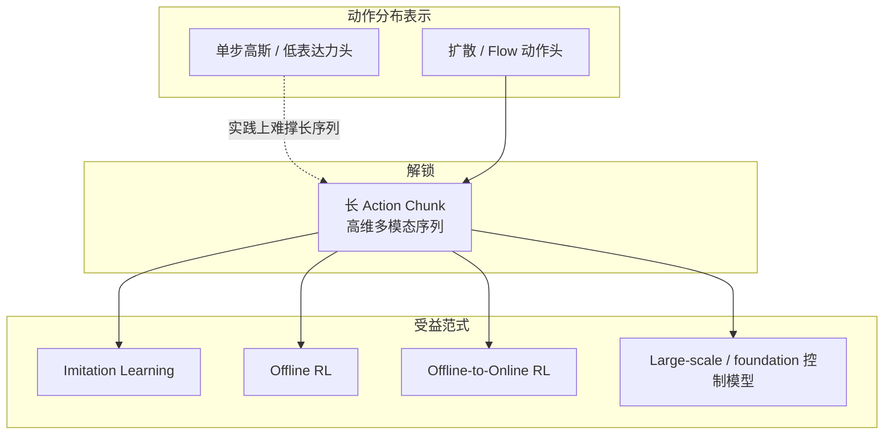

# Sergey Levine：表达力更强的连续动作策略

> **本页定位**：为 Levine 在 Simons「Diffusion Generative Modeling: Progress and Next Steps」（2026-08-07）上的报告提供 **按机制—范式—部署组织的阅读坐标**。一手录像见 [YouTube `agi3xLTGyaU`](../../sources/courses/sergey_levine_diffusion_rl_robotics_simons_youtube.md)；文字以 [官方 talk 页 abstract](../../sources/sites/simons_sergey_levine_diffusion_rl_robotics_2026.md) 为准。方法细节见 `wiki/methods/` 各页，本页不复述公式。

## 一句话观点

学习式控制对动作分布族「名义上中立」，但实践里 **扩散 / flow 动作头** 通过吃下高维多模态分布，使 **长 action chunk** 成为默认接口——先显著抬升模仿学习，再把同一表达力红利延伸到 **offline RL** 与 **offline-to-online RL**，并支撑大规模生成式控制模型。

## 英文缩写速查

| 缩写 | 英文全称 | 简要说明 |
|------|----------|----------|
| IL | Imitation Learning | 从演示学习策略；本报告的主受益范式之一 |
| RL | Reinforcement Learning | 用回报优化策略；报告覆盖 offline / offline-to-online |
| DP | Diffusion Policy | 扩散生成动作序列的 visuomotor IL 代表方法 |
| AC | Action Chunking | 一次预测多步动作序列，降低抖动与时域错配 |
| O2O | Offline-to-Online RL | 先离线初始化再在线/部署交互继续改进 |

## 为什么重要

- **把「生成式动作头」从单一论文名提升为跨范式默认**：不只读 [Diffusion Policy](../methods/diffusion-policy.md)，而是看到同一表示如何同时服务 IL 与 offline RL。
- **解释为何 chunk 变长成为趋势**：表达力不够时，长序列动作分布会塌缩或不可采样；扩散 / flow 是「敢输出大 chunk」的工程前提之一（对照 [Action Chunking](../methods/action-chunking.md)）。
- **对接通才策略叙事**：flow matching VLA（如 [π₀](../methods/π0-policy.md)）与车队级 [LWD](../methods/lwd.md) 可视为「大规模模型建于这些原则」的下游实例。

## 核心主张（按官方 abstract）

1. **理论中立 ≠ 实践等价**  
   IL / RL 算法可以换掉动作分布表示；但换成扩散 / flow 后，跨多种学习式控制域的经验性能显著更好。
2. **高维复杂分布 → 大块动作序列**  
   关键机制不是「多画几张图」，而是能在高维空间上建模复杂分布，从而表示很长的 **action chunks（动作序列）**。
3. **收益顺序：IL 先行，offline RL 跟进**  
   chunk + 生成式动作头先大幅改善模仿学习；**最近**同样改善 offline RL 与 offline-to-online RL。
4. **议程两端**  
   既谈用于 RL / IL 的算法，也谈建于其上的 **large-scale models**。

## 流程总览：表达力如何改写控制接口

## 与本库页面的挂接

| 报告节点 | 本库入口 | 读法 |
|----------|----------|------|
| 扩散 / flow 动作头 | [Diffusion Model](../concepts/diffusion-model.md)、[Probability Flow](../formalizations/probability-flow.md)、[Diffusion Policy](../methods/diffusion-policy.md)、[π₀](../methods/π0-policy.md) | 生成式连续动作的方法与形式化 |
| Action chunks | [Action Chunking](../methods/action-chunking.md) | 训练目标 vs 部署协议可解耦；勿把「能表长序列」等同于「必须整段播放」 |
| IL 收益 | [Imitation Learning](../methods/imitation-learning.md) | visuomotor / 操作模仿的主线入口 |
| Offline / O2O | [Online vs Offline RL](../comparisons/online-vs-offline-rl.md)、[LWD](../methods/lwd.md) | 固定数据与部署闭环如何吃同一类动作头 |
| 大规模模型 | [VLA](../methods/vla.md)、[Foundation Policy](../concepts/foundation-policy.md) | abstract 中「large-scale models」的下游地图 |

## 局限与风险（阅读时注意）

- **本页编译自官方 abstract，非字幕逐字稿**：入库日 YouTube 对 yt-dlp 触发 bot 校验，章节时间戳与 Q&A 待字幕回填（见 [课程归档](../../sources/courses/sergey_levine_diffusion_rl_robotics_simons_youtube.md)）。
- **不要把「表达力红利」读成算法无关**：abstract 强调的是 **动作分布表示** 的实践影响；优化目标、数据覆盖与部署协议仍各自决定成败。
- **无独立项目代码仓**：步骤 2.5 判定为学术报告页；复现请跟各方法官方仓，而非本 talk 页。

## 关联页面

- [Diffusion Policy](../methods/diffusion-policy.md)
- [Action Chunking](../methods/action-chunking.md)
- [Imitation Learning](../methods/imitation-learning.md)
- [Online RL vs Offline RL](../comparisons/online-vs-offline-rl.md)
- [LWD（Learning while Deploying）](../methods/lwd.md)
- [π₀（Pi-zero）](../methods/π0-policy.md)
- [扩散模型（概念）](../concepts/diffusion-model.md)

## 参考来源

- [sergey_levine_diffusion_rl_robotics_simons_youtube.md](../../sources/courses/sergey_levine_diffusion_rl_robotics_simons_youtube.md) — YouTube 录像与 ingest 元数据（`agi3xLTGyaU`）
- [simons_sergey_levine_diffusion_rl_robotics_2026.md](../../sources/sites/simons_sergey_levine_diffusion_rl_robotics_2026.md) — Simons 官方 talk 页（abstract 权威文本）

## 推荐继续阅读

- [Simons talk 页（含 abstract）](https://simons.berkeley.edu/talks/sergey-levine-uc-berkeley-2026-08-07)
- [YouTube 录像（约 45 min 槽位）](https://www.youtube.com/watch?v=agi3xLTGyaU)
- [Diffusion Generative Modeling 工作坊](https://simons.berkeley.edu/workshops/diffusion-generative-modeling-progress-next-steps)
- Chi et al., [*Diffusion Policy*](https://arxiv.org/abs/2303.04137) — visuomotor 扩散动作头代表作
