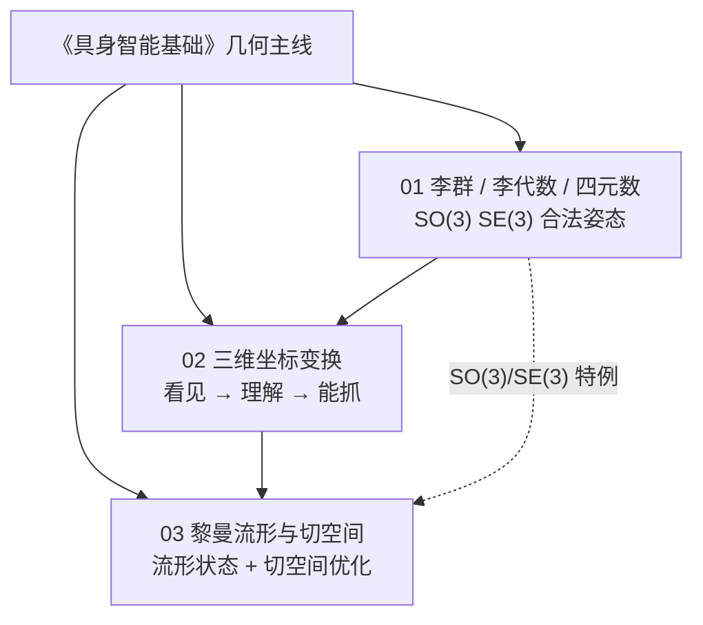

# 《具身智能基础》专栏：几何三篇技术地图

> **本页定位**：为深蓝具身智能微信公众号 [**《具身智能基础》**](https://mp.weixin.qq.com/mp/appmsgalbum?__biz=MzkwMDcyNDUzMQ==&action=getalbum&album_id=4525948187102363653) 已入库的 **几何/运动学三篇** 提供 **父节点阅读坐标**；不复述公式推导，只保留 **专栏顺序、子节点分工、与 VLA/抓取栈的挂接**。

## 一句话观点

具身智能的大模型叙事容易掩盖一条暗线：**所有「能交互」的智能，最终都要在多个坐标系与弯曲状态空间之间做对变换**——先学会合法旋转（李群），再统一相机与机械臂的语言（坐标变换），最后用流形–切空间统一「补丁式约束」与「原生几何优化」。

## 英文缩写速查

| 缩写 | 英文全称 | 简要说明 |
|------|----------|----------|
| VLA | Vision-Language-Action | 视觉-语言-动作多模态基础策略方向 |
| RL | Reinforcement Learning | 通过与环境交互最大化长期回报来学习策略的范式 |
| WBC | Whole-Body Control | 协调全身关节满足多任务/约束的控制基础设施 |
| SLAM | Simultaneous Localization and Mapping | 同步定位与建图 |
| SOP | Standard Operating Procedure | 标准操作流程，如渐进式真机验证 |

## 流程总览：三篇递进

## 子节点索引

| 序 | 专栏篇目 | 分类节点 | 核心问题 |
|----|----------|----------|----------|
| 01 | [李群、李代数、四元数](../formalizations/lie-group-rigid-body-motions.md) | 姿态与刚体运动 | 旋转/位姿如何在 **流形** 上合法表示与优化？四元数、矩阵、李代数如何分工？ |
| 02 | [三维世界坐标变换](../formalizations/3d-coordinate-transforms-vision-robotics.md) | 感知–操作对齐 | 世界 / 相机 / 像素如何经 $K,[R|t]$ 串联？深度与手眼标定如何闭合抓取链？ |
| 03 | [黎曼流形与切空间](../formalizations/riemannian-manifold-tangent-space.md) | 统一几何语言 | 为何欧式插值会「多转 340°」？Exp/Log 与工程近似如何支撑 RL / 控制？ |

## 原始资料

| 篇目 | Source | 微信链接 |
|------|--------|----------|
| 01 | [wechat_shenlan_lie_group_lie_algebra_quaternion.md](../../sources/blogs/wechat_shenlan_lie_group_lie_algebra_quaternion.md) | `JviRH2LW-fkCHA5gY7Qflw` |
| 02 | [wechat_shenlan_3d_coordinate_transforms.md](../../sources/blogs/wechat_shenlan_3d_coordinate_transforms.md) | `P5Jm7bMhaTHsytHStFbbLg` |
| 03 | [wechat_shenlan_riemannian_manifold_tangent_space.md](../../sources/blogs/wechat_shenlan_riemannian_manifold_tangent_space.md) | `uFTKN5FDvlHQxOSspvxVZw` |

## 按目标选入口

| 你的目标 | 从哪开始 |
|----------|----------|
| 策略 / WBC 里姿态增量不合法、万向锁 | [01 李群](../formalizations/lie-group-rigid-body-motions.md) → [Modern Robotics](../entities/modern-robotics-book.md) |
| VLA / 抓取真机「看起来对、抓空」 | [02 坐标变换](../formalizations/3d-coordinate-transforms-vision-robotics.md) → [grasp-pose-estimation](../methods/grasp-pose-estimation.md) |
| RL 在大角度旋转上发散、想理解流形优化 | [03 黎曼流形](../formalizations/riemannian-manifold-tangent-space.md) → 回看 01 |
| 补 2025 VLA 开源复现地图（同公众号） | [VLA 复现景观](./vla-open-source-repro-landscape-2025.md) |
| 补世界模型 15 项目地图（同公众号） | [世界模型三线地图](./world-models-15-open-source-technology-map.md) |

## 常见误区

1. **「有三维视觉就不需要坐标变换」** — 点云再密，末端执行仍要在 **基座系** 下规划；未手眼标定则系统性偏移。
2. **「李群篇与黎曼篇重复」** — 01 是 SO(3)/SE(3) **操作手册**；03 是 **一般流形 + 近似清单**，01 为其重要特例。
3. **「流形只给 SLAM 后端用」** — 专栏论点：具身任务复杂度使 **大角度策略更新** 必须在切空间/Exp 上算，而非事后归一化四元数。
4. **把专栏当性能榜单** — 三篇均为 **第一性原理科普**，不替代教材证明与标定 SOP。

## 关联页面

- [SE(3) Representation](../formalizations/se3-representation.md) — 欧拉/四元数/6D 与 DL 损失
- [Visual Servoing](../methods/visual-servoing.md) — 标定敏感 vs 图像雅可比
- [Grasp Pose Estimation](../methods/grasp-pose-estimation.md) — 多视点与手眼
- [VLA 方法页](../methods/vla.md) — 上层策略对底层几何的依赖
- [Agent Reach](../entities/agent-reach.md) — 微信正文抓取工具链

## 参考来源

- [深蓝具身智能：李群、李代数、四元数](../../sources/blogs/wechat_shenlan_lie_group_lie_algebra_quaternion.md)
- [深蓝具身智能：三维世界坐标变换](../../sources/blogs/wechat_shenlan_3d_coordinate_transforms.md)
- [深蓝具身智能：黎曼流形与切空间](../../sources/blogs/wechat_shenlan_riemannian_manifold_tangent_space.md)

## 推荐继续阅读

- Lynch & Park, *Modern Robotics* Ch 3–4 — [sources/papers/modern_robotics_textbook.md](../../sources/papers/modern_robotics_textbook.md)
- [深蓝具身智能《具身智能基础》专栏专辑](https://mp.weixin.qq.com/mp/appmsgalbum?__biz=MzkwMDcyNDUzMQ==&action=getalbum&album_id=4525948187102363653)（微信，可能需订阅）
