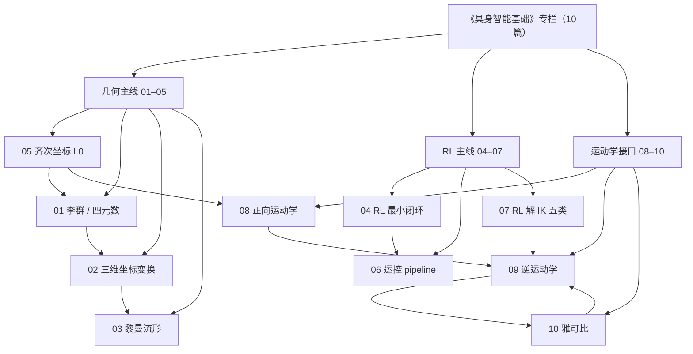

# 《具身智能基础》专栏技术地图

> **本页定位**：为深蓝具身智能微信公众号 [**《具身智能基础》**](https://mp.weixin.qq.com/mp/appmsgalbum?__biz=MzkwMDcyNDUzMQ==&action=getalbum&album_id=4525948187102363653) 专辑 **已入库 10/10 篇** 提供 **父节点阅读坐标**；不复述公式推导，只保留 **专栏顺序、子节点分工、与 VLA/抓取/运控栈的挂接**。专辑清单见 [`sources/raw/wechat_shenlan_embodied_ai_fundamentals_album_2026.json`](../../sources/raw/wechat_shenlan_embodied_ai_fundamentals_album_2026.json)（2026-08-13 复核）。

## 一句话观点

具身智能的大模型叙事容易掩盖两条必须打通的暗线：**几何**（多坐标系与弯曲状态空间上的合法变换）和 **运动学接口**（任务空间目标必须在关节空间执行）。专栏前半用齐次矩阵把刚体写进可连乘的 $4\times4$，后半用 FK → IK → 雅可比把「在哪 / 怎么变 / 怎么发力」收成同一套局部线性结构；RL 只叠在这层结构之上。

## 英文缩写速查

| 缩写 | 英文全称 | 简要说明 |
|------|----------|----------|
| FK | Forward Kinematics | 关节角 → 末端位姿的确定映射 |
| IK | Inverse Kinematics | 目标位姿 → 关节角；可能多解或无解 |
| SE(3) | Special Euclidean Group in 3D | 三维刚体位姿群；齐次 $4\times4$ 为其工程表示 |
| RL | Reinforcement Learning | 交互最大化回报；专栏用于最小闭环、运控管线与 IK |
| WBC | Whole-Body Control | 多任务约束经雅可比投影到关节 |

## 流程总览：几何 → RL → 运动学接口

```mermaid
flowchart TB
  P["《具身智能基础》专栏（10 篇）"]
  P --> G["几何主线 01–05"]
  P --> R["RL 主线 04–07"]
  P --> K["运动学接口 08–10"]
  G --> C5["05 齐次坐标 L0"]
  G --> C1["01 李群 / 四元数"]
  G --> C2["02 三维坐标变换"]
  G --> C3["03 黎曼流形"]
  C5 --> C1 --> C2 --> C3
  R --> C4["04 RL 最小闭环"]
  R --> C6["06 运控 pipeline"]
  R --> C7["07 RL 解 IK 五类"]
  C4 --> C6
  K --> C8["08 正向运动学"]
  K --> C9["09 逆运动学"]
  K --> C10["10 雅可比"]
  C5 --> C8 --> C9 --> C10
  C7 --> C9
  C10 --> C9
```

## 子节点索引

| 序 | 专栏篇目 | 分类节点 | 核心问题 |
|----|----------|----------|----------|
| 01 | [李群、李代数、四元数](../formalizations/lie-group-rigid-body-motions.md) | 姿态与刚体运动 | 旋转/位姿如何在流形上合法表示与优化？ |
| 02 | [三维世界坐标变换](../formalizations/3d-coordinate-transforms-vision-robotics.md) | 感知–操作对齐 | 世界 / 相机 / 像素如何经 $K,[R\|t]$ 串联？ |
| 03 | [黎曼流形与切空间](../formalizations/riemannian-manifold-tangent-space.md) | 统一几何语言 | 为何欧式插值会「多转 340°」？ |
| 04 | （RL 最小闭环，**已并入运动控制路线 L5**） | [具身 RL 最小闭环](../concepts/embodied-rl-minimal-closed-loop.md) | 策略/MDP/PPO·SAC/PyBullet 入门 |
| 05 | [齐次坐标与齐次变换](../formalizations/homogeneous-coordinates-transform.md) | L0 工程底座 | 为何 $p'=Rp+t$ 不够？如何用 $4\times4$ 统一 FK？ |
| 06 | [RL 运动控制完整管线](./robot-rl-motion-control-pipeline.md) | 腿式工程链 | DRL+PD、PPO、蒸馏、DR、GPU 并行如何串起来？ |
| 07 | [RL 求解 IK 五类方案](../comparisons/rl-inverse-kinematics-five-approaches.md) | 选型 | 何时 DDPG/PPO/模型基/混合/分层，何时仍用雅可比？ |
| 08 | [正向运动学](../formalizations/forward-kinematics.md) | 确定映射 | DH 四参数如何连乘出唯一末端位姿？ |
| 09 | [逆运动学](../formalizations/inverse-kinematics.md) | 反函数 | 解析 / DLS / 零空间 / 学习型候选如何分工？ |
| 10 | [雅可比矩阵](../formalizations/robot-jacobian.md) | 速度–力接口 | $v=J\dot q$ 与 $\tau=J^\top F$ 如何统一 IK/WBC/MPC？ |

## 原始资料

| 篇目 | Source | 微信 |
|------|--------|------|
| 01 | [wechat_shenlan_lie_group_lie_algebra_quaternion.md](../../sources/blogs/wechat_shenlan_lie_group_lie_algebra_quaternion.md) | `JviRH2LW-fkCHA5gY7Qflw` |
| 02 | [wechat_shenlan_3d_coordinate_transforms.md](../../sources/blogs/wechat_shenlan_3d_coordinate_transforms.md) | `P5Jm7bMhaTHsytHStFbbLg` |
| 03 | [wechat_shenlan_riemannian_manifold_tangent_space.md](../../sources/blogs/wechat_shenlan_riemannian_manifold_tangent_space.md) | `uFTKN5FDvlHQxOSspvxVZw` |
| 04 | [wechat_shenlan_rl_embodied_minimal_closed_loop.md](../../sources/blogs/wechat_shenlan_rl_embodied_minimal_closed_loop.md) | `hHkQqLfIOTn0CoAZNuLWJA` |
| 05 | [wechat_shenlan_homogeneous_coordinates_transform.md](../../sources/blogs/wechat_shenlan_homogeneous_coordinates_transform.md) | `3vwaizPOgJKCwQ9e5LuKGA` |
| 06 | [wechat_shenlan_rl_motion_control_pipeline.md](../../sources/blogs/wechat_shenlan_rl_motion_control_pipeline.md) | `mid=2247505497` |
| 07 | [wechat_shenlan_rl_inverse_kinematics.md](../../sources/blogs/wechat_shenlan_rl_inverse_kinematics.md) | `mid=2247506122` |
| 08 | [wechat_shenlan_forward_kinematics.md](../../sources/blogs/wechat_shenlan_forward_kinematics.md) | `mid=2247506508` |
| 09 | [wechat_shenlan_inverse_kinematics.md](../../sources/blogs/wechat_shenlan_inverse_kinematics.md) | `mid=2247506764` |
| 10 | [wechat_shenlan_robot_jacobian.md](../../sources/blogs/wechat_shenlan_robot_jacobian.md) | `mid=2247507685` |

## 按目标选入口

| 你的目标 | 从哪开始 |
|----------|----------|
| FK/SLAM 里位姿变量为何全是 $4\times4$ | [05 齐次坐标](../formalizations/homogeneous-coordinates-transform.md) → [08 FK](../formalizations/forward-kinematics.md) |
| 策略 / WBC 里姿态增量不合法 | [01 李群](../formalizations/lie-group-rigid-body-motions.md) |
| VLA / 抓取「看起来对、抓空」 | [02 坐标变换](../formalizations/3d-coordinate-transforms-vision-robotics.md) |
| 末端要到某位姿、关节该转多少 | [09 IK](../formalizations/inverse-kinematics.md) → [10 雅可比](../formalizations/robot-jacobian.md) |
| 冗余臂要边跟末端边避障 | [09 零空间](../formalizations/inverse-kinematics.md) 或 [07 混合 RL-IK](../comparisons/rl-inverse-kinematics-five-approaches.md) |
| 四足 RL 从最小闭环扩到真机管线 | [04 最小闭环](../concepts/embodied-rl-minimal-closed-loop.md) → [06 pipeline](./robot-rl-motion-control-pipeline.md) |
| 人形运控 RL 五模块 | [人形 RL 策略训练五模块](./humanoid-rl-policy-training-five-modules.md) |

## 常见误区

1. **「有三维视觉就不需要坐标变换」** — 点云再密，末端仍要在基座系规划。
2. **「李群篇与黎曼篇重复」** — 01 是 SO(3)/SE(3) 操作手册；03 是一般流形。
3. **「会四元数就不用齐次矩阵」** — 四元数是 SO(3) 存储，齐次矩阵是 SE(3) 连乘默认形状。
4. **「FK 简单所以不值得建页」** — IK、雅可比、URDF、RL 位姿误差都建立在同一套 FK 上。
5. **「RL 已经替代 IK」** — 专栏 07 明确反对：雅可比管精度，RL 管冗余/非标/多目标。
6. **把专栏当性能榜单** — 均为第一性原理科普，不替代教材与标定 SOP。

## 关联页面

- [SE(3) Representation](../formalizations/se3-representation.md)
- [Grasp Pose Estimation](../methods/grasp-pose-estimation.md)
- [VLA 方法页](../methods/vla.md)
- [Whole-Body Control](../concepts/whole-body-control.md)
- [Agent Reach](../entities/agent-reach.md) — 微信正文抓取工具链

## 参考来源

- [深蓝具身智能：齐次坐标与齐次变换](../../sources/blogs/wechat_shenlan_homogeneous_coordinates_transform.md)
- [深蓝具身智能：李群、李代数、四元数](../../sources/blogs/wechat_shenlan_lie_group_lie_algebra_quaternion.md)
- [深蓝具身智能：三维世界坐标变换](../../sources/blogs/wechat_shenlan_3d_coordinate_transforms.md)
- [深蓝具身智能：黎曼流形与切空间](../../sources/blogs/wechat_shenlan_riemannian_manifold_tangent_space.md)
- [深蓝具身智能：RL 运动控制 pipeline](../../sources/blogs/wechat_shenlan_rl_motion_control_pipeline.md)
- [深蓝具身智能：RL 求解 IK](../../sources/blogs/wechat_shenlan_rl_inverse_kinematics.md)
- [深蓝具身智能：正向运动学](../../sources/blogs/wechat_shenlan_forward_kinematics.md)
- [深蓝具身智能：逆运动学](../../sources/blogs/wechat_shenlan_inverse_kinematics.md)
- [深蓝具身智能：雅可比矩阵](../../sources/blogs/wechat_shenlan_robot_jacobian.md)
- [专辑清单 JSON](../../sources/raw/wechat_shenlan_embodied_ai_fundamentals_album_2026.json)

## 推荐继续阅读

- Lynch & Park, *Modern Robotics* Ch 2–6 — [sources/papers/modern_robotics_textbook.md](../../sources/papers/modern_robotics_textbook.md)
- [深蓝具身智能《具身智能基础》专栏专辑](https://mp.weixin.qq.com/mp/appmsgalbum?__biz=MzkwMDcyNDUzMQ==&action=getalbum&album_id=4525948187102363653)（微信，可能需订阅）
