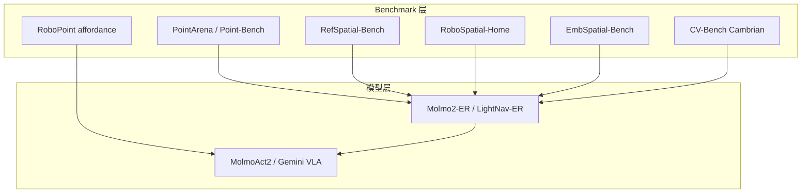

# 空间推理与指代 Benchmark 阅读地图

本页串联一次 batch ingest 的 **14 个入口**（8 篇 arXiv + 6 项目页/博客），帮助在 **pointing → affordance → 空间指代 → 场景 QA → ER mid-training → VLA** 链上选型。

## 一句话定义

**机器人 VLM 的「空间智能」不是单一分数——要用不同 benchmark 测 pointing、指代、egocentric 关系与 3D QA，再用 ER/VLA 模型对齐训练阶段。**

## 英文缩写速查

| 缩写 | 英文全称 | 简要说明 |
|------|----------|----------|
| ER | Embodied Reasoning | 具身推理 mid-training |
| VLA | Vision-Language-Action | 视觉-语言-动作策略 |
| REF | Referring Expression | 指代表达 |
| POI | Point of Interest | RoboSpatial 类 POI 子项 |

## 能力轴与代表资源

| 能力轴 | 代表 benchmark / 模型 | 站内页 |
|--------|----------------------|--------|
| **语言→像素 pointing** | PointArena | [pointarena](../entities/pointarena.md) |
| **keypoint affordance** | RoboPoint | [paper-robopoint](../entities/paper-robopoint.md) |
| **空间指代 + 推理** | RefSpatial-Bench（RoboRefer） | [paper-roborefer](../entities/paper-roborefer.md) · [refspatial](../entities/refspatial.md) |
| **3D scan 空间 QA** | RoboSpatial-Home | [robospatial](../entities/robospatial.md) |
| **egocentric 六关系** | EmbSpatial-Bench | [embspatial](../entities/embspatial.md) |
| **开放词汇场景关系（SGG）** | OV-SGG-Bench + RelateAnything | [paper-relateanything](../entities/paper-relateanything.md) |
| **2D 空间 MLLM** | CV-Bench（Cambrian） | [paper-cambrian-1](../entities/paper-cambrian-1.md) |
| **ER 八项套件** | LightNav-ER（含 Point-Bench 等） | [lightnav-er](../entities/lightnav-er.md) · [3 篇地图](./lightorigins-3blogs-technology-map.md) |
| **ER→Action 开源栈** | MolmoAct2 + Molmo2-ER | [paper-molmoact2](../entities/paper-molmoact2.md) · [molmo-er](../entities/molmo-er.md) |
| **闭源产业对照** | Gemini Robotics（arXiv:2503.20020） | [gemini-robotics](../entities/gemini-robotics.md) |

## 开源边界速查

| 资源 | 评测/代码 | 权重 |
|------|-----------|------|
| MolmoAct2 | **已开源** | **已发布** HF |
| RoboRefer/RefSpatial | **已开源** | **已发布** |
| RoboSpatial-Home | pipeline+eval **已开源** | 随下游模型 |
| PointArena / RoboPoint / EmbSpatial / Cambrian / RelateAnything | **已开源** | 多数已发布 |
| Gemini Robotics | ER 样例 **部分** | VLA **未开源** |

## 关联页面

- [3D 空间 VQA](../concepts/3d-spatial-vqa.md)
- [LightNav-0](../entities/paper-lightnav-0.md)
- [VLA](../methods/vla.md)

## 参考来源

见 frontmatter `sources` 列表（本次 ingest 的 8 篇 arXiv 归档 + 项目页核查）。

## 推荐继续阅读

- [LightNav-ER 八项套件](./lightorigins-3blogs-technology-map.md)
- [Hub：具身评测 benchmark 选型](../overview/hub-embodied-eval-benchmark.md)
