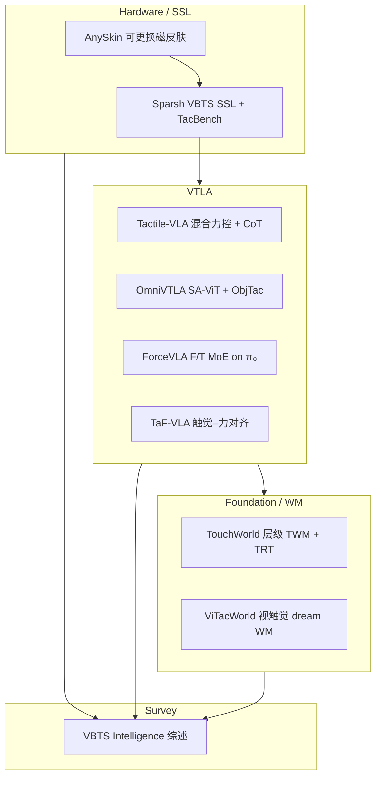

# 触觉智能九篇论文阅读地图

> **本页定位**：为 **2026-09-23 九篇触觉 batch ingest** 提供按 **硬件/SSL → VTLA → Foundation/WM → Survey** 四层组织的阅读坐标；方法细节与实验表见各实体页，不复述公式。

## 一句话观点

**触觉智能正从「传感器单点」走向「可维护硬件 + SSL 表征 + 力/语义对齐 VTLA + 触觉世界模型」的分层栈——选型时先定层（硬件/表征/策略/WM），再打开对应实体页核对开源状态与指标。**

## 英文缩写速查

| 缩写 | 英文全称 | 简要说明 |
|------|----------|----------|
| VBTS | Vision-Based Tactile Sensing | 图像式触觉 |
| VTLA | Vision-Tactile-Language-Action | 视–触–语–动作策略 |
| SSL | Self-Supervised Learning | Sparsh 等预训练表征 |
| WM | World Model | TouchWorld TWM / ViTacWorld |
| MoE | Mixture of Experts | ForceVLA FVLMoE |
| TaF | Tactile-Force | TaF-VLA 对齐范式 |

## 为什么单独做这张地图

- 九篇覆盖 **磁皮肤、VBTS SSL、四条 VTLA 路线、两个 WM/foundation、一篇 VBTS 综述**，横向对照成本高。
- 各实体页已写入 **开源核查（2026-09-23）** 与 **可引用指标**；本页只做分层索引与选型提示。
- 与 [Awesome Touch 技术地图](./sun-awesome-touch-technology-map.md) 互补：策展清单 vs 本批深度实体。

## 流程总览

## 分层索引

### 层 1 — Hardware / SSL

| # | 论文 | 核心信号 | 开源（2026-09-23） | 详情 |
|---|------|----------|-------------------|------|
| 1 | **AnySkin**（ICRA 2025） | 可更换磁皮肤；跨实例 BC ~13% 降幅；滑移 **92%** | **已开源** `raunaqbhirangi/anyskin` | [painode-146-anyskin](../entities/painode-146-anyskin.md) |
| 2 | **Sparsh**（CoRL 2024） | 460k+ SSL；TacBench **+95.1%** vs E2E | **已开源（ARCHIVED）** `facebookresearch/sparsh` + HF | [paper-sparsh](../entities/paper-sparsh.md) |

### 层 2 — VTLA（Vision-Tactile-Language-Action）

| # | 论文 | 力/触觉路线 |  headline 指标 | 开源 | 详情 |
|---|------|-------------|---------------|------|------|
| 3 | **Tactile-VLA** | VBTS + **混合位置–力** + CoT | Charger **90%**；擦板 OOD **80%** vs 0% | 待发布 | [paper-sa-2507-09160](../entities/paper-sa-2507-09160-tactile-vla-unlocking-vision-language-action-mod.md) |
| 4 | **OmniVTLA** | **SA-ViT** 语义对齐 + ObjTac | Pick-place **96.9% / 100%**；peg **83.3%** | 部分（ObjTac 已放） | [paper-sa-2508-08706](../entities/paper-sa-2508-08706-omnivtla-vision-tactile-language-action-model-wi.md) |
| 5 | **ForceVLA**（NeurIPS 2025） | **6 轴 F/T + FVLMoE** on π₀ | 五任务 **60.5%**（**+23.2 pt**）；plug **80%** | 待发布 | [paper-forcevla](../entities/paper-forcevla.md) |
| 6 | **TaF-VLA** | **触觉–力 latent 对齐** TaF-Adapter | 7 任务 **+22%** vs SOTA 视触觉 VLA | 部分 `mrHuangyz/TaF-VLA` | [paper-sa-2601-20321](../entities/paper-sa-2601-20321-taf-vla-tactile-force-alignment-in-vision-langua.md) |

**VTLA 选型速记：**

- 要 **VLM 物理语义 + 混合力控 + CoT** → Tactile-VLA
- 要 **语义对齐触觉 + 大规模 ObjTac** → OmniVTLA
- 要 **低维腕部 F/T + MoE、π₀ 兼容** → ForceVLA
- 要 **高维 VBTS 与力 profile 隐式对齐 + 10M 数据** → TaF-VLA

### 层 3 — Foundation / World Model

| # | 论文 | 角色 | headline 指标 | 开源 | 详情 |
|---|------|------|---------------|------|------|
| 7 | **TouchWorld** | 预测–反应 **触觉基础模型**（TWM + TRT） | 六任务 **65.0% / 53.7%**（干净/扰动） | 待发布 | [paper-touchworld](../entities/paper-touchworld-tactile-foundation-dexterous-manipulation.md) |
| 8 | **ViTacWorld** | **视触觉 dream WM** + 策略评估 | π₀.₅+触觉 **42.5→67.5→80%** | 待发布 | [paper-vitacworld](../entities/paper-vitacworld.md) |

### 层 4 — Survey

| # | 论文 | 角色 | 详情 |
|---|------|------|------|
| 9 | **Vision-Based Tactile Intelligence** | VBTS hardware + learning + scaling **一体化综述** | [paper-vision-based-tactile-intelligence](../entities/paper-vision-based-tactile-intelligence.md) |

## 概念枢纽

- [触觉传感](../concepts/tactile-sensing.md) — 磁触觉 vs VBTS vs 力阵列
- [视触觉融合](../concepts/visuo-tactile-fusion.md) — 多模态融合与对齐范式
- [接触丰富操作](../concepts/contact-rich-manipulation.md) — 插入/擦板/fragile 任务语境
- [VLA](../methods/vla.md) — π₀、flow matching、VTLA 骨干
- [Awesome Touch 技术地图](./sun-awesome-touch-technology-map.md) — 65 篇策展清单

## 结论

**九篇合起来描述一条完整栈：AnySkin/Sparsh 解决「触觉从哪来、怎么表征」；四条 VTLA 解决「怎么进策略、力怎么建模」；TouchWorld/ViTacWorld 解决「怎么预测与生成接触未来」；综述给出 taxonomy 与 open challenges。**

1. **开源优先** — 当前全栈可跑通 mainly Sparsh + AnySkin + ObjTac 数据；VTLA/WM 多数 code coming soon。
2. **力建模分岔** — 混合力控（Tactile-VLA）、低维 F/T MoE（ForceVLA）、触觉–力对齐（TaF-VLA）三条线并行。
3. **表征分岔** — Sparsh SSL vs SA-ViT 语义对齐 vs TaF-Adapter 力对齐。
4. **WM 正交** — ViTacWorld 外置 dream 工厂 vs TouchWorld 内置 TWM+TRT 层级。
5. **先读 Survey** — [paper-vision-based-tactile-intelligence](../entities/paper-vision-based-tactile-intelligence.md) 定框架，再按层下钻实体页。

## 关联页面

- 九篇实体页（见上表 **详情** 列）
- [Sun Awesome Touch 技术地图](./sun-awesome-touch-technology-map.md)
- [接触丰富操作](../concepts/contact-rich-manipulation.md)

## 参考来源

- [AnySkin](../../sources/papers/anyskin_arxiv_2409_08276.md)
- [Sparsh](../../sources/papers/sparsh_arxiv_2410_24090.md)
- [Tactile-VLA](../../sources/papers/tactile_vla_arxiv_2507_09160.md)
- [OmniVTLA](../../sources/papers/omnivtla_arxiv_2508_08706.md)
- [ForceVLA](../../sources/papers/forcevla_arxiv_2505_22159.md)
- [TaF-VLA](../../sources/papers/taf_vla_arxiv_2601_20321.md)
- [TouchWorld](../../sources/papers/touchworld_arxiv_2607_07287.md)
- [ViTacWorld](../../sources/papers/vitacworld_arxiv_2607_22530.md)
- [Vision-Based Tactile Intelligence](../../sources/papers/vision_based_tactile_intelligence_arxiv_2608_15490.md)

## 推荐继续阅读

- [VBTS 综述实体](../entities/paper-vision-based-tactile-intelligence.md) — taxonomy 与 §VI challenges
- [Awesome Touch 仓库](https://github.com/sun254667/awesome-touch) — 更广策展列表
- 各 VTLA 项目页（见实体页 **推荐继续阅读**）
