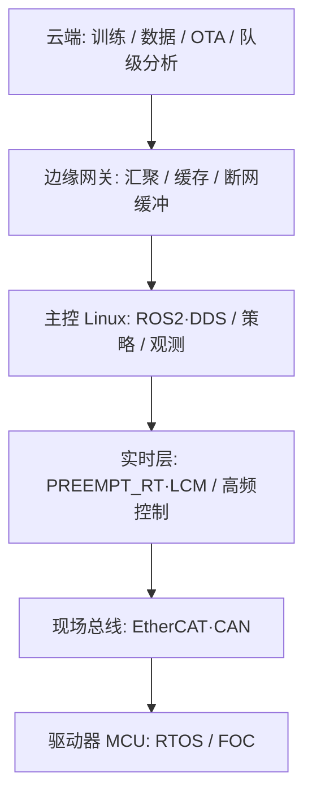

# 机器人系统工程（专题汇总）

> **图谱专题视图**：本页是「系统工程 / Systems Engineering」知识链入口，覆盖从 Linux 主控到云边发布的非算法基座能力。

## 一句话定义

**机器人系统工程专题** 回答：策略与控制之外，真机与研发栈还依赖哪些 **操作系统、网络、数据、分布式、部署、实时与安全** 能力，以及它们在运控环路中的边界。

## 英文缩写速查

| 缩写 | 英文全称 | 简要说明 |
|------|----------|----------|
| OS | Operating System | 进程/线程/内存/文件系统/调度所在层 |
| RTOS | Real-Time Operating System | 面向截止时间的实时操作系统 |
| DDS | Data Distribution Service | ROS 2 默认底层通信标准 |
| OTA | Over-The-Air | 空中固件/模型更新 |
| CAP | Consistency Availability Partition tolerance | 分布式系统取舍框架 |
| CI/CD | Continuous Integration / Delivery | 持续集成与持续交付 |

## 为什么重要

- 人形/足式落地故障大量来自 **调度抖动、总线超时、错误的中间件选型、无安全 FSM、不可回滚的模型更新**，而非单点 reward 设计。
- 研发效率依赖 **容器化训练、可观测性、数据面一致性**；与 1 kHz 运控环是两套语义，必须分层。

## 主题盘点：已有 vs 新建

| 主题簇 | 状态 | 独立节点 |
|--------|------|----------|
| 操作系统（进程/线程/内存/FS/调度） | **新建** | [operating-system-basics](../concepts/operating-system-basics.md) |
| 网络（TCP/UDP/HTTP/DNS/TLS/LB） | **新建**（UDP 组播形式化已有） | [network-protocol-stack](../concepts/network-protocol-stack.md)、[udp-multicast-dynamics](../formalizations/udp-multicast-dynamics.md) |
| 数据库（索引/事务/锁/隔离/复制/分片） | **新建** | [database-fundamentals](../concepts/database-fundamentals.md) |
| 缓存（穿透/雪崩/击穿/一致性） | **新建** | [cache-consistency-pitfalls](../concepts/cache-consistency-pitfalls.md) |
| 消息系统（队列/重复/顺序/幂等） | **新建** | [message-queue-reliability](../concepts/message-queue-reliability.md) |
| 分布式（CAP/选主/一致性/超时/重试） | **新建** | [distributed-systems-basics](../concepts/distributed-systems-basics.md) |
| 容器与部署（Docker/K8s/CI·CD） | **新建** | [container-orchestration-cicd](../concepts/container-orchestration-cicd.md) |
| 可观测性（Logs/Metrics/Tracing） | **新建** | [observability-logs-metrics-tracing](../concepts/observability-logs-metrics-tracing.md) |
| 安全（认证/授权/密钥/供应链） | **新建** | [software-security-basics](../concepts/software-security-basics.md) |
| 实时 OS 与实时调度 | **新建**（查询页已有实践） | [rtos-realtime-scheduling](../concepts/rtos-realtime-scheduling.md)、[real-time-control-middleware-guide](../queries/real-time-control-middleware-guide.md) |
| ROS 2 | **已有** | [ros2-basics](../concepts/ros2-basics.md) |
| DDS 通信机制 | **新建**（原仅嵌在 ROS 2 页） | [dds-communication](../concepts/dds-communication.md) |
| CAN / EtherCAT / UDP | **已有** | [can-bus-protocol](../concepts/can-bus-protocol.md)、[ethercat-protocol](../concepts/ethercat-protocol.md)、[udp-multicast-dynamics](../formalizations/udp-multicast-dynamics.md) |
| 边缘计算与云端协同 | **新建** | [edge-cloud-robotics](../concepts/edge-cloud-robotics.md) |
| 控制频率与推理频率解耦 | **新建** | [control-inference-frequency-decoupling](../concepts/control-inference-frequency-decoupling.md) |
| 模型版本管理与 OTA | **新建** | [model-versioning-ota](../concepts/model-versioning-ota.md) |
| 硬件/通信故障与安全状态机 | **新建**（实体 FSM 已有） | [robot-safety-state-machine](../concepts/robot-safety-state-machine.md)、[wbc-fsm](../entities/wbc-fsm.md) |

## 分层读法

- **数据面**（DB/缓存/消息/分布式/容器/安全）服务云与边。
- **控制面**（RTOS、总线、频率解耦、安全 FSM）服务机载截止时间。
- 中间件选型见 [通信协议专题](./topic-communication.md)。

## 关联页面

- [硬件通信与协议专题](./topic-communication.md)
- [控制环路延迟建模](../formalizations/control-loop-latency-modeling.md)
- [Deployment 技术地图](../../tech-map/modules/system/deployment.md)

## 参考来源

- [OS 与网络一手资料](../../sources/sites/systems_engineering_os_network_primary_refs.md)
- [数据与分布式一手资料](../../sources/sites/systems_engineering_data_distributed_primary_refs.md)
- [部署可观测安全一手资料](../../sources/sites/systems_engineering_deploy_obs_security_primary_refs.md)
- [DDS/RTOS/边云/OTA/安全 FSM 一手资料](../../sources/sites/dds_omg_rtos_edge_ota_safety_primary_refs.md)

## 推荐继续阅读

- [实时运控中间件配置指南](../queries/real-time-control-middleware-guide.md)
