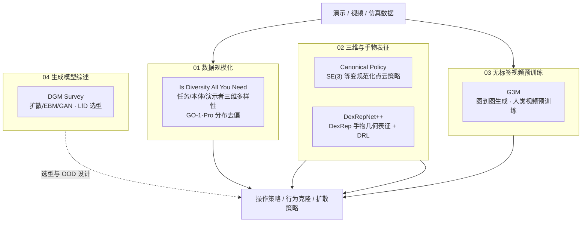

# T-RO 2026 操作学习：5 篇论文技术地图

> **本页定位**：为 [深蓝具身智能 · T-RO 2026 操作学习精选](https://mp.weixin.qq.com/s/nswA-jCGC3kr9iQjhRRuXQ) 提供 **按四条技术脉络组织的阅读坐标**；不复述每篇论文细节，只保留 **问题重框、分组地图、与 manipulation / IL 主线的挂接**。

## 一句话观点

2026 年上半年 T-RO 操作学习代表作共同指向：**规模化数据 + 更高级表征（SE(3) 等变、手物几何）+ 无标签视频结构化预训练 + 生成式策略** 正在并行重塑泛化能力；同时 **任务/本体/演示者** 三维数据多样性须被正交理解，而非盲目堆量。

## 英文缩写速查

| 缩写 | 英文全称 | 简要说明 |
|------|----------|----------|
| T-RO | IEEE Transactions on Robotics | 机器人领域顶级期刊 |
| SE(3) | Special Euclidean Group in 3D | 三维刚体旋转+平移变换群 |
| DRL | Deep Reinforcement Learning | 深度强化学习 |
| DGM | Deep Generative Model | 深度生成模型（扩散/EBM/GAN 等） |
| LfD | Learning from Demonstrations | 从演示中学习 / 模仿学习 |
| OOD | Out-of-Distribution | 分布外泛化 |

## 为什么单独做这张地图

- [Manipulation](../tasks/manipulation.md) 任务页已覆盖大量单篇方法；本页聚焦 **T-RO 2026 上半年策展** 提出的横切面：**数据怎么收、怎么表征、怎么从无标签视频迁移、生成模型如何选型**。
- **G3M（T-RO 2026）** 与 **GraphMimic（CVPR 2025）** 为同一研究线，wiki 以期刊版 **G3M** 为主节点，勿与无关 graph 方法合并。

## 流程总览：四条脉络 → 可部署操作策略

## 四组分类节点（图谱 hub）

| 组 | 分类节点 | 篇数 | 核心问题 |
|----|----------|------|----------|
| 01 | [数据规模化](./tro-manip-category-01-data-scaling.md) | 1 | 任务/本体/演示者三维多样性如何影响 scaling？ |
| 02 | [三维与手物表征](./tro-manip-category-02-representation.md) | 2 | SE(3) 等变与手物几何如何提升 OOD 泛化？ |
| 03 | [无标签视频预训练](./tro-manip-category-03-video-pretraining.md) | 1 | 人类视频如何经图结构变成可迁移操作知识？ |
| 04 | [生成模型综述](./tro-manip-category-04-generative-models-survey.md) | 1 | 扩散/EBM/GAN 等在 LfD 中如何选型？ |

## 5 篇论文速查

| # | 工作 | 分组 | Wiki |
|---|------|------|------|
| 01 | Is Diversity All You Need | 01 | [paper-tro-manip-01-diversity-scaling](../entities/paper-tro-manip-01-diversity-scaling.md) |
| 02 | Canonical Policy | 02 | [paper-tro-manip-02-canonical-policy](../entities/paper-tro-manip-02-canonical-policy.md) |
| 03 | DexRepNet++ | 02 | [paper-tro-manip-03-dexrepnet-plus-plus](../entities/paper-tro-manip-03-dexrepnet-plus-plus.md) |
| 04 | G3M | 03 | [paper-tro-manip-04-g3m](../entities/paper-tro-manip-04-g3m.md) |
| 05 | DGM Robot Learning Survey | 04 | [paper-tro-manip-05-dgm-robot-learning-survey](../entities/paper-tro-manip-05-dgm-robot-learning-survey.md) |

## 文内收束判断（策展）

| 判断 | 含义 |
|------|------|
| 多样性 ≠ 越多越好 | 任务多样性关键；跨本体预训练可选；演示者速度多模态性可能有害 |
| 表征 > 记忆姿态 | SE(3) 等变规范化与 DexRep 手物几何分别从刚体对称与接触几何提升泛化 |
| 视频 → 图 → 策略 | G3M 用结构化图捕捉可迁移空间关系，降低动作标注依赖 |
| 生成模型进 LfD 主流 | 扩散/流匹配等与行为克隆深度融合；实时性与安全仍是落地瓶颈 |

## 与其他页面的关系

- [Manipulation](../tasks/manipulation.md) — 操作任务总入口
- [Behavior Cloning](../methods/behavior-cloning.md) — LfD 经典范式
- [Diffusion Policy](../methods/diffusion-policy.md) — 生成式操作策略代表
- [Loco-Manip 8 篇技术地图](./loco-manip-8-papers-technology-map.md) — 人形 loco-manip 数据入口姊妹地图

## 参考来源

- [wechat_shenlan_tro_manip_5_papers_survey.md](../../sources/blogs/wechat_shenlan_tro_manip_5_papers_survey.md)
- [tro_manip_5_papers_catalog.md](../../sources/papers/tro_manip_5_papers_catalog.md)
- [wechat_shenlan_tro_manip_5_papers_2026-07-08.md](../../sources/raw/wechat_shenlan_tro_manip_5_papers_2026-07-08.md)

## 推荐继续阅读

- [IEEE T-RO 官方索引](../../sources/sites/robotics-venues-primary-refs.md)
- [操作 VLA 与视频-动作架构选型](../queries/manipulation-vla-architecture-selection.md)
