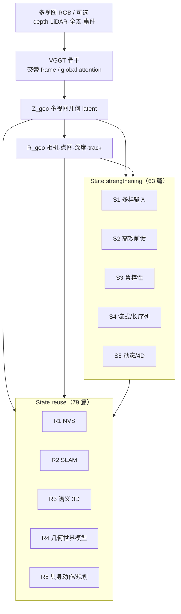

# VGGT 几何状态综述视角

> **本页定位**：为 [Chen et al. 2026 VGGT Survey](https://richardchen225.github.io/vggt_survey/) 提供 **按几何状态组织的阅读坐标**；不复述 142 篇细节，只保留 **Z/R 双组分框架、十类 taxonomy、数据集评测逻辑、开放挑战** 与和本库已有 VGGT 系实体的挂接。状态估计知识链总入口见 [状态估计（知识链汇总）](./hub-state-estimation.md)。

## 一句话观点

**VGGT 的价值不在「又出一个 depth 网络」，而在一次前馈同时给出可复用的几何状态：** 多视图 latent **Zgeo** 与结构化输出 **Rgeo**（相机、点图、深度、track）。2026 年的后续文献几乎都在回答两件事——**怎么把 Z/R 建得更准、更快、更久、更动态**，以及 **怎么把 Z/R 接到 NVS、SLAM、语义 3D、几何世界模型与具身下游**。

## 英文缩写速查

| 缩写 | 英文全称 | 简要说明 |
|------|----------|----------|
| VGGT | Visual Geometry Grounded Transformer | Meta 前馈多视图几何基础模型；综述中心对象 |
| Zgeo | Multi-view geometry latent features | 帧内/跨帧聚合的几何 latent 状态 |
| Rgeo | Structured geometric outputs | 相机、点图、深度、track 等解码输出 |
| NVS | Novel View Synthesis | 新视角合成；state reuse 主分支之一 |
| SLAM | Simultaneous Localization and Mapping | 同步定位与建图；VGGT 作前端/初始化热点 |
| SfM | Structure-from-Motion | 多视图相机与结构恢复；VGGT 可替代 COLMAP 环节 |
| 4D | 4D Reconstruction | 含时序/动态场景的几何重建 |

## 为什么需要单独读这条线

- **[State Estimation](../concepts/state-estimation.md)** 传统上按 **EKF / 因子图 / SLAM 栈** 组织；VGGT 系把 **「多视图几何」** 收成 **可前馈、可冻结、可微调** 的基础状态，与 [Glob3R](../entities/paper-glob3r.md)、[Wid3R](../entities/paper-wid3r.md) 等 **3D foundation model** 同一设计空间。
- 机器人侧已出现 **窗口化 VGGT-Omega 拼接**（见 [Macrodata 手重建](../methods/macrodata-egocentric-hand-action.md)）、**流式 LingBot-Map**、**SLAMFormer-∞ 长程 dense mono SLAM** 等——缺一张 **「几何状态如何加强 / 复用」** 的地图时，容易把 **加速论文** 与 **下游 SLAM** 混在同一选型桶里。
- 综述 companion（[`Awesome-VGGT`](https://github.com/richardchen225/Awesome-VGGT)）截至 **2026-09-17** 收录 **142 篇**（63 strengthening + 79 reuse），并维护 **71 数据集** 能力矩阵——适合作为 **lint / ingest 的外部索引**，而非替代单篇深读。

## 流程总览：加强状态 → 复用状态

## 十类论文地图（142 篇，2026-09-17 catalog）

> 篇数为 companion catalog 统计；**站内已有实体** 以链接标出，其余请读 [项目页 Literature 检索](https://richardchen225.github.io/vggt_survey/#papers) 或 [Awesome-VGGT README](https://github.com/richardchen225/Awesome-VGGT)。

### State strengthening

| ID | 方向 | 篇数 | 典型子题 | 本库 |
|----|------|------|----------|------|
| S1 | Diverse-Input 3D Reconstruction | 11 | 可选相机/深度、LiDAR-VGGT、鱼眼/全景/事件 | [Wid3R](../entities/paper-wid3r.md)（宽 FoV 原生几何） |
| S2 | Efficient 3D Reconstruction | 22 | 量化、token merge、sparse/global attention 加速 | [VGG-T³](../entities/paper-vgg-ttt.md)（TTT 线性化全局 attention） |
| S3 | Robust 3D Reconstruction | 5 | 噪声、遮挡、域移 | — |
| S4 | Streaming and Long-Sequence | 17 | 流式 KV、长序列窗口、有界内存 | [LingBot-Map](../entities/paper-lingbot-map.md)、[SURE-Map](../entities/paper-sure-map.md)、[VGG-T³](../entities/paper-vgg-ttt.md) |
| S5 | Dynamic 3D Reconstruction | 8 | 动态场景 / 4D 查询 | [D4RT](../entities/paper-d4rt.md) |

### State reuse

| ID | 方向 | 篇数 | 典型子题 | 本库 |
|----|------|------|----------|------|
| R1 | Novel View Synthesis | 15 | 冻结几何状态 + 生成 | [Glob3R](../entities/paper-glob3r.md)（离线 SfM + 3D FM 渲染） |
| R2 | SLAM | 20 | 前馈前端、PGGO/图优化后端 | [UniSim-SLAM](../entities/paper-unisim-slam.md)、[SLAMFormer-∞](../entities/paper-slamformer-infinity.md) |
| R3 | Semantic 3D Scene Understanding | 19 | 开放词汇 / 关系 / 场景图 | — |
| R4 | Geometry-Aware World Models | 10 | 自回归几何 WM | [VGGT-World](../entities/paper-sa-2603-12655-vggt-world-transforming-vggt-into-an-autoregress.md) |
| R5 | Embodied Action and Planning | 15 | 手重建、导航、操作 | [Track4World](../entities/paper-track4world.md)；[Macrodata 手重建](../methods/macrodata-egocentric-hand-action.md)（VGGT-Omega 窗） |

## 数据集与评测：证据链而非单指标

综述整理 **71** 个数据集，并按 **3D reconstruction / NVS / other downstream** 分组，矩阵化标注各数据集是否支持 **camera pose、depth、long stream、dynamic 4D、SLAM、world models、embodied** 等任务。

**三个读法（沿用 survey 主张）：**

1. **先问数据集提供什么观测/标注**，再选 metrics——避免在缺 depth GT 的集合上硬比 pointmap。
2. **区分 strengthening vs reuse 增益**——同一 NVS 数字可能来自 **更好的 Rgeo** 或 **更好的生成头**；benchmark 应控制几何状态是否冻结/共享。
3. **长序列与动态是独立轴**——S4/S5 常用数据集与静态 SfM 基准 **重叠有限**；读 [LingBot-Map](../methods/lingbot-map.md) / [D4RT](../entities/paper-d4rt.md) 时应对照 survey 的 **long stream / dynamic 4D** 列。

## 五个可执行结论

1. **选型先问「要加强 Z/R 还是复用 Z/R」** — S2 加速文（FastVGGT、量化）与 R2 SLAM 文（UniSim、SLAMFormer）解决的问题正交；勿用 FPS 代替 ATE。
2. **长序列有两条技术路线** — **流式 KV / 分页记忆**（LingBot-Map）vs **离线线性复杂度全局聚合**（VGG-T³）；前者偏在线视频，后者偏千图 COLMAP 替代。
3. **SLAM 栈正在「前馈几何 + 可换后端」** — UniSim-SLAM 展示 **VGGT 前端可换 STA 降延迟**；图优化层比单一 backbone 更决定部署形态。
4. **动态 4D 是显式分支** — D4RT 类 **统一查询式 4D** 与静态 VGGT pointmap **不应混评**；见 survey S5 与 dynamic 数据集列。
5. **Companion 是索引，不是实现** — 复现某篇应跟 catalog 中的 **Code** 链到具体仓库；[facebookresearch/vggt](https://github.com/facebookresearch/vggt) 仍是骨干基线入口。

## 开放挑战（survey §05）

| # | 问题 | 对机器人读者的含义 |
|---|------|-------------------|
| 1 | Reliable and persistent geometric state | 长时程 loco / 手重建需要 **窗拼接或流式状态** 仍稳定；见 Macrodata 的 Sim(3) 窗对齐实践 |
| 2 | Adaptive representations for downstream | 同一 Z/R 如何同时服务 **SLAM 前端 + NVS + WM** 而不重复训练整套几何网 |
| 3 | Dataset design for benchmarking | 具身数据管线选型时需声明：增益来自 **几何 FM 升级** 还是 **下游头 / 编排** |

## 与现有 wiki 的位置

| 读者问题 | 去哪里 |
|----------|--------|
| EKF / 因子图 / 多传感器 SLAM 总览？ | [状态估计（知识链汇总）](./hub-state-estimation.md) |
| 流式单目几何 ~20 FPS？ | [LingBot-Map](../methods/lingbot-map.md) |
| 离线千图 pointmap / 查询定位？ | [VGG-T³](../entities/paper-vgg-ttt.md) |
| 无界 dense mono SLAM？ | [SLAMFormer-∞](../entities/paper-slamformer-infinity.md) |
| 世界系全像素 3D track？ | [Track4World](../entities/paper-track4world.md) |
| 几何 WM 自回归线？ | [VGGT-World](../entities/paper-sa-2603-12655-vggt-world-transforming-vggt-into-an-autoregress.md)、[Generative World Models](../methods/generative-world-models.md) |

## 局限

- 综述为 **ResearchGate preprint**（DOI:10.13140/RG.2.2.14069.33767），catalog **随社区快速更新**；本页篇数以 **2026-09-17** companion 为准，后续 ingest 应回查 [Awesome-VGGT](https://github.com/richardchen225/Awesome-VGGT) diff。
- **142 篇中仅少数** 在本库有深读实体页；taxonomy 表 **不臆造** 未入库论文的细节。
- Survey **不包含** VGGT 官方训练代码；各被引论文开源状态以 **各自项目页** 为准（步骤 2.5 已核查 companion **已开源**）。

## 关联页面

- [状态估计（知识链汇总）](./hub-state-estimation.md)
- [State Estimation](../concepts/state-estimation.md)
- [LingBot-Map](../methods/lingbot-map.md)、[VGG-T³](../entities/paper-vgg-ttt.md)
- [SLAMFormer-∞](../entities/paper-slamformer-infinity.md)、[UniSim-SLAM](../entities/paper-unisim-slam.md)
- [D4RT](../entities/paper-d4rt.md)、[Track4World](../entities/paper-track4world.md)
- [Glob3R](../entities/paper-glob3r.md)、[Wid3R](../entities/paper-wid3r.md)
- [VGGT-World](../entities/paper-sa-2603-12655-vggt-world-transforming-vggt-into-an-autoregress.md)
- [Macrodata Egocentric Hand-Action](../methods/macrodata-egocentric-hand-action.md) — VGGT-Omega 工程复用例

## 参考来源

- [VGGT Survey 论文归档（ResearchGate 2026）](../../sources/papers/vggt_survey_researchgate_2026.md)
- [VGGT Survey 项目页归档](../../sources/sites/richardchen-vggt-survey.md)
- [Awesome-VGGT companion 仓库归档](../../sources/repos/awesome-vggt.md)

## 推荐继续阅读

- [VGGT Survey 交互项目页](https://richardchen225.github.io/vggt_survey/)
- [Awesome-VGGT（GitHub 文献库）](https://github.com/richardchen225/Awesome-VGGT)
- [VGGT 官方仓库（Meta）](https://github.com/facebookresearch/vggt)
- [DOI:10.13140/RG.2.2.14069.33767](https://doi.org/10.13140/RG.2.2.14069.33767)
