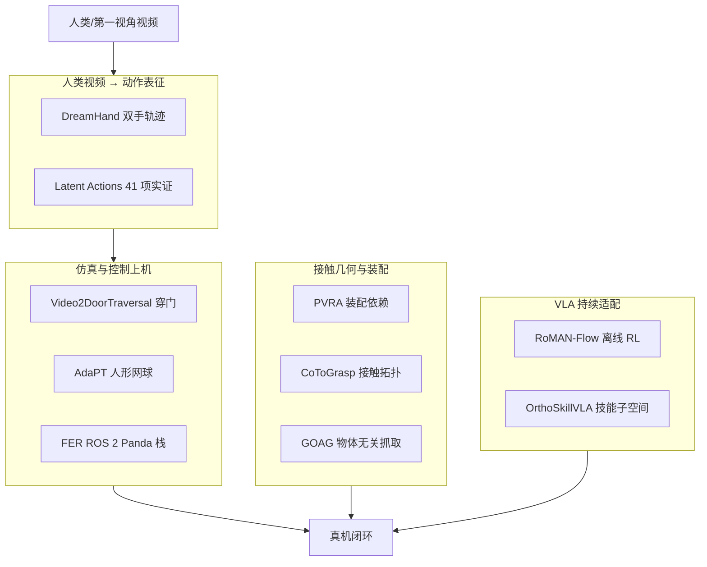

# 视频–接触–控制：10 篇论文的阅读坐标

> **本页定位**：为 [具身智能小站 · 10 篇盘点](https://mp.weixin.qq.com/s/EmC4gNgcQdPX34vxy-qSVQ)（2026-08-22）提供 **按四类问题组织的阅读坐标**；不复述每篇方法细节。姊妹近期盘点见 [世界模型与真实执行（2026-08-19）](./world-model-exec-10-papers-technology-map.md)、[接触–预测–适应（2026-08-18）](./contact-predict-adapt-10-papers-technology-map.md)。

## 一句话观点

**具身智能正在把「看懂人类视频」、「仿真与控制接口」、「接触几何」与「大模型持续适配」焊成同一条动作链路——单点刷榜不如看机制能否复用到更长视野与更开放场景。**

## 英文缩写速查

| 缩写 | 英文全称 | 简要说明 |
|------|----------|----------|
| VDM | Video Diffusion Model | DreamHand 重用的视频扩散骨干 |
| LAM | Latent Action Model | 无标注视频紧凑动作代理 |
| VLA | Vision-Language-Action | 视觉-语言-动作大模型 |
| R2S2R | Real-to-Sim-to-Real | Video2DoorTraversal 单视频门孪生管线 |
| ROS 2 | Robot Operating System 2 | FER Panda 现代中间件栈 |

## 为什么单独做这张地图

- 公众号把 10 篇放在「视频、接触、控制、VLA 持续学习」同一叙事里。
- 站内已有 loco-manip、灵巧操作、VLA 节点；需要横切面索引避免 10 个实体成孤岛。
- **AdaPT 当日已有 complete 页**，本专辑复用、不重复造页。

## 流程总览

## 分组索引

### 人类视频 → 可学习动作表征

| # | 论文 | 开源（入库日） | 详情 |
|---|------|----------------|------|
| 01 | DreamHand | 仓已建，代码/权重待发布 | [paper-dreamhand](../entities/paper-dreamhand.md) |
| 09 | What Matters for Latent Actions | GitHub + HF | [paper-latent-actions-matter](../entities/paper-latent-actions-matter.md) |

### 仿真、跟踪与控制接口上机

| # | 论文 | 开源（入库日） | 详情 |
|---|------|----------------|------|
| 02 | Video2DoorTraversal | Code Coming soon | [paper-video2door-traversal](../entities/paper-video2door-traversal.md) |
| 04 | AdaPT | **复用** 部分开源 | [paper-adapt](../entities/paper-adapt.md) |
| 08 | FER ROS 2 Panda 栈 | 站点演示；代码待发布 | [paper-fer-ros2-panda-stack](../entities/paper-fer-ros2-panda-stack.md) |

### 接触几何、装配与灵巧抓取

| # | 论文 | 开源（入库日） | 详情 |
|---|------|----------------|------|
| 05 | PVRA | 训练/评测已开 | [paper-pvra](../entities/paper-pvra.md) |
| 06 | CoToGrasp | 项目页未开源 | [paper-cotograsp](../entities/paper-cotograsp.md) |
| 07 | GOAG | 项目页未开源 | [paper-goag](../entities/paper-goag.md) |

### 策略学习与 VLA 持续适配

| # | 论文 | 开源（入库日） | 详情 |
|---|------|----------------|------|
| 03 | RoMAN-Flow | 全流程 + HF 权重 | [paper-roman-flow](../entities/paper-roman-flow.md) |
| 10 | OrthoSkillVLA | LIBERO 连续技能 | [paper-orthoskillvla](../entities/paper-orthoskillvla.md) |

## 综合观察（策展）

1. **视频侧**：扩散模型既可生成像素，也可当 **几何记忆**（DreamHand）；潜动作则需 **统一实验设置** 才能指导 VLA 初始化（Latent Actions）。
2. **上机侧**：单视频 **仿真孪生**（穿门）与 **速度自适应跟踪**（网球）解决不同时间尺度的 sim2real；**基础栈可靠性**（Panda ROS 2）是上层研究的乘法器。
3. **接触侧**：装配依赖（PVRA）与接触拓扑/物体无关抓取（CoToGrasp/GOAG）把泛化问题从「认物体」推进到「理解关系与功能意图」。
4. **学习侧**：离线 RL 要同时保住 **似然可处理性** 与 **部署延迟**（RoMAN-Flow）；VLA 持续学习要 **分组件约束**（OrthoSkillVLA）。

## 关联页面

- [Manipulation](../tasks/manipulation.md)
- [Loco-Manipulation](../tasks/loco-manipulation.md)
- [VLA](../methods/vla.md)
- [Macrodata Egocentric Hand-Action](../methods/macrodata-egocentric-hand-action.md)
- [Online vs Offline RL](../comparisons/online-vs-offline-rl.md)

## 参考来源

- [具身智能小站 10 篇盘点（2026-08-22）](../../sources/blogs/wechat_embodied_station_video_contact_control_10_papers_2026-08-22.md)
- [原始抓取](../../sources/raw/wechat_embodied_station_video_contact_control_10_papers_2026-08-22.md)

## 推荐继续阅读

- [AdaPT（复用节点）](../entities/paper-adapt.md)
- [世界模型与真实执行 10 篇技术地图](./world-model-exec-10-papers-technology-map.md)
