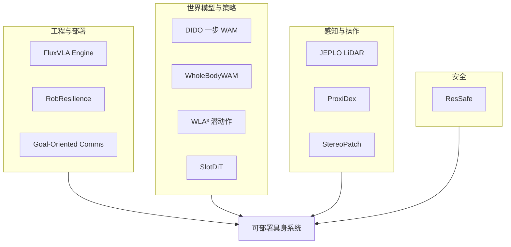

# VLA 部署与系统可靠性：12 篇论文阅读坐标

> **本页定位**：为 [具身智能小站 · 12 篇盘点](https://mp.weixin.qq.com/s/nsAslK7HCyhUaViGkSVgWA)（2026-09-16）提供按问题组织的阅读坐标。

## 一句话观点

**「代码能否帮部署」取决于工程契约是否统一、感知退化是否被评测、以及安全/通信是否进入闭环——而非再多一个策略结构。**

## 英文缩写速查

| 缩写 | 英文全称 | 简要说明 |
|------|----------|----------|
| VLA | Vision-Language-Action | 视觉–语言–动作策略 |
| WAM | World Action Model | 世界–动作联合模型 |
| WBC | Whole-Body Control | 人形全身控制 |
| GoC | Goal-Oriented Communications | 目标导向通信 |

## 为什么单独做这张地图

- 一次列出 12 篇方向跨度大的工作；需要横切面索引。
- **12 篇各有一页**，可逐篇点开核对部署链路。

## 流程总览

## 分组索引

### VLA 工程与系统

| 论文 | 节点 | 开源 |
|------|------|------|
| FluxVLA Engine | [fluxvla-engine](../entities/fluxvla-engine.md) | 已开源 |
| RobResilience | [paper-robresilience](../entities/paper-robresilience.md) | 已开源 |
| Goal-Oriented Comms | [paper-goal-oriented-comms-physical-ai](../entities/paper-goal-oriented-comms-physical-ai.md) | 待发布 |

### 世界模型与动作

| 论文 | 节点 | 开源 |
|------|------|------|
| DIDO | [paper-dido-wam](../entities/paper-dido-wam.md) | 已开源 |
| WholeBodyWAM | [paper-wholebodywam](../entities/paper-wholebodywam.md) | 待发布 |
| WLA³ | [paper-wla3](../entities/paper-wla3.md) | 待发布 |
| SlotDiT | [paper-slotdit](../entities/paper-slotdit.md) | 待发布 |

### 感知与足式

| 论文 | 节点 | 开源 |
|------|------|------|
| JEPLO | [paper-jeplo](../entities/paper-jeplo.md) | 已开源 |
| ProxiDex | [paper-proxidex](../entities/paper-proxidex.md) | 待发布 |
| StereoPatch | [paper-stereopatch](../entities/paper-stereopatch.md) | 部分开源 |

### 安全与其它

| 论文 | 节点 | 开源 |
|------|------|------|
| ResSafe | [paper-ressafe](../entities/paper-ressafe.md) | 待发布 |
| Machine Zygote | [paper-machine-zygote](../entities/paper-machine-zygote.md) | 已开源 |

## 关联页面

- [VLA](../methods/vla.md)
- [World Action Models](../concepts/world-action-models.md)
- [Safety Filter](../concepts/safety-filter.md)
- [VLA 部署指南](../queries/vla-deployment-guide.md)

## 参考来源

- [wechat_embodied_station_12_papers_vla_deploy_2026-09-16.md](../../sources/blogs/wechat_embodied_station_12_papers_vla_deploy_2026-09-16.md)

## 推荐继续阅读

- [FluxVLA Engine](../entities/fluxvla-engine.md)
- [ResSafe](../entities/paper-ressafe.md)
