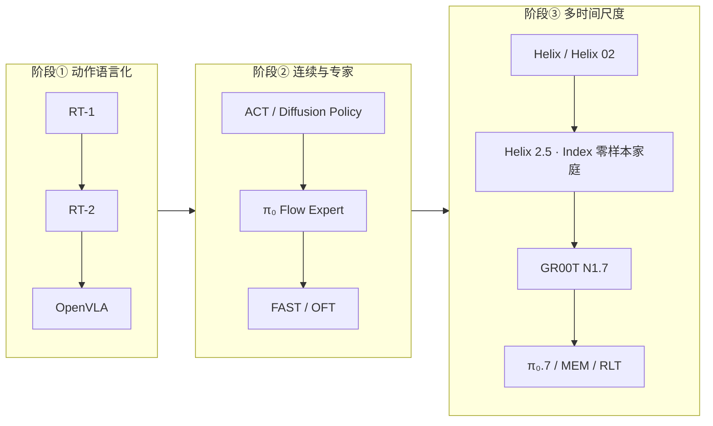
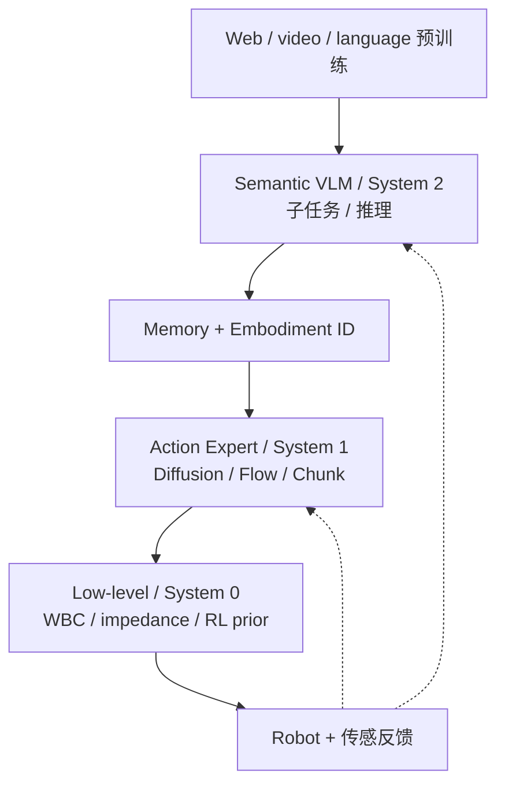

# VLA 演进：从动作 Token 到分层具身智能体

> **本页定位**：为 [PinkRobot · VLA 演进综述](https://mp.weixin.qq.com/s/w2QP2RXmpA5juqUjyd0tsQ) 提供 **按问题线索组织的阅读坐标**；算法与实体细节以 [VLA 方法页](../methods/vla.md)、[RT-2](../entities/paper-rt-2.md)、[π₀](../entities/paper-pi0.md) 等专页为准。与 [Mimic 控制演进](./mimic-control-evolution-lineage.md)、[深度 RL Off/On-policy 演进](./deep-rl-off-on-policy-evolution.md) 同属 PinkRobot 系列纵览。

## 一句话观点

VLA 的真正演进不是「VLM 越来越大」，而是 **语义主干与动作生成逐步解耦**，并重新发现 **多时间尺度分层**（慢语义 → 快 chunk → 更快全身稳定）；2026 年前沿把 **记忆、经验后训练与 steering** 纳入完整具身智能体闭环。

## 英文缩写速查

| 缩写 | 英文全称 | 简要说明 |
|------|----------|----------|
| VLA | Vision-Language-Action | 视觉、语言与动作统一的多模态策略 |
| VLM | Vision-Language Model | 预训练视觉–语言语义主干 |
| OXE | Open X-Embodiment | 跨本体机器人数据与 RT-X 训练混合 |
| OFT | Optimized Fine-Tuning | OpenVLA 并行连续 chunk + 高效微调配方 |
| FAST | Efficient Action Tokenization | DCT + BPE 频域动作 tokenizer |
| RECAP | RL with Experience and Corrections via Advantage-conditioned Policies | π\*₀.₆ 经验驱动后训练框架 |
| WBC | Whole-Body Control | 全身低层协调与平衡控制 |

## 三次结构迁移

| 迁移 | 核心问题 | 典型解法 |
|------|----------|----------|
| **① token 化** | 如何把机器人动作接入 LLM 训练栈 | 逐维 bin → 文本式动作 token（RT-2） |
| **② 连续化** | 量化误差、AR 延迟、多峰轨迹 | action chunk、Diffusion/Flow、专用 Action Expert |
| **③ 层级化** | 语义推理频率 vs 闭环控制频率 | System 2/1/0、异步 chunk、WBC/阻抗低层 |

## 四类 VLA 结构（可组合）

| 类型 | 语义 | 动作 | 代表 |
|------|------|------|------|
| 单体自回归 | 统一 Transformer | 离散 token 自回归 | RT-2、OpenVLA |
| VLM + Action Expert | 冻结/部分冻结 VLM | Flow/Diffusion chunk | π₀、CogACT、GR00T N1 |
| 分层双/三系统 | 7–9 Hz VLM | 200 Hz 视觉运动 + 1 kHz 全身 | Helix、Helix 02 |
| 轻量端侧 | 小 VLM、少视觉 token | 异步 flow chunk | SmolVLA、Gemini On-Device 2 |

## 主线时间线（分段检索）

| 阶段 | 代表 | 主要贡献 | 本库入口 |
|------|------|----------|----------|
| 技能规划 | SayCan | LLM × affordance 价值函数 | [SayCan](../methods/saycan.md) |
| 统一序列 | Gato、VIMA | 动作即 token；多模态 Prompt | [统一多模态 token](../methods/unified-multimodal-tokens.md) |
| 机器人 Transformer | RT-1 | 大规模真机离散策略 | [RT 系列](../methods/robotics-transformer-rt-series.md) |
| VLA 成形 | RT-2 | Web 语义 co-fine-tune | [paper-rt-2](../entities/paper-rt-2.md) |
| 跨本体数据 | OXE / Octo | schema 统一 + 开源通用策略 | [Octo](../methods/octo-model.md) |
| 开源 VLA | OpenVLA | 完整权重与微调路径 | [OpenVLA](../entities/paper-openvla.md) |
| 连续 VLA | π₀ | VLM + Flow Action Expert | [π₀](../entities/paper-pi0.md) |
| 动作 token 效率 | FAST、OFT | 频域 token / 并行 chunk | [action-chunking](../methods/action-chunking.md) |
| 人形工业 VLA | GR00T N1.7 | Flow DiT + 部署导出 | [Isaac GR00T](../entities/isaac-gr00t.md) |
| 三系统全身 | Helix 02 | 7–9 / 200 / 1000 Hz | [Gemini / Figure 对照](../entities/gemini-robotics.md) |
| Index 预训练 + 家庭零样本 | Helix 2.5 | 单基座 · 30 unseen homes · 56% vs 9% ablation | [Helix 2.5](../entities/helix-25.md) |
| 经验与记忆 | π\*₀.₆、MEM、RLT、π₀.7 | RECAP、多尺度记忆、steering | [π₀.₇](../methods/pi07-policy.md) |

## 动作表示机制选型

| 机制 | 适合 | 主要代价 |
|------|------|----------|
| 逐维离散 token | 中低频、复用 LLM 栈 | 量化 + AR 延迟 |
| FAST 频域 token | 仍要 AR 但提高序列效率 | tokenizer 与训练复杂度 |
| 连续并行 chunk（OFT/ACT） | 单峰或强反馈任务 | 多峰分布表达弱 |
| Diffusion / Flow | 灵巧、多峰、长 chunk | 积分/去噪步数 → 延迟 |
| RL 残差（RLT） | 精密局部在线适配 | 安全探索与稳定性 |

**读法：** 不存在唯一最优动作头；应同时看 **控制频率、动作维数、多峰程度、硬件延迟与后训练数据**。

## 多时间尺度：与学习栈的接口

| 时间尺度 | 典型频率 | VLA 模块 | 类比经典栈 |
|----------|----------|----------|------------|
| 慢 | 1–10 Hz | VLM / System 2 | 任务规划、行为树 |
| 中 | 10–200 Hz | Action Expert / System 1 | 视觉伺服、局部轨迹 |
| 快 | 200 Hz–1 kHz+ | System 0 / 低层策略 | WBC、阻抗、关节伺服 |

关键不是「VLA 替代 MPC/WBC」，而是 **接口定义**：VLA 输出 chunk 或全身参考，低层保证动力学可行与高频稳定。概念对齐见 [具身三层控制架构](../concepts/embodied-three-layer-control-architecture.md)。

## 现代 VLA 统一计算图（抽象）

与 2023 RT-2 的最大区别：**VLM 不再直接「说出动作」**，而是作语义大脑；Action Expert 作运动皮层；System 0 作脊髓/反射层；记忆与 RL 闭合部署环。

## 数据与训练范式

数据源演进：**单机器人示范 → 多任务真机 → OXE + Web VLM → 人视频 / 仿真 / rollout / 纠正 / 在线 RL**。

训练目标从单一 BC 扩展为多损失混合（语义、子任务、动作、记忆、价值/优势等——权重因系统而异）。部署后 **RECAP、RLT、LWD** 等路线把失败与干预变为后训练信号。

## 开放问题（文内 §17 摘要）

- **语义 vs 实时**：靠分层与语义特征缓存，而非无限放大 VLM 频率
- **互联网知识 vs 物理经验**：重量、摩擦、接触需机器人/仿真/在线数据补全
- **BC 上限 vs 自主提升**：安全探索、reward、off-policy 稳定、灾难性遗忘
- **跨本体**：缺「机器人版统一词表」；FAST schema、adapter、Motion Transfer 并行探索
- **长程任务**：显式具身记忆管理器，而非硬塞全历史进 context
- **安全与失效恢复**：碰撞约束、置信度、fallback；与 MPC/CBF/WBC/行为树长期共存

## 与其他页面的关系

- **方法总览：** [VLA](../methods/vla.md)
- **五类模型 taxonomy：** [VLM/VLN/VLA/VLX/WM](../comparisons/vlm-vln-vla-vlx-world-model-taxonomy.md)
- **14 篇精读地图：** [vla-wm-reading-roadmap](./vla-wm-reading-roadmap-14-papers-technology-map.md)
- **Foundation policy 抽象：** [foundation-policy](../concepts/foundation-policy.md)

## 推荐继续阅读

- [RT-2 项目页](https://robotics-transformer2.github.io/)
- [Physical Intelligence · π₀](https://www.pi.website/blog/pi0)
- [Figure · Helix 02](https://www.figure.ai/news/helix-02)
- [Figure · Helix 2.5](https://www.figure.ai/news/helix-2-5-zero-shot-30-home-generalization)
- [Open X-Embodiment](https://robotics-transformer-x.github.io/)

## 参考来源

- [PinkRobot · VLA 演进：从动作 Token 到分层具身智能体](../../sources/blogs/wechat_pinkrobot_vla_evolution_hierarchical_2026-09-17.md)
- [Figure · Helix 2.5 官方新闻归档](../../sources/blogs/figure_ai_helix_25_zero_shot_30_home_generalization.md)
