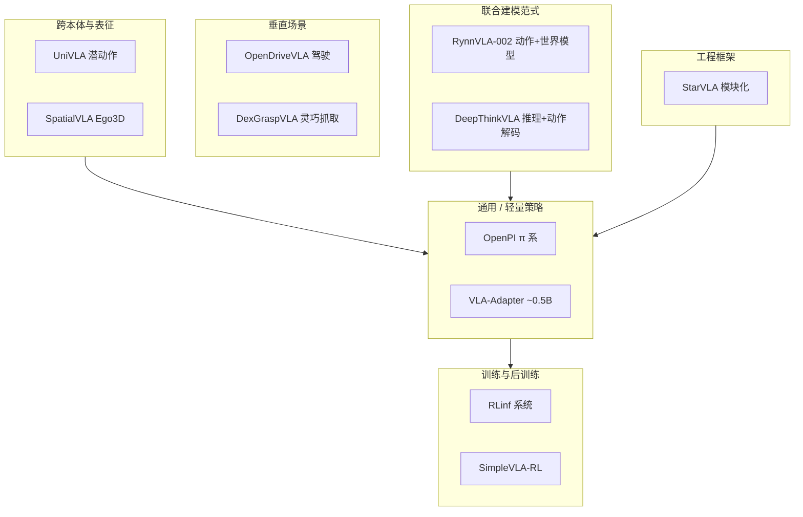

# VLA 开源复现景观（2025 策展）

> **本页定位：** 将深蓝具身智能微信公众号对 GitHub 高 star VLA 项目的「复现向」综述，整理为可按目标检索的地图；**不**替代各仓库 README，也**不**固化 star 快照。

## 一句话总结

VLA 的「智能」可以写在论文里，但**跑不通的训练脚本与权重**会直接暴露工程差距；2025 年开源生态同时在 **模型、RL 训练系统、跨本体与 VLA+世界模型** 四条线上铺开，复现时应先选对「你要验证的层」再选仓库。**2026 起** 可另见通义 [Qwen-VLA](../entities/qwen-vla.md)（**操作 + VLN 统一通才**、Qwen3.5-4B + DiT flow），本页 11 项表仍锁定 2025-12 策展快照。

## 为什么用「复现目标」而不是「榜单排名」

- 筛选口径（原文）：代码可获取、活跃度、star>400（截至 2025-12-22）——**遗漏仍多**，未上榜项目同样有参考价值。
- 同一 star 段的项目可能服务完全不同环节：**策略权重** vs **RL 集群** vs **VLM→VLA 脚手架** vs **自动驾驶栈**。
- 与本站 [VLA 方法页](../methods/vla.md)、[操作 VLA 选型 Query](../queries/manipulation-vla-architecture-selection.md) 互补：本页偏 **开源入口与复现路径**，彼处偏 **架构族与数据假设**。

## 景观总览

## 11 项开源栈速查（文内 01–12，缺 02）

| 项目 | 核心贡献（归纳） | 一手仓库 | 本站相关页 |
|------|------------------|----------|------------|
| **OpenPI** | Physical Intelligence 的 π0 / π0-FAST / π0.5；VLM 语义 + flow matching 动作；多真机平台微调 | [openpi](https://github.com/Physical-Intelligence/openpi) | [π0 Policy](../methods/π0-policy.md)、[π0.7](../methods/pi07-policy.md)、[VLA](../methods/vla.md) |
| **VLA-Adapter** | ~0.5B 轻量 VLA；Bridge Attention 注入 VL；强调低机器人预训练数据 | [VLA-Adapter](https://github.com/OpenHelix-Team/VLA-Adapter) | [VLA](../methods/vla.md)、[选型 Query](../queries/manipulation-vla-architecture-selection.md) |
| **RLinf** | 大规模 RL **系统**（流水线、通信、调度）；支撑 π-RL 等具身 RL | [RLinf](https://github.com/RLinf/RLinf) | [VLA](../methods/vla.md)、[强化学习](../methods/reinforcement-learning.md) |
| **SimpleVLA-RL** | veRL 扩展；面向 VLA 的轨迹采样与并行；OpenVLA-OFT RL 实验 | [SimpleVLA-RL](https://github.com/PRIME-RL/SimpleVLA-RL) | [VLA](../methods/vla.md) |
| **UniVLA** | 从视频学 **潜动作**；跨平台轻量解码；减弱显式动作标签依赖 | [UniVLA](https://github.com/OpenDriveLab/UniVLA) | [DeFI](../methods/defi-decoupled-dynamics-vla.md)（潜动作路线对照）；**≠** 导航向 [Uni-NaVid](../overview/vln-open-source-repro-paradigms.md) |
| **RynnVLA-002** | 统一动作生成与环境预测的自回归 **动作-世界模型** | [RynnVLA-002](https://github.com/alibaba-damo-academy/RynnVLA-002) | [世界模型闭环分类](../overview/robot-world-models-training-loop-taxonomy.md)、[LeRobot](../entities/lerobot.md) |
| **StarVLA** | VLM / VLA /「用 VLM 训 VLA」模块化框架；单卡可训 | [starVLA](https://github.com/starVLA/starVLA) | [StarVLA](../methods/star-vla.md) |
| **SpatialVLA** | Ego3D 三维位置编码；百万级真机轨迹预训练 | [SpatialVLA](https://github.com/SpatialVLA/SpatialVLA) | [VLA](../methods/vla.md)、[3D 空间 VQA](../concepts/3d-spatial-vqa.md) |
| **OpenDriveVLA** | 端到端驾驶 VLA；2D/3D 实例 + 分层 VL 对齐 | [OpenDriveVLA](https://github.com/DriveVLA/OpenDriveVLA) | [VLA](../methods/vla.md)（驾驶域扩展） |
| **DexGraspVLA** | 分层 VLM 规划 + 扩散抓取控制；杂乱场景长程 | [DexGraspVLA](https://github.com/Psi-Robot/DexGraspVLA) | [Manipulation](../tasks/manipulation.md)、[抓取选型](../queries/grasp-policy-selection.md) |
| **DeepThinkVLA** | 先因果推理 token，再双向注意力 **并行** 动作解码 | [DeepThinkVLA](https://github.com/wadeKeith/DeepThinkVLA) | [VLA](../methods/vla.md) |

## 按复现目标选入口

| 你的首要目标 | 建议起点 | 常见坑 |
|-------------|----------|--------|
| 复现 π 系多任务操作 | OpenPI 仓库 + 官方权重/数据说明 | 多机器人 URDF、相机标定与 action space 不一致 |
| 单卡 / 小团队试 VLA | VLA-Adapter 或 StarVLA | 勿与 OpenPI 数据规模假设混用 |
| 给已有 VLA 做 RL 后训练 | SimpleVLA-RL + 确认仿真/渲染依赖 | 需对齐 veRL 与 OpenVLA-OFT 版本 |
| 搭集群 RL 基建 | RLinf | 系统项目，不等同于单一策略 checkpoint |
| 人视频 → 机器人 | UniVLA（对照 [DeFI](../methods/defi-decoupled-dynamics-vla.md) 解耦路线） | 潜动作语义与真机控制接口对齐 |
| VLA + 世界模型联合 | RynnVLA-002 | 数据收集（文内 SO100 抓取放置）与 WM 训练算力 |
| 换 VLM backbone 做消融 | StarVLA | 模块边界清晰，但 benchmark 需自对齐 |
| 强调 3D 几何的操作 | SpatialVLA | 预训练离散动作网格与目标机器人网格匹配 |
| 驾驶端到端 | OpenDriveVLA | 与室内操作 VLA 数据/评测完全不同域 |
| 灵巧长程抓取 | DexGraspVLA | 分层延迟与扩散推理实时性 |
| 可解释推理链 + 控制 | DeepThinkVLA | 推理数据构建成本 |

## 与深蓝专栏其他篇的关系

- [《具身智能基础》几何三篇](../overview/shenlan-embodied-ai-fundamentals-series.md)（李群 → 坐标变换 → 黎曼流形）补 **姿态、标定与流形优化**；VLA 部署时仍要面对 SE(3) 动作空间（见 [SE(3) 表示](../formalizations/se3-representation.md)）。
- 姊妹篇「12 个 VLA 开源项目」偏影响力盘点；**本篇偏「刷完 repo 后优先复现哪几个」**，索引重叠但叙事不同。

## 常见误区

- **star 高 ≠ 与你的机器人栈直接可用**：OpenPI 与 OpenDriveVLA 共享「VLA」缩写，数据与评测几乎不互通。
- **把 RLinf 当策略仓库**：它是训练系统；策略权重仍在各算法仓库。
- **忽略文内缺号 02**：索引表按抓取版保留 11 项有效条目，不虚构第 12 个「影响力」项。

## 关联页面

- [VLN 四范式复现路径](../overview/vln-open-source-repro-paradigms.md) — 导航域 VLA（Uni-NaVid）与操作域 VLA 分工
- [VLA（Vision-Language-Action）](../methods/vla.md)
- [StarVLA](../methods/star-vla.md)
- [操作 VLA 架构选型 Query](../queries/manipulation-vla-architecture-selection.md)
- [机器人世界模型训练闭环分类](../overview/robot-world-models-training-loop-taxonomy.md)
- [LeRobot](../entities/lerobot.md) — RynnVLA-002 文内 SO100 数据收集语境

## 参考来源

- [深蓝具身智能：刷完 Github VLA 项目后的复现推荐（微信公众号归档）](../../sources/blogs/wechat_shenlan_vla_github_repro_survey_2025.md)

## 推荐继续阅读

- [Physical Intelligence openpi](https://github.com/Physical-Intelligence/openpi) — π 系官方开源入口
- [OpenHelix VLA-Adapter](https://github.com/OpenHelix-Team/VLA-Adapter) — 轻量 VLA 复现入口
