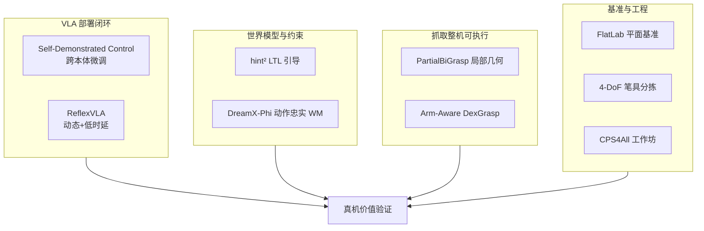

# VLA·预测·抓取：9 篇论文的阅读坐标

> **本页定位**：为 [具身智能小站 · 9 篇盘点](https://mp.weixin.qq.com/s/e0yXB8Rz4ma3CCPX8HN2CQ)（2026-08-24）提供 **按四类问题组织的阅读坐标**；不复述每篇方法细节。姊妹近期盘点见 [视频–接触–控制（2026-08-22）](./video-contact-control-10-papers-technology-map.md)、[VLA 可执行性与鲁棒性（2026-08-23）](./vla-robustness-9-papers-technology-map.md)。

## 一句话观点

**具身智能正从「扩大模型与数据」转向部署闭环：本体迁移、动态时延、长时序约束、整机可执行抓取，以及基准与低成本任务工程共同定义真实价值。**

## 英文缩写速查

| 缩写 | 英文全称 | 简要说明 |
|------|----------|----------|
| VLA | Vision-Language-Action | 视觉-语言-动作大模型 |
| LTL | Linear Temporal Logic | 长时序逻辑约束语言 |
| WM | World Model | 世界模型，预测动作后果 |
| CPS | Cyber-Physical System | 赛博物理系统 |
| FC | Force Closure | 力闭合抓取约束 |

## 为什么单独做这张地图

- 公众号把 9 篇放在 VLA、预测控制、双臂/灵巧抓取与任务工程同一叙事里。
- 站内已有 VLA、世界模型、抓取节点；需要横切面索引避免 9 个实体成孤岛。
- **PartialBiGrasp / ReflexVLA / DreamX-Phi 已有 complete 页**，本专辑复用、不重复造页。

## 流程总览

## 分组索引

### VLA 部署：本体迁移与动态反应

| 论文 | 节点 | 开源（入库日） |
|------|------|----------------|
| Self-Demonstrated Control | [paper-self-supervised-control](../entities/paper-self-supervised-control.md) | 确认未开源 |
| ReflexVLA | [paper-reflexvla](../entities/paper-reflexvla.md) | 录用后开源 |

### 世界模型与推理时约束

| 论文 | 节点 | 开源（入库日） |
|------|------|----------------|
| hint² | [paper-hint2](../entities/paper-hint2.md) | 待发布 |
| DreamX-Phi 1.0 | [paper-dreamx-phi](../entities/paper-dreamx-phi.md) | 部分开源（占位仓） |

### 抓取：局部几何与臂约束

| 论文 | 节点 | 开源（入库日） |
|------|------|----------------|
| PartialBiGrasp | [paper-partialbigrasp](../entities/paper-partialbigrasp.md) | 部分开源 |
| Arm-Aware DexGrasp | [paper-arm-aware-dexgrasp](../entities/paper-arm-aware-dexgrasp.md) | 待发布 |

### 基准、社区与低成本工程

| 论文 | 节点 | 开源（入库日） |
|------|------|----------------|
| FlatLab | [paper-flatlab](../entities/paper-flatlab.md) | 待发布 |
| 4-DoF 笔具分拣 | [paper-4dof-pen-sorting](../entities/paper-4dof-pen-sorting.md) | 已开源 |
| CPS4All | [paper-cps4all](../entities/paper-cps4all.md) | 不适用（工作坊） |

## 阅读建议

1. **做 VLA 后训练** — 先 [Self-Demonstrated Control](../entities/paper-self-supervised-control.md)，再对照 [ReflexVLA](../entities/paper-reflexvla.md) 的动态时延维度。
2. **做长时序合规** — [hint²](../entities/paper-hint2.md) vs 语言条件策略；视频 WM 看 [DreamX-Phi](../entities/paper-dreamx-phi.md)。
3. **做双臂/灵巧抓取** — partial view 用 [PartialBiGrasp](../entities/paper-partialbigrasp.md)；整机约束用 [Arm-Aware DexGrasp](../entities/paper-arm-aware-dexgrasp.md)。
4. **做平面物体** — [FlatLab](../entities/paper-flatlab.md) 补基准；低成本栈参考 [4-DoF 分拣](../entities/paper-4dof-pen-sorting.md)。

## 关联页面

- [VLA](../methods/vla.md)
- [生成式世界模型](../methods/generative-world-models.md)
- [双臂操作](../tasks/bimanual-manipulation.md)
- [灵巧抓取](../tasks/manipulation.md)

## 参考来源

- [wechat_embodied_station_9_papers_vla_predict_grasp_2026-08-24](../../sources/blogs/wechat_embodied_station_9_papers_vla_predict_grasp_2026-08-24.md)
- [raw 抓取归档](../../sources/raw/wechat_embodied_station_9_papers_vla_predict_grasp_2026-08-24.md)

## 推荐继续阅读

- [具身智能小站原文](https://mp.weixin.qq.com/s/e0yXB8Rz4ma3CCPX8HN2CQ)
