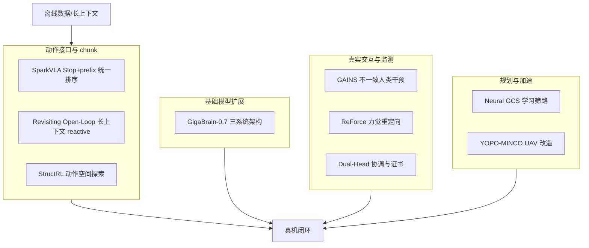

# VLA 可执行性与鲁棒性：9 篇论文的阅读坐标

> **本页定位**：为 [具身智能小站 · 9 篇盘点](https://mp.weixin.qq.com/s/CXOf3PU8-H6OzI77vnhZMA)（2026-08-23）提供 **按四类问题组织的阅读坐标**；不复述每篇方法细节。姊妹近期盘点见 [视频–接触–控制（2026-08-22）](./video-contact-control-10-papers-technology-map.md)、[世界模型与真实执行（2026-08-19）](./world-model-exec-10-papers-technology-map.md)。

## 一句话观点

**具身智能正在把策略学习从静态模仿推向可诊断、可适配、可闭环的系统——关键不在单一模型名，而在动作 chunk、探索噪声、人类反馈与规划结构能否稳定复用。**

## 英文缩写速查

| 缩写 | 英文全称 | 简要说明 |
|------|----------|----------|
| VLA | Vision-Language-Action | 视觉-语言-动作大模型 |
| GCS | Graphs of Convex Sets | 离散-连续耦合运动规划框架 |
| HIL-RL | Human-in-the-Loop RL | 人类在环强化学习 |
| FM | Flow Matching | 流匹配动作生成 |

## 为什么单独做这张地图

- 公众号把 9 篇放在「更长上下文 → 更可控动作分布 → 真实硬件反馈」同一叙事里。
- 站内已有 VLA、action chunking、retargeting 节点；需要横切面索引避免 9 个实体成孤岛。
- **Revisiting Open-Loop** 在先前 ingest 已有 complete 页，本专辑复用、不重复造页。

## 流程总览

## 分组索引

### 动作 chunk、闭环与探索噪声

| 论文 | 详情节点 | 读什么 |
|------|----------|--------|
| SparkVLA | [paper-sparkvla](../entities/paper-sparkvla.md) | 层级 VLA 的 Stop 与 action-prefix 联合排序 |
| Revisiting Open-Loop | [paper-revisiting-open-loop-action-chunking](../entities/paper-revisiting-open-loop-action-chunking.md) | 长 open-loop 多因短上下文；够长 \(T_o\) 后 reactive 最优 |
| StructRL | [paper-structrl](../entities/paper-structrl.md) | flow-VLA 在线 RL 的结构化动作空间探索 |

### 具身基础模型规模化

| 论文 | 详情节点 | 读什么 |
|------|----------|--------|
| GigaBrain-0.7 | [paper-gigabrain-0-7](../entities/paper-gigabrain-0-7.md) | 三系统架构 + 37k 小时数据 + System-3 世界模型 |

### 人类反馈、力觉与策略监测

| 论文 | 详情节点 | 读什么 |
|------|----------|--------|
| GAINS | [paper-gains](../entities/paper-gains.md) | 不一致干预信号的分布 RL 建模 |
| ReForce | [paper-reforce](../entities/paper-reforce.md) | 从运动重定向到力觉重定向 |
| Dual-Head Coordination | [paper-dual-head-coordination](../entities/paper-dual-head-coordination.md) | 双 flow 头协调与 collapse certificate |

### 规划加速与 aerial 改造

| 论文 | 详情节点 | 读什么 |
|------|----------|--------|
| Neural GCS | [paper-neural-gcs](../entities/paper-neural-gcs.md) | 神经候选 + 排序加速 GCS |
| YOPO-MINCO | [paper-yopo-minco](../entities/paper-yopo-minco.md) | MINCO 分段与多同伦改造 YOPO |

## 关联页面

- [VLA](../methods/vla.md)
- [Action Chunking](../methods/action-chunking.md)
- [Motion Retargeting Pipeline](../concepts/motion-retargeting-pipeline.md)
- [模仿学习](../methods/imitation-learning.md)

## 参考来源

- [wechat_embodied_station_9_papers_open_source_2026-08-23](../../sources/blogs/wechat_embodied_station_9_papers_open_source_2026-08-23.md)

## 推荐继续阅读

- [具身智能小站原文](https://mp.weixin.qq.com/s/CXOf3PU8-H6OzI77vnhZMA)
