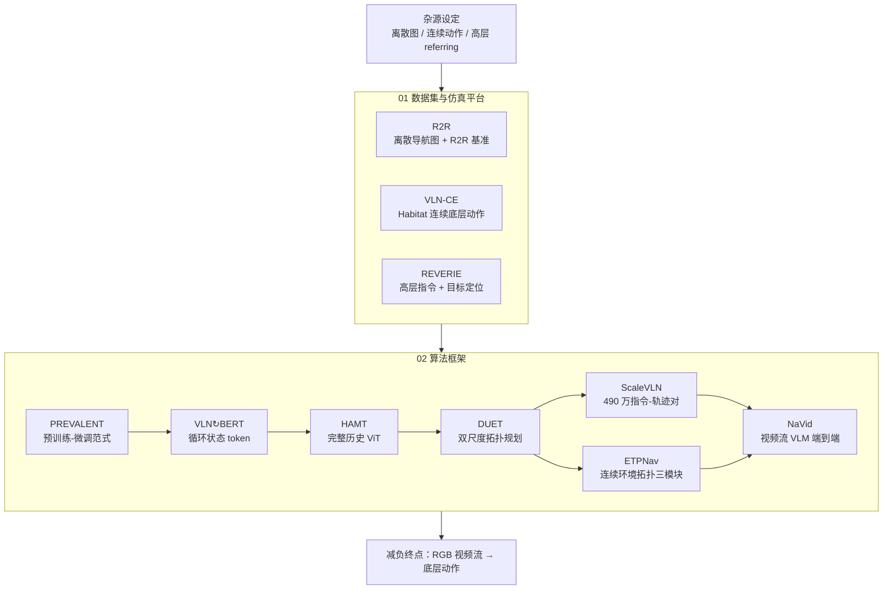

# VLN 10 篇论文技术地图

> **本页定位**：为 [深蓝具身智能 · VLN 10 项代表性研究](https://mp.weixin.qq.com/s/2_dYaN6IeWn_vvS_jmGqRQ) 提供 **按两组入口组织的阅读坐标**；不复述每篇论文细节，只保留 **问题重框、两组论文地图、与四范式复现/任务页的挂接**。姊妹篇 [VLN 四范式开源复现路径](./vln-open-source-repro-paradigms.md)、[视觉–语言导航任务页](../tasks/vision-language-navigation.md)。

## 一句话观点

VLN 七年演进的核心脉络是 **减负**：从 R2R 离散导航图 + 逐步指令，到 VLN-CE 连续动作与 REVERIE 高层目标定位，再到 PREVALENT 预训练、拓扑建图、大规模数据生成，最终由 NaVid 仅凭 RGB 视频流完成端到端导航——显式辅助信号被逐步剥离。

## 英文缩写速查

| 缩写 | 英文全称 | 简要说明 |
|------|----------|----------|
| VLN | Vision-and-Language Navigation | 依据自然语言指令在环境中导航的具身任务 |
| R2R | Room-to-Room | Matterport3D 上经典逐步导航指令数据集 |
| VLN-CE | VLN in Continuous Environments | 连续动作空间下的 VLN 设定与 benchmark 族 |
| VLM | Vision-Language Model | 视觉-语言多模态大模型，NaVid 等路线的骨干 |
| VLA | Vision-Language-Action | 视觉-语言-动作多模态策略 |

## 为什么单独做这张地图

- [视觉–语言导航（VLN）](../tasks/vision-language-navigation.md) 任务页已覆盖大量 **单篇方法与复现栈**；本页聚焦 **2026-06 盘点** 提出的横切面：**基础设施如何定义任务、算法如何减负演进**。
- 与 [四范式复现路径](./vln-open-source-repro-paradigms.md) 分工：复现页回答 **能跑通哪条开源栈**；本页回答 **领域代表性工作如何按历史脉络串读**。
- **NaVid**（RSS 2024，arXiv:2402.15852）≠ **Uni-NaVid**（RSS 2025 导航 VLA 复现项目，勿合并节点）。

## 流程总览：两组入口 → 减负演进

## 两组分类节点（图谱 hub）

| 组 | 分类节点 | 篇数 | 核心问题 |
|----|----------|------|----------|
| 01 | [数据集与仿真平台](./vln-category-01-datasets-platforms.md) | 3 | **测什么、在哪测、动作空间如何定义？** |
| 02 | [算法框架](./vln-category-02-algorithm-frameworks.md) | 7 | **模型如何对齐、记忆、规划、扩数据、接 VLM？** |

## 10 篇论文速查

| # | 工作 | 分组 | Wiki |
|---|------|------|------|
| 01 | R2R | 01 | [paper-vln-01-r2r](../entities/paper-vln-01-r2r.md) |
| 02 | VLN-CE | 01 | [paper-vln-02-vln-ce](../entities/paper-vln-02-vln-ce.md) |
| 03 | REVERIE | 01 | [paper-vln-03-reverie](../entities/paper-vln-03-reverie.md) |
| 04 | PREVALENT | 02 | [paper-vln-04-prevalent](../entities/paper-vln-04-prevalent.md) |
| 05 | VLN↻BERT | 02 | [paper-vln-05-vln-bert](../entities/paper-vln-05-vln-bert.md) |
| 06 | HAMT | 02 | [paper-vln-06-hamt](../entities/paper-vln-06-hamt.md) |
| 07 | DUET | 02 | [paper-vln-07-duet](../entities/paper-vln-07-duet.md) |
| 08 | ScaleVLN | 02 | [paper-vln-08-scalevln](../entities/paper-vln-08-scalevln.md) |
| 09 | ETPNav | 02 | [paper-vln-09-etpnav](../entities/paper-vln-09-etpnav.md) |
| 10 | NaVid | 02 | [paper-vln-10-navid](../entities/paper-vln-10-navid.md) |

## 文内收束判断（策展）

| 判断 | 含义 |
|------|------|
| 减负 > 堆模块 | 从导航图、深度、里程计到单目 RGB 视频流，显式辅助信号逐步剥离 |
| 基础设施先行 | R2R / VLN-CE / REVERIE 定义「测什么」后，算法创新才有可比性 |
| 预训练是范式转折 | PREVALENT 开启 VLN 预训练-微调，后续 BERT 类与时序建模均在此基础上迭代 |
| 数据与模型并行 | ScaleVLN 证明数据规模扩展与架构创新同为抬升 benchmark 上限的杠杆 |
| VLM 是新前沿 | NaVid 展示 VLM 端到端导航可行性；与 Uni-NaVid 等复现栈对照阅读 |

## 按目标选入口

| 你的目标 | 从哪开始 |
|----------|----------|
| 理解 VLN 任务起源与 R2R 基准 | [01 R2R](../entities/paper-vln-01-r2r.md) |
| 离散图 vs 连续动作设定差异 | [02 VLN-CE](../entities/paper-vln-02-vln-ce.md) |
| 高层指令 + 物体定位 | [03 REVERIE](../entities/paper-vln-03-reverie.md) |
| VLN 预训练范式起点 | [04 PREVALENT](../entities/paper-vln-04-prevalent.md) |
| 时序导航的 BERT 类基线 | [05 VLN↻BERT](../entities/paper-vln-05-vln-bert.md) |
| 完整历史视觉建模 | [06 HAMT](../entities/paper-vln-06-hamt.md) |
| 拓扑建图 + 双尺度规划 | [07 DUET](../entities/paper-vln-07-duet.md) |
| 大规模自动数据生成 | [08 ScaleVLN](../entities/paper-vln-08-scalevln.md) |
| 连续环境拓扑规划基线 | [09 ETPNav](../entities/paper-vln-09-etpnav.md) |
| VLM 视频流端到端导航 | [10 NaVid](../entities/paper-vln-10-navid.md) |
| 能跑通的开源复现栈 | [四范式复现路径](./vln-open-source-repro-paradigms.md) |

## 关联页面

- [视觉–语言导航（VLN）](../tasks/vision-language-navigation.md)
- [VLN 四范式开源复现路径](./vln-open-source-repro-paradigms.md)
- [SceneVerse++](../entities/sceneverse-pp.md) — 互联网视频→R2R 风格数据扩展
- [Agent Reach](../entities/agent-reach.md) — 本文微信抓取工具链

## 参考来源

- [wechat_shenlan_vln_10_papers_survey.md](../../sources/blogs/wechat_shenlan_vln_10_papers_survey.md)
- [wechat_vln_10_papers_2026-06-20.md](../../sources/raw/wechat_vln_10_papers_2026-06-20.md)
- [vln_10_papers_catalog.md](../../sources/papers/vln_10_papers_catalog.md)

## 推荐继续阅读

- 原文：<https://mp.weixin.qq.com/s/2_dYaN6IeWn_vvS_jmGqRQ>
- [VLN 四范式开源复现路径](./vln-open-source-repro-paradigms.md)
